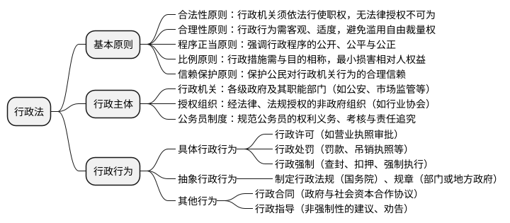

```plantuml
+ 法律
++ [[https://flk.npc.gov.cn/xf.html 宪法]]\n根本法
++ [[https://flk.npc.gov.cn/list.html?sort=true&type=flfg&xlwj=07 刑法]]
++ [[https://mfd.pkulaw.com/ 民法]]
++ 商法
++ [[https://flk.npc.gov.cn/list.html?sort=true&type=flfg&xlwj=04 行政法]]
++ [[https://flk.npc.gov.cn/list.html?sort=true&type=flfg&xlwj=05 经济法]]
++ [[https://flk.npc.gov.cn/list.html?sort=true&type=flfg&xlwj=06 社会法]]
++ [[https://flk.npc.gov.cn/list.html?sort=true&type=flfg&xlwj=08 诉讼与非诉讼程序法]]
```


