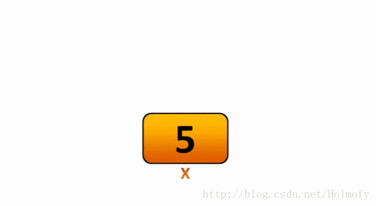

在网上看过很多关于数据库事务的文章，没有上千也有一百了吧，这么多文章没有一个能把事务讲的透彻。首先可见的是国内的程序员大多是抄来抄去，自己没有理解的东西就抄过来，最后以讹传讹终成三夫之言，令人难以理解。对于那些我无法理解的文章，我都归结为两种：写文章的人水平太高，远远超出我的理解范围；写文章的人水平太烂，自己都没有理解就从别的地方抄过来了。所以这篇文章想要从根本上讲清楚事务到底是什么。


各种课本、书籍、资料里都说[数据库事务](https://en.wikipedia.org/wiki/Database_transaction)有ACID的特性，然后列了一下A是[Atomic](https://en.wikipedia.org/wiki/Atomicity_%28database_systems%29)、C是[Consistency](https://en.wikipedia.org/wiki/Consistency_%28database_systems%29)、I是[Isolation](https://en.wikipedia.org/wiki/Isolation_%28database_systems%29)、D是[Durability](https://en.wikipedia.org/wiki/Durability_%28database_systems%29)进行一下名词解释就蒙混过关了。那我就一个个的讲一下ACID到底是个啥。

# Durability

我们先从最简单的持久性讲起。Durability这个特性其实我们平时都在接触——有人问过我，为什么打开word会生成~$ 开头的文件，我电脑是不是中毒了。


放心的告诉你，你电脑没有中病毒，这个文件是为了保护你编辑的内容中没有保存就突然断电，后面打开[Word文件还能重新恢复](https://support.microsoft.com/zh-cn/office/%E6%81%A2%E5%A4%8D-word-%E6%96%87%E4%BB%B6%E5%92%8C%E6%96%87%E6%A1%A3-5851ef9c-dcd6-4c42-9364-ad3416d8497d)。


这个预先持久化的功能在很多软件都有应用，比如我们用vim编辑文件，它会帮我们生成一个`xxx.swap`的文件。


数据库事务的持久性和Word的这个功能是一个原理。

你执行了一个修改操作，数据库大致的操作是这样的：数据库从硬盘里把你要修改的数据读到内存，然后在内存里修改，你的事务提交了，这个修改大概率还没有刷到硬盘里（因为数据库为了避免频繁的随机IO，做了BufferPool缓存）。

数据没落盘，这要是数据库宕机了，内存里的数据就没了，所以数据库提供了一个[Redo Log](https://en.wikipedia.org/wiki/Redo_log)的功能，把你修改的数据先用顺序IO写到一个日志文件里。

后面重启了，数据库把Redo Log里操作**再执行**(redo)一下，就能恢复到原来的状态了。

# Atomic

在数据库中，事务的原子性指的是事务中的一系列操作是不可分割的，要么都执行要么都不执行。

嗯...这大概是教科书里的解释吧，但是大多数教科书里都没说这个是怎么做到的。

**事务中的操作都执行**还好说，我们按照上面正常的逻辑，把每个操作的数据写到Redo Log里，事务执行完提交，不管宕机与否，反正都能恢复到所有操作都执行完的状态。

Atomic的重点在于怎么保证这个**事务中的操作都不执行**——事务执行到一半数据库宕机或者事务回滚了，这个**事务已经执行过的所有操作都得撤销**。

撤销这个我们平常可能也有在用到——编辑一个文件前，我们会把文件先备份一下，如果出现了什么问题，我们可以用备份文件进行还原。


数据库里也在用这种类似的方式对以前执行过的操作进行撤销——每次写操作前，先把原始数据备份到Undo Log里，如果事务要撤销，直接用Undo Log里的备份数据进行还原。

由于Redo Log和Undo Log在数据库执行写操作之前记录的，很多存储系统把它放在同一个日志文件里，并且有一个更专业的名字[预写日志(Write-Ahead Log)](https://en.wikipedia.org/wiki/Write-ahead_logging)，常常被缩写成WAL。很多专业的数据库比如[PostgreSQL](https://www.postgresql.org/docs/current/wal-intro.html)、[MongoDB](https://docs.mongodb.com/manual/tutorial/manage-journaling/)、[Sqlite](https://sqlite.org/wal.html)、[ElasticSearch](https://www.elastic.co/guide/en/elasticsearch/reference/current/index-modules-translog.html)等都在使用WAL。

事实上要实现WAL还是比较复杂的，WAL中算法的演进也不是一蹴而就的。不过从[Shadow Paging](https://en.wikipedia.org/wiki/Shadow_paging)到[ARIES](https://en.wikipedia.org/wiki/Algorithms_for_Recovery_and_Isolation_Exploiting_Semantics)，一直围绕着两个主题：减少同步写以及尽量用顺序写代替随机写。

关于WAL内部的实现已经超出我的理解范围了，有兴趣的可以参考阿里云PolarDB的大佬写的《[数据库故障恢复机制的前世今生](https://zhuanlan.zhihu.com/p/54981906)》中提到的几篇论文。


## 基于sql的原子性实现的乐观锁

> 既然讲到原子性了，那这里顺便插一段，讲讲数据库里常用的乐观锁。锁这个东西本来是用来实现事务的隔离性，这里顺带讲一下锁也为我们后面讲隔离性做铺垫。

我们常说的原子操作，是CPU级别的不可分隔的指令，比如最简单的[ADD](https://www.felixcloutier.com/x86/add)、[SUB](https://www.felixcloutier.com/x86/sub)、[MUL](https://www.felixcloutier.com/x86/mul)、[DIV](https://www.felixcloutier.com/x86/div)这样的四则运算指令。

而我们常用的`i++`只是`i=i+1`的另一个表现形式，实际包含了从内存加载到寄存器([MOV](https://www.felixcloutier.com/x86/mov))、寄存器加一(ADD)、再从寄存器写回内存([MOV](https://www.felixcloutier.com/x86/mov))等若干个操作操作。

我们要想让最简单的`i++`操作保证原子性避免并发修改出现问题，最直接的方式就是对变量`i`的修改进行加锁。



加锁的方式可以让修改操作排队进行，在计算机里这个加锁排队叫做“[同步](https://en.wikipedia.org/wiki/Synchronization_%28computer_science%29)”。


同步最粗暴的做法就是操作系统让线程挂起，线程挂起意味着[上下文切换](https://en.wikipedia.org/wiki/Context_switch)——CPU中的寄存器、堆栈指针、程序计数器都需要写到内存缓冲区，换进另一个线程的执行信息。

为了同步`i++`这么简单的操作，进行线程挂起，是得不偿失的。所以就有了基于[CMPXCHG](https://www.felixcloutier.com/x86/cmpxchg)指令实现的[CAS](https://en.wikipedia.org/wiki/Compare-and-swap)自旋锁。

```c
#define LOCKED 1
#define UNLOCK 0

bool cas(int* addr,int expected,int new) {
  if(*addr != expected)
    return false;
  *addr = new;
  return true;
}

void lock(int* lock) {
  // 从未上锁到上锁状态，一直尝试
  while(!cas(lock,UNLOCK,LOCKED));
}
```

[自旋锁](https://en.wikipedia.org/wiki/Spinlock)说白了就是while循环忙等，只不过上面的`cas`实际应该换成Intel的`cmpxchg`指令：

```c
bool cas(int* addr,int expected,int new) {
  __asm {
    mov edx, addr
    mov ecx, new
    mov eax, expected
	  _emit 0xF0
    cmpxchg dword ptr [edx], ecx
  }
}
```

对比切换上下文，忙等一下`i++`还是很值得的。

前面说的这一堆东西和乐观锁有啥关系吗？其实[乐观锁](https://en.wikipedia.org/wiki/Optimistic_concurrency_control)和CAS的思想是相似的：

```sql
update $table set $column=$update, version=version+1 where id=$id and version=$expected_version;
```

CAS是内存里的值与期望值比较，如果相等就将新值写入，基于CAS的自旋锁就是乐观地认为线程之间的锁竞争不激烈，所以忙等一下。

我们应用在数据库中乐观锁也是用期望的版本号与数据库中的版本号比较，相等数据库就会执行这条update语句，乐观锁就是乐观地认为数据库并发低，应该没有人能修改到这条数据。

乐观锁是基于单条update语句的原子性来保证的，如果update影响行数为0，意味着修改失败，这次修改需要重试。

CAS存在[ABA问题](https://en.wikipedia.org/wiki/ABA_problem)，而乐观锁为了避免ABA问题，可以使用使用线性自增的`version`或者[时间戳](https://en.wikipedia.org/wiki/Timestamp-based_concurrency_control)，只不过时间戳受服务器时钟以及时区的影响，大多数情况下我们都用自增的`version`。

乐观锁缺点是事务之间争用越多，冲突就越多，事务回滚的概率就越大。对于争用情况比较多的时候，如果回滚的数据特别多，还不如使用悲观锁，让另一个事务阻塞。

https://stackoverflow.com/questions/129329/optimistic-vs-pessimistic-locking

# Isolation

隔离性可能是事务里最复杂的一部分了，它是用来控制多个并发事务之间的数据可见性的，历史上很多数据库的先驱在研究这个问题，并发了[一篇又一篇的论文](https://ristret.com/s/f643zk/history_transaction_histories)。

## SQL92标准中定义的隔离级别

[SQL92](https://en.wikipedia.org/wiki/SQL-92)标准中针对两个并发事务间数据读取的三种现象：

- **脏读(Dirty Read)**：事务读取到另一个未提交的并发事务写入的数据。


| 事务1                                                        | 事务2                                                        |
| ------------------------------------------------------------ | ------------------------------------------------------------ |
| **set** **transaction** **isolation** **level** **read** **uncommitted**; | **set** **transaction** **isolation** **level** **read** **uncommitted**; |
| **SELECT** age **FROM** users **WHERE** id = 1;<br />--> 20  |                                                              |
|                                                              | **UPDATE** users **SET** age = 21 **WHERE** id = 1;          |
| **SELECT** age **FROM** users **WHERE** id = 1;<br />--> 21  |                                                              |
|                                                              | **ROLLBACK**                                                 |

  事务2修改了一条数据，没有提交就被事务1读取到了。事务2如果回滚的话，事务1就看到了一个从未提交过的数据，这个错误是很明显需要避免的。

- **不可重复读(Non-Repeatable Read / Fuzzy Read)**：一个事务重新读取它先前已读取的数据，并发现该数据已被另一个事务（自初次读取以来提交的）修改或删除。

  | 事务1                                                        | 事务2                                                        |
  | ------------------------------------------------------------ | ------------------------------------------------------------ |
  | **set** **transaction** **isolation** **level** **read** **committed**; | **set** **transaction** **isolation** **level** **read** **committed**; |
  | **SELECT** age **FROM** users **WHERE** id = 1;<br />--> 20  |                                                              |
  |                                                              | **UPDATE** users **SET** age = 21 **WHERE** id = 1;          |
  |                                                              | **COMMIT**;                                                  |
  | **SELECT** age **FROM** users **WHERE** id = 1;<br />--> 21  |                                                              |
  | **COMMIT**;                                                  |                                                              |

  事务2已经提交了修改，事务1中两次重复读取相同的行，数据不一致。

- **幻读(Phantom Read)**：事务重新执行查询，返回满足搜索条件的一组数据行，并发现由于另一项最近提交的事务，满足该条件的这组数据行已发生变更。

  | 事务1                                                        | 事务2                                                        |
  | ------------------------------------------------------------ | ------------------------------------------------------------ |
  | **set** **transaction** **isolation** **level** **repeatable** **read** | **set** **transaction** **isolation** **level** **repeatable** **read** |
  | **SELECT** * **FROM** users **WHERE** age **BETWEEN** 10 **AND** 30;<br />--> 返回n条数据 |                                                              |
  |                                                              | **INSERT** **INTO** users(id, name, age) **VALUES** (3, 'Bob', 27); |
  |                                                              | **COMMIT**;                                                  |
  | **SELECT** * **FROM** users **WHERE** age **BETWEEN** 10 **AND** 30;<br />--> 返回n+1条数据 |                                                              |
  | **COMMIT**;                                                  |                                                              |

  事务2插入或修改了某一条数据，满足事务1的搜索条件，导致事务1两次查询结果不一致。

SQL92标准定义了[四种标准隔离级别](http://web.mit.edu/cygwin/cygwin_v1.3.2/usr/doc/postgresql-7.1.2/html/transaction-iso.html)来解决这三种现象：

| Isolation Level  | Dirty Read   | Non-Repeatable Read | Phantom Read |
| ---------------- | ------------ | ------------------- | ------------ |
| Read uncommitted | Possible     | Possible            | Possible     |
| Read committed   | Not possible | Possible            | Possible     |
| Repeatable read  | Not possible | Not possible        | Possible     |
| Serializable     | Not possible | Not possible        | Not possible |

上面的sql拿到各个数据库下执行，会发现实际执行结果和标准定义的现象不一样。不用怀疑，SQL92中定义的隔离级别在95年就被微软的几个研究员写了篇论文抨击了——[A Critique of ANSI SQL Isolation Levels](https://www.microsoft.com/en-us/research/wp-content/uploads/2016/02/tr-95-51.pdf)。SQL92中并没有定义数据库具体需要怎么实现这些隔离级别，实际每个数据库实现起来各不相同。

[PostgreSQL](https://www.postgresql.org/docs/current/transaction-iso.html):


[SqlServer](https://docs.microsoft.com/en-us/sql/connect/jdbc/understanding-isolation-levels?view=sql-server-ver15):


[MySQL InnoDB](https://dev.mysql.com/doc/refman/8.0/en/innodb-transaction-isolation-levels.html):


[TiDB](https://docs.pingcap.com/tidb/stable/transaction-isolation-levels):


在解释这些“爱恨纠葛”之前我们先看一下微软那篇很著名的抨击SQL92标准隔离级别的论文中怎么定义的事务并发现象。

论文地址：[A Critique of ANSI SQL Isolation Levels](https://www.microsoft.com/en-us/research/wp-content/uploads/2016/02/tr-95-51.pdf)

这里有篇论文解读文章: [a-critique-of-ansi-sql-isolation-levels](https://blog.acolyer.org/2016/02/24/a-critique-of-ansi-sql-isolation-levels/)， [中文版解读](https://www.infoq.cn/article/0x7mi6f75zxldyubjefz)

## 并发事务冲突

我们先不考虑你知道的锁呀、MVCC等各种事务并发控制的机制，单纯看两个并发事务读写数据时会发生什么冲突。

* P0: 脏写(***Dirty writes***)——[写写冲突](https://en.wikipedia.org/wiki/Write%E2%80%93write_conflict): `w1[x]...w2[x]...`((c1 or a1) and (c2 or a2) in any order)


当一个事务覆盖另一个正在运行的事务先前写入的值，这种现象为“脏写”，这个现象是SQL92中没有定义的。

* P1: 脏读(***Dirty read***)——[写读冲突](https://en.wikipedia.org/wiki/Write%E2%80%93read_conflict): `w1[x]...r2[x]...`((c1 or a1) and (c2 or a2) in any order)


脏读就是SQL92中定义的现象：读取到另一个事务未提交的数据。上图中事务2读取数据a就属于脏读，事务1读取b就不属于脏读。

* P2: 不可重复读(**Unrepeatable read/Fuzzy read**)——[读写冲突](https://en.wikipedia.org/wiki/Read%E2%80%93write_conflict): `r1[x]...w2[x]...`((c1 or a1) and (c2 or a2) any order)


不可重复读也是SQL92中定义的现象：事务1两次读取结果不一样，后一次读取到事务2提交的数据。

* P3: 幻读(**Phantom read**)——`r1[P]...w2[y in P]...`((c1 or a1) and (c2 or a2) any order)

  

  事务2插入了一条数据，或者更新了某条数据，导致新数据满足事务1前一次查询的条件，事务1再次查询发现数据多了一条，这条数据就叫“幻影行”。

[微软的那篇论文](https://www.microsoft.com/en-us/research/wp-content/uploads/2016/02/tr-95-51.pdf)里还提到两个影响完整性的两种现象：

* A5A: 读偏序(**Read Skew**)——`r1[x]...w2[x]...w2[y]...c2...r1[y]...`(c1 or a1)

  

  a和b满足某个完整性约束(比如唯一性或a+b=100)，当事务2写入满足一致性约束的a和b后，事务1最开始读取的a和事务2提交后读取的b两者不满足一致性约束。

* A5B: 写偏序(**Write Skew**)——`r1[x]...r2[y]...w1[y]...w2[x]...`(c1 and c2 occur)

  

  写偏斜和读偏序非常相似，只是数据库中的值违背了一致性约束。假设我们的约束是 x + y≤100。事务 T1 读取了 x = 30，并将 y = 70 写入了数据库，事务 T2 读取了 y = 10，并将 x = 90 写回了数据库。此时数据库中 x + y = 160，违背了一致性约束。

为了能解决这些问题，我们先从最古老的技术开始看，先辈们是怎么解决这些问题的。

## 基于锁的并发控制

90年代以前，那个年代[网景浏览器都还没有发布的年代](https://en.wikipedia.org/wiki/History_of_the_Internet)里，数据库的连接还极其简单粗暴，事务的并发控制都是通过锁的方式实现的。

使用锁完全可以让所有的事务排队执行，每个事务都会加上表锁，对这个表的所有操作都排队进行。看上去有点像`Serializable`隔离级别的语义，很明显这种排队方式是有很大的优化空间的。让我们看一下为了优化“可串行化”(Serializable)事务的并发度，数据库都引入了哪些功能。

### 锁的粒度

在物理结构上，按照锁住的对象的不同，可以分成不同锁粒度：

* 表锁：锁住整张表，在全表扫描、执行DDL语句或者使用[`Lock tables`](https://dev.mysql.com/doc/refman/8.0/en/lock-tables.html)语句时会对表上锁。
* 页锁：对数据页上锁，数据页可以是聚簇索引的数据页、非聚簇索引的数据页或者Heap页，据我所知目前只有[SqlServer实现了页级锁](https://docs.microsoft.com/en-us/sql/relational-databases/sql-server-transaction-locking-and-row-versioning-guide?view=sql-server-ver15#lock-escalation)，MySQL 5.1之前提供的[BDB引擎](https://docs.oracle.com/cd/E19078-01/mysql/mysql-refman-5.0/storage-engines.html#bdb-storage-engine)支持页级锁。
* 行锁：或者叫[记录锁](https://en.wikipedia.org/wiki/Record_locking)，是对表中的某一条记录上锁。

锁的粒度越小，事务并行的可能性越大。

看下面这个例子，当两个`Serializable`级别的事务写的是两个不同的数据行，此时两个事务时完全可以并行的：


### 共享锁与互斥锁

为了解决上面提到的“写写”(P0)、“写读”(P1)、“读写”(P2)三种冲突，引入了共享锁(Shared，S-Lock)和互斥锁(Exclusive，X-Lock)。不管是[表锁](https://dev.mysql.com/doc/refman/8.0/en/lock-tables.html)还是[行锁](https://dev.mysql.com/doc/refman/8.0/en/innodb-locking-reads.html)按照读写模式的不同都有对应的共享锁和互斥锁——**读共享、写互斥**。数据库的锁管理模块，会专门负责给访问对象加锁和释放锁。只有持有锁的事务才能操作相应的对象。

|        | S-Lock | X-Lock |
| ------ | ------ | ------ |
| S-Lock | 兼容   | 不兼容 |
| X-Lock | 不兼容 | 不兼容 |

回头看一下，基于读共享、写互斥的锁模式，P0、P1、P2三种现象都可以解决了。

### 意向锁

如果只有行锁，那么事务要更新一亿条记录，需要获取一亿个行锁，将占用大量的内存资源。我们知道锁是用来保护数据库内部访问对象的，这些对象根据大小可能是：属性（Attribute）、记录（Tuple）、页面（Page）、表（Table），相应的锁可分为行锁、页面锁、表锁（没人实现属性锁，对于OLTP数据库，最小的操作单元是行）。对于事务来讲，获得最少量的锁当然是最好的，比如更新一亿条记录，或许加一个表锁就足够了。

**层次越高的锁（如表锁），可以有效减少对资源的占用，显著减少锁检查的次数，但会严重限制并发。层次越低的锁（如行锁），有利于并发执行，但在事务请求对象多的情况下，需要大量的锁检查**。数据库系统为了解决高层次锁限制并发的问题，引入了意向（Intention）锁的概念：

* Intention-Shared (IS)：表明其内部一个或多个对象被S-Lock保护，例如某表加IS，表中至少一行被S-Lock保护。
* Intention-Exclusive (IX)：表明其内部一个或多个对象被X-Lock保护。例如某表加IX，表中至少一行被X-Lock保护。
* Shared+Intention-Exclusive (SIX)：表明内部至少一个对象被X-Lock保护，并且自身被S-Lock保护。例如某个操作要全表扫描，并更改表中几行，可以给表加SIX。读者可以思考一下，为啥没有XIX或XIS

意向锁的锁定方式也被称为[多重粒度锁定](https://en.wikipedia.org/wiki/Multiple_granularity_locking)，意向锁和普通锁的兼容关系如下：

|      | IS     | IX     | SIX    | S      | X      |
| ---- | ------ | ------ | ------ | ------ | ------ |
| IS   | 兼容   | 兼容   | 兼容   | 兼容   | 不兼容 |
| IX   | 兼容   | 兼容   | 不兼容 | 不兼容 | 不兼容 |
| SIX  | 兼容   | 不兼容 | 不兼容 | 不兼容 | 不兼容 |
| S    | 兼容   | 不兼容 | 不兼容 | 兼容   | 不兼容 |
| X    | 不兼容 | 不兼容 | 不兼容 | 不兼容 | 不兼容 |

意向锁的好处在于：当表加了IX，意味着表中有行正在修改。

（1）这时对表发起DDL操作，需要请求表的X锁，那么看到表持有IX就直接等待了，而不用逐个检查表内的行是否持有行锁，有效减少了检查开销。

（2）这时有别的读写事务过来，由于表加的是IX而非X，并不会阻止对行的读写请求（先在表上加IX，再去行上加S/X），事务如果没有涉及已经加了X锁的行，则可以正常执行，增大了系统的并发度。

### 2PL协议

数据库引入了那么多锁，但是有这些锁并不一定能保证事务的`Serializable`。

比如刚刚的脏读现象：


事务1过早的释放了锁，事务2仍然能读取到事务1未提交的数据。所以还需要一个对**上锁解锁过程进行组织**的算法。

[2PL(Two Phase Locking)](https://en.wikipedia.org/wiki/Two-phase_locking)是数据库最常见的基于锁的并发控制协议。

2PL有一个规则：如果一个事务释放了它所持有的**任意一个锁**，那它就**再也不能获取任何锁**。

明白了这一条规则我们也就明白two-phase locking名字的由来了。在2PL协议下，每个事务都会经过两个阶段：

在第一个阶段里，事务根据需要不断地获取锁，叫做 **growing phase (expanding phase)**；

在第二个阶段里，事务开始释放其持有的锁，根据2PL的规则，这个事务不能再获得新的锁，所以它所持有的锁逐渐减少，叫做 **shrinking phase (contracting phase)**。


> [这里有篇文章](https://zhuanlan.zhihu.com/p/59535337)使用反证法证明2PL协议[`conflict serializability`](https://en.wikipedia.org/wiki/Serializability)。

2PL协议还有几个变体：

* C2PL(Conservative two-phase locking)：保守两阶段锁定——在事务开始时获取需要的所有锁，确保这个事务不需要等待其他锁。C2PL能有效的防止死锁，但在工程上很难实现，因为事务执行过程是不确定的，应用代码可能有各种条件判断，数据库无法在事务开始时知道执行过程中需要哪些锁。

  

* S2PL(Strict two-phase locking)：严格两阶段锁定——在事务提交或回滚时释放所有的互斥锁，共享锁可以逐步释放。

* SS2PL(Strong strict two-phase locking)：强严格两阶段锁定是S2PL的一个特殊情况——在事务提交或回滚时释放所有的互斥锁和共享锁。

  

### 死锁处理

S2PL因为是逐个加锁的，必然绕不开一个问题——[死锁](https://en.wikipedia.org/wiki/Deadlock)：事务1持有A锁等B锁，事务2持有B锁等A锁。

目前解决死锁问题有两种方案：

* Deadlock Detection:

  数据库系统根据[waits-for图](https://en.wikipedia.org/wiki/Wait-for_graph)记录事务的等待关系，其中点代表事务，有向边代表事务在等待另一个事务放锁。当waits-for图出现环时，代表死锁出现了。系统后台会定时检测waits-for图，如果发现环，则需要选择一个合适的事务abort。


* Deadlock Prevention:

  当事务去请求一个已经被持有的锁时，数据库系统为防止死锁，杀死其中一个事务（一般持续越久的事务，保留的优先级越高）。这种防患于未然的方法不需要waits-for图，但提高了事务被杀死的比率。

1970年代初期，SS2PL是数据库中最常见的事务隔离机制。但是基于锁的方式可能会带来较差的性能，因为即使避免了死锁，锁仍然会极大地限制事务的并发性。

## 基于校验的乐观并发控制(OCC)

[基于T/O的并发控制](https://en.wikipedia.org/wiki/Timestamp-based_concurrency_control)，**读写不需加锁**， 每行记录都标记了最后修改和读取它的事务的timestamp。当事务的timestamp小于记录的timestamp时（不能读到”未来的”数据），**需要abort后重新执行**。

假设记录X上标记了读写两个timestamp：WTS(X)和RTS(X)，事务的timestamp为TTS，可见性判断如下：

**读：**

* TTS < WTS(X)：该对象对该事务不可见，abort事务，取一个新timestamp重新开始。
* TTS > WTS(X)：该对象对事务可见，更新RTS(X) = max(TTS,RTS(X))。为了满足repeatable read，事务复制X的值。
* 为了防止读到脏数据，可以在记录上做特殊标记，读请求需等待事务提交后再去读。

**写：**

* TTS < WTS(X) || TTS < RTS(X)：abort事务，重新开始。
* TTS > WTS(X) && TTS > RTS(X)：事务更新X，WTS(X) = TTS。

这里之所以要求TTS > RTS(X)，是为了防止如下情况：读请求的时间戳为rts，已经读过X，时间戳设为RTS(X)=rts，如果新事务的TTS < RTS(X)，并且更新成功，则rts读请求再来读一次就看到新的更改了，违反了repeatable read，因此这是为了避免读写冲突。记录上存储了最后的读写时间，可以保证conflict serializable。

这种方式也能避免write skew，例如：初始状态，X和Y两条记录，X=-3，Y=5，X+Y >0，RTS(X)=RTS(Y)=WTS(X)=WTS(Y)=0。事务T1的时间戳为TTS1=1，事务T2的时间戳TTS2=2。

## 基于校验的乐观并发控制(OCC)

[乐观并发控制(Optimistic Concurrency Control)](https://en.wikipedia.org/wiki/Optimistic_concurrency_control)，执行过程中，每个事务维护自己的写操作（Basic T/O在事务执行过程中写就将数据写入DB）和相应的RTS/WTS，提交时判断自己的更改是否和数据库中已存在的数据冲突，如果不冲突才写入DB。OCC分为三个阶段：


https://www.elastic.co/cn/blog/versioning

## 基于MVCC的并发控制

基于锁的性能最大的问题在于互斥锁无法让其他事务读取数据。1981年伯克利学院的第一次在[论文](https://people.eecs.berkeley.edu/~brewer/cs262/concurrency-distributed-databases.pdf)中提到了MVCC多版本的并发控制([Multi-Version Concurrent Control](https://en.wikipedia.org/wiki/Multiversion_concurrency_control))，后来便有[各位计算机的先驱发论文](https://www.google.com/search?q=MVCC+paper+filetype%3Apdf)逐步完善这个算法。

数据库维护了一条记录的多个物理版本，也就是数据的快照，事务写入时，创建写入数据的新版本，读请求依据事务/语句开始时的快照信息，获取当时已经存在的最新版本数据。它带来的最直接的好处是：**写不阻塞读，读也不阻塞写，读请求永远不会因为而冲突失败**。

> 这种

对数据库请求来说，读请求往往多于写请求。主流的数据库几乎都采用了这项优化技术，可以到[维基百科里看使用MVCC的数据库列表](https://en.wikipedia.org/wiki/List_of_databases_using_MVCC)。


95年微软研究员们在论文[A Critique of ANSI SQL Isolation Levels](https://www.microsoft.com/en-us/research/wp-content/uploads/2016/02/tr-95-51.pdf)中抨击SQL92标准，然后在自家的SQLServer上加上了基于MVCC的[Snapshot隔离级别](https://en.wikipedia.org/wiki/Snapshot_isolation)（微软就是刚:sunglasses:）


而PostgreSQL和MySQL呢，使用


https://www.postgresql.org/docs/9.5/mvcc-intro.html

https://docs.oracle.com/cd/E17276_01/html/bdb-sql/mvcc.html

https://dev.mysql.com/doc/refman/8.0/en/innodb-multi-versioning.html

https://www.infoq.cn/article/history_transaction_histories


https://docs.pingcap.com/tidb/stable/transaction-isolation-levels

https://blogs.oracle.com/oraclemagazine/on-transaction-isolation-levels


[next-key-lock](https://dev.mysql.com/doc/refman/8.0/en/innodb-locking.html#innodb-next-key-locks)

[幻读](https://dev.mysql.com/doc/refman/8.0/en/innodb-next-key-locking.html)


Refs:

* A Critique of ANSI SQL Isolation Levels: https://www.microsoft.com/en-us/research/wp-content/uploads/2016/02/tr-95-51.pdf
* PostgreSQL Transaction Isolation: https://www.postgresql.org/docs/current/transaction-iso.html
* Serializable Snapshot Isolation in PostgreSQL: https://arxiv.org/pdf/1208.4179
* InnoDB Transaction Isolation Levels: https://dev.mysql.com/doc/refman/8.0/en/innodb-transaction-isolation-levels.html
* Consistent Nonlocking Reads: https://dev.mysql.com/doc/refman/8.0/en/innodb-consistent-read.html
* InnoDB Phantom Rows: https://dev.mysql.com/doc/refman/8.0/en/innodb-next-key-locking.html
* Well-known Databases Use Different Approaches for MVCC: https://www.enterprisedb.com/blog/well-known-databases-use-different-approaches-mvcc
* Readings in Database Systems: http://www.redbook.io/
* 数据库故障恢复机制的前世今生: https://zhuanlan.zhihu.com/p/54981906A 
* History of Transaction Histories: https://ristret.com/s/f643zk/history_transaction_histories
* 聊一聊事务的历史: https://www.infoq.cn/article/history_transaction_histories
* Multi Version Concurrency Control: https://marsishandsome.github.io/2019/06/Multi_Version_Concurrency_Control
* 数据库事务原子性、一致性是怎样实现的？https://www.zhihu.com/question/30272728
* 一篇讲透如何理解数据库并发控制（纯干货）: https://zhuanlan.zhihu.com/p/133823461
* PolarDB-X 强一致分布式事务原理: https://zhuanlan.zhihu.com/p/329978215
* A Critique of ANSI SQL Isolation Levels: https://blog.acolyer.org/2016/02/24/a-critique-of-ansi-sql-isolation-levels/
* SQL 隔离级别: https://ggaaooppeenngg.github.io/zh-CN/2017/04/16/SQL%E9%9A%94%E7%A6%BB%E7%BA%A7%E5%88%AB/
* 多版本并发控制(MVCC)在分布式系统中的应用: https://coolshell.cn/articles/6790.html
