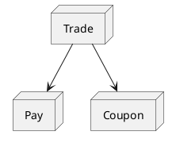
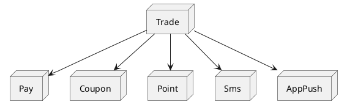
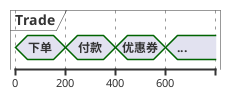

上一家公司并没有用消息队列中间件，大学里对[ActiveMQ](https://activemq.apache.org/)有所了解但并未深入研究，[RocketMQ](https://rocketmq.apache.org/)、[Kafka](https://kafka.apache.org/)也一直囿于听闻。不过在原来的项目中经常会用Redis的list实现一个分布式的阻塞队列。在短信营销任务中，会将服务的同步调用改为异步任务存入队列表，Worker批量调度以提高吞吐量，并降低大促期间大批量短信同步调用带来的压力。我觉得后面这一点也非常接近消息队列所要实现的需求。然后受益于[隆基](https://www.atatech.org/users/13788)前辈的[阿里消息中间件架构演进之路：notify和metaq](https://www.atatech.org/articles/95456)一文，用这篇小笔记总结下我对消息队列的认识和理解。

# 1、为什么用消息队列

任何技术的诞生都有它背后的故事，消息队列肯定也是为了解决某些已有的问题才出现的。


## 1.1、解耦

比如对于一个分布式的电商网站，最初订单系统只需要接入支付系统的接口。后面网站又拓展了优惠券模块也需要接入订单系统。



随着需求和业务的发展，后面加了短信模块、积分模块。可能觉得发短信通知成本有点高，又替换成了App上的消息通知等。



如果用传统的RPC接口方式同步调用，可能是这样的：

```java
void createTrade(...) {
  doCreateTrade(args);                    // 订单系统自己进行下单操作
  payService.payTrade(tid);               // 付款系统的接口进行扣款操作
  couponService.applyCoupon(couponId);    // 优惠券系统将优惠券使用掉
  smsService.sendSms(content);            // 短信系统发送短信
  pointService.givePoint();               // 积分系统赠送积分
  appPushService.sendPush();              // 应用推送系统发送推送消息
}
```

任何一个业务需求的添加或改动都需要修改订单系统的代码，这对于维护订单系统的同学来说简直是噩梦。

如果中间有消息队列，那订单系统只需要关系下单付款的核心流程，然后发一个下单消息到消息队列中，其他系统拿到消息爱干嘛干嘛去。如果网站有新模块需要用到下单消息，只需从消息队列订阅，订单系统不用修改代码。订单系统的代码也变得简洁多了：

```java
void createTrade(...) {
  doCreateTrade(args);                    // 订单系统自己进行下单操作
  payService.payTrade(tid);               // 付款系统的接口进行扣款操作
  mq.sendMessage(msg);
}
```


## 1.2、异步

原来的订单系统会调用多个外部服务，每个服务的调用都会消耗一定的时间，随着接入的系统增多，整个下单流程的时间肯定会线性增长。这对于电商这样的互联网应用来说肯定是不能容忍的——用户的耐心是有限的，下个单loading半天鬼才用你家软件呢。




而如果使用消息队列，优惠券、积分、短信等外部系统可以异步处理消息，这明显降低了调用时长。


## 1.3、削峰

双十一这种大促对于所有涉及到电商业务的网站都是大考，我上一家公司是做isv业务的，也不例外。之前的项目主要是为淘宝店铺发营销短信，在双十一前一两个礼拜开始就有大量的店铺发各种促销短信，那几天的短信量有时甚至可以顶得上平常大半年的短信量。而系统当时使用的策略是将营销模块提交的一条条短信记录存在短信网关的一张队列表里，短信网关调度任务会批量从队列表拿出短信，处理后再批量地发送给下游的网关通道商——这种方式也确实达到了削峰填谷的作用。

> 听之前同事说，项目最早的使用的是同步的RPC调用，短信网关只是对多个下游网关通道商的抽象。后来由于明显的性能瓶颈才改为了异步批量发送的方式。

双十一当晚秒杀对于阿里本身的电商系统也是一场大考验，为了保证订单、付款等系统不被泄洪般的流量冲垮。需要在系统前“造一个蓄水池”，系统再根据自身性能不紧不慢地处理掉“蓄水池”中的数据——细水长流才能可持续发展。


由于新的链路上消息队列和数据库一样都扮演着重要角色，这也意味着消息中间件也必须保证高可用。


# 2、消息怎么存储

消息被暂存到中间的[消息代理(Message broker)](https://en.wikipedia.org/wiki/Message_broker)上，消息具体如何存储是首要解决的问题。


## 2.1、数据库

就像我之前项目一样，在数据库中创建一张队列表存储——也就是所谓“工作队列”，其实就是将任务插入到数据表中，通常需要任务调度进行处理，然后将其标记为已完成。

Apache下的ActiveMQ就可以选用[JDBC方式](https://activemq.apache.org/jdbc-support)来做[消息持久化](https://activemq.apache.org/persistence)（ActiveMQ默认是使用内建的[kahadb](https://activemq.apache.org/kahadb)）。从[源代码](https://github.com/apache/activemq/blob/activemq-5.15.x/activemq-jdbc-store/src/main/java/org/apache/activemq/store/jdbc/Statements.java)中可以看出ActiveMQ会创建一张`ACTIVEMQ_MSGS`的表：

```sql
CREATE TABLE ACTIVEMQ_MSGS(
  ID BIGINT NOT NULL, 
  CONTAINER VARCHAR(250) NOT NULL, 
  MSGID_PROD VARCHAR(250), 
  MSGID_SEQ BIGINT, 
  EXPIRATION BIGINT, 
  MSG BLOB, 
  PRIMARY KEY (ID) 
)
```


但使用[队列表经常会引起性能问题](https://www.xaprb.com/blog/2011/09/15/5-subtle-ways-youre-using-mysql-as-a-queue-and-why-itll-bite-you/)，主要有三个原因：

1. **轮询**。通常系统都有一个或多个Worker进程来检查队列表中是否有消息需要处理。在负载很大的应用程序中，这很容易造成问题。

   > 解决这个问题的方法要么寄希望于数据库的通知功能，可惜MySQL没有。要么使用长轮询降低查询频率，这也意味着实时性有所下降，需要根据业务要求对轮询频率进行权衡。

2. **锁**。轮询后的消息具体处理逻辑通常是这样的：运行`select for update`查出需要处理的任务，然后运行`update`标记成“执行中”，最后处理完了再标记成“已完成”。当然不一定是使用`select for update`，但是为了保证消息只被一个工作线程处理，肯定会使用其他同步互斥技术。

   > 上一个项目里，一个worker进程对接指定的几个分库，数据库按用户水平拆分，所以不涉及多台机器争抢一条数据的问题。只需要在内存中(`ConcurrentHashMap`)存储当前正在running的任务，之后轮询出来的任务需要先reject掉running的任务，再提交到线程池执行。
   >
   > 当然这种策略的问题在于如果任务集中在一个Worker上，会导致负载不均衡。这个问题可能就涉及到集团的`SchedulerX`分布式调度里的网格任务了。

3. **数据增长**。随着时间流逝，队列表可能会堆积数百万甚至几亿的数据。而真正需要处理的消息可能只有几百几千条。

   > 避免这个问题也很简单，将处理完的消息删除掉，如有需要可以转储到另一个表里。这样就能保证队列表保持相对合适的数据量。
   >
   > 但是面对有大量消息堆积的应用，比如双十一期间的电商网站，一下子上亿的数据量存储在数据库中肯定对性能有所影响，因为数据增长到一定数量级后，B+树层级会变得更深，从而会导致I/O次数的增加。

## 2.2、分布式KV存储

> 之前也在用Redis做消息队列，主要是使用了list的阻塞功能，以实现消息的实时处理：比如用户的物流信息有变化会立即`lpush`写入队列，后台会使用`brpop`的阻塞方式取出消息交给Worker线程处理，这样避免了高频率轮询数据库导致压力，也避免了长轮询导致消息处理不够及时。
>
> 但是Redis的list用作消息队列有几个缺点：
>
> 1、 Redis不能完全保证持久化，[aof和 rdb各有优缺点](https://redis.io/topics/persistence)
>
> 2、 不能重复消费，Worker从list取出来后，如果有异常消息就丢失了。有一种方式是维护`pending`和`doing`两个list，将需要处理的任务从`pending`取出来放到`doing`中，并使用[`rpoplpush`](https://redis.io/commands/rpoplpush)保证这个操作的原子性，消费成功后再从`doing`中删除。
>
> 3、 list支持一个消费者，不支持多消费者订阅。这个可以由Redis提供了[pub-sub](https://redis.io/topics/pubsub)的解决。
>
> 总体来说，Redis本身更适合做缓存，针对消息队列，Redis作者另外提供了[Disque](https://github.com/antirez/disque)。

ActiveMQ中还支持[LevelDB的持久化方式](https://activemq.apache.org/leveldb-store)。[LevelDB](https://github.com/google/leveldb)是谷歌开源的一款支持**持久化的KV存储引擎**，它使用一种`append-only`的索引结构[LSM-Tree(基于日志结构的合并树)](https://en.wikipedia.org/wiki/Log-structured_merge-tree)来存储数据。由于先写入内存的MemTable，然后由Merge线程**顺序写入**到磁盘中的SSTable中，所以写入性能会比传统的关系型数据库好很多。但是因为LSM-Tree索引结构会按照一定的策略分成多个SSTable分段，这也意味着读取时会有多次I/O，所以读取性能会有所牺牲。而消息队列经常有消息消费失败后面临重试的情况，读取性能的降低势必会对系统性能有所影响。

## 2.3、基于文件顺序写的日志结构

目前业界较为常用的几款产品（[RocketMQ](http://rocketmq.apache.org/)/[Kafka](https://kafka.apache.org/)/[RabbitMQ](https://www.rabbitmq.com/)）均采用消息刷盘至文件系统来做持久化。

人们普遍认为“磁盘速度很慢”，但[有研究指出](https://queue.acm.org/detail.cfm?id=1563874)顺序的磁盘I/O有时甚至快于随机内存访问速度。


也正因此，现代操作系统提供了预读和延迟写入的技术，所谓“预读”就是以磁盘块(新硬盘一个扇区4KB)为单位读取，“延迟写”就是将小单元的写入聚集成块写入磁盘。这其实就和Java中`BufferedInputStream`和`BufferedOutputStream`预留8KB缓存原理一样。

现代操作系统越来越多地用到内存做磁盘数据的缓存，所以Java1.4出现的NIO技术也将原本在JVM层面的缓存转移到了操作系统层面——也就是`MappedByteBuffer`相关类。这主要因为构建在JVM上的缓存有几个缺点：

1、Java对象的内存开销更高。

2、堆数据的增加，Java GC触发的频率也会更高。

而使用操作系统缓存不仅解决了这些问题，还减少了内核缓存到应用层缓存的拷贝过程。此外重启应用，缓存仍然有效，而进程内的缓存重启后需要重建。这也简化了应用维护缓存的代码复杂度，因为所有用于维护缓存和文件系统之间一致性的逻辑现在都在操作系统中。

日志由于它`append-only`的特点，所以它的写入操作都是顺序的。

> 时至今日，已不知日志概念起源于何时了，因为它太简单了。但纵观日志的使用，从保证数据库的ACID到数据库间的数据复制，日志结构一直都扮演着重要角色。

起初使用ActiveMQ的[Linkedin公司](https://engineering.linkedin.com/distributed-systems/log-what-every-software-engineer-should-know-about-real-time-datas-unifying)也正是基于日志的顺序写的思想开发出了以高吞吐量著称的[Kafka](https://kafka.apache.org/)。


# 3、集团的消息中间件——notify和metaq

看了[隆基](https://www.atatech.org/users/13788)前辈的[阿里消息中间件架构演进之路：notify和metaq](https://www.atatech.org/articles/95456)这篇文章，让我对集团这两个核心的中间件有了初步认识。

notify可以对标ActiveMQ。最早notify也确实是参考ActiveMQ的kaha实现的kv存储，到后来为了保证可靠性使用关系型数据库Oracle存储消息，随着集团的去IOE化战略，才全面迁移到MySQL集群存储。notify的[Message模型](http://gitlab.alibaba-inc.com/messaging/notify1/blob/master/notify-server/src/main/java/com/taobao/notify/server/domain/MessageEntity.java)设计如下：


而MetaQ则是受Kafka的影响开发的，最早第一版的名字["metamorphosis"](https://github.com/killme2008/Metamorphosis)，是奥地利作家卡夫卡的名作——《变形记》，这算是对Kafka的致敬吧。

但MetaQ在设计上和Kafka略有不同。Kafka对于每个[Topic都会维护一个分区日志](https://kafka.apache.org/intro#intro_topics)。


一旦topic数量增多，broker的分区文件数也会随着增大，本来高性能的顺序写文件会变成随机写，吞吐量会有较大的下降。

所以MetaQ2.0时就对存储层进行了重新设计，结构如下图所示：


MetaQ存储的核心是实现一个持久化的分布式队列，重新设计后的MetaQ抽象出了CommitLog和Consume queue。其中CommitLog属于物理队列，存储完整的消息数据，不定长记录，也起到了类似redo log的功能，一旦CommitLog落盘成功，消息就不会丢失；所有Topic的消息都会写入到同一个CommitLog，哪怕单机一万个topic，还是能保持顺序写，保障吞吐量。Consume queue可以认为是逻辑队列、索引队列，每个topic的消息在写完CommitLog之后，都会写到独立的Consume queue；队列里的每个元素为定长记录，元素内容包含该消息在对应CommitLog的`offset`和`size`。基于这样的存储结构，MetaQ对客户端暴露的主要是Consume queue逻辑视图，提供队列访问接口。消费者通过指定Consume queue的位点来读取消息，通过提交Consume queue的位点来维护消费进度。

也许你会问，Consumer queue也是随机I/O，为什么相比Kafka就能支持更多的Topic呢？原因就是利用了[操作系统文件缓存(MappedByteBuffer)](http://gitlab.alibaba-inc.com/middleware/metaq/blob/master/metaq-store/src/main/java/com/taobao/metaq/store/MapedFile.java)。因为Consumer queue只存储消息的`offset`和`size`等信息，数据量比较小，所以Consumer queue的读写基本都能命中缓存，原本低性能的随机I/O大多都变成了内存读写。

根据[阿里云团队的压测结果](https://www.alibabacloud.com/blog/kafka-vs-rocketmq--multiple-topic-stress-test-results_69781)可以看出，在Topic较多的情况下，Kafka的性能有大幅下降，而RocketMQ相对受影响较小。


参考链接：

MQ是什么：https://www.zhihu.com/question/54152397/answer/657234090

5 subtle ways you're using mysql as a queue and why it'll bite you：https://www.xaprb.com/blog/2011/09/15/5-subtle-ways-youre-using-mysql-as-a-queue-and-why-itll-bite-you/

The Log: What every software engineer should know about real-time data's unifying abstraction：https://engineering.linkedin.com/distributed-systems/log-what-every-software-engineer-should-know-about-real-time-datas-unifying

一个简单的 MySQL 批量事务消息队列：https://zhuanlan.zhihu.com/p/130494984

Kafka介绍：https://kafka.apache.org/intro

Kafka的持久化：https://kafka.apache.org/documentation/#persistence

阿里消息中间件架构演进之路：notify和metaq：https://www.atatech.org/articles/95456

RocketMQ消息存储：https://zhuanlan.zhihu.com/p/92125985

RocketMQ vs. ActiveMQ vs. Kafka：http://rocketmq.apache.org/docs/motivation/#rocketmq-vs-activemq-vs-kafka

Notify和Metaq ——学习总结：https://www.atatech.org/articles/36160

Kafka vs. Apache RocketMQ™- Multiple Topic Stress Test Results：https://www.alibabacloud.com/blog/kafka-vs-rocketmq--multiple-topic-stress-test-results_69781

JMS vs. AMQP：http://www.mastertheboss.com/jboss-server/jboss-jms/comparing-messaging-standards-jms-vs-amqp

消息队列设计精要：https://tech.meituan.com/2016/07/01/mq-design.html

消息队列RabbitMQ自研之路：https://www.atatech.org/articles/160175

MetaQ再学习-消息存储：https://www.atatech.org/articles/114508

谈谈 RocketMQ 消息存储的设计与实现：https://www.atatech.org/articles/145197

rocketmq详解之消息存储机制：https://www.atatech.org/articles/129514

比较RocketMQ与Kafka的消息存储方式及RocketMQ源码分析：https://www.atatech.org/articles/127436


其他MQ产品：

https://github.com/akullpp/awesome-java#messaging

HornetQ：https://hornetq.jboss.org/

Pulsar：https://pulsar.apache.org/

ZeroMQ：https://zeromq.org/

TubeMQ：https://tubemq.apache.org/en-us/

qmq：https://github.com/qunarcorp/qmq
