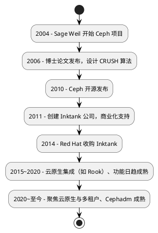

## Ceph

Ceph 是一个分布式存储系统，提供块、文件和对象存储三个层次的抽象，并已部署在大规模生产集群中。

```lua
+------------------------+
| 应用层 / 客户端       |
+------------------------+
| 对象存储（API访问）   |  <-- 最高抽象
+------------------------+
| 文件存储（路径访问）   |  <-- 中等抽象
+------------------------+
| 块存储（原始块设备）   |  <-- 最底层
+------------------------+
| 物理磁盘、SSD 等       |
```

| 特性     | 块存储（Block）        | 文件存储（File）       | 对象存储（Object）       |
| ------ | ----------------- | ------------------ | ---------------- |
| 访问方式   | 以块为单位（如磁盘）        | 以路径访问（/dir/file） | 以对象+ID 访问（API）     |
| 协议/API | iSCSI、RBD、NVMe-oF | NFS、CIFS、CephFS  | S3、Swift、HTTP REST |
| 元数据支持  | 无                 | 基本文件属性           | 支持丰富自定义元数据         |
| 扩展性    | 中                 | 中到强（如 CephFS）    | 极强（对象存储优于其他）       |
| 并发能力   | 高                 | 中（锁机制有时成瓶颈）      | 高                  |
| 应用场景   | 数据库、VM、K8S 卷      | 文件共享、工程文件存储      | 云应用、日志、备份、AI       |
| 文件系统支持 | 客户端自己创建           | 有                | 无（扁平结构）            |

Ceph的历史比Hadoop更久远。Hadoop的HDFS是文件存储层的抽象，并且由于块粒度为128MB，所以只适合大数据应用。MinIO使用兼容Amazon S3 API的对象存储，抽象层次更高，MinIO也可以使用Ceph作为底层存储。



Ceph本身三个层次的抽象都支持，块存储（RBD）、文件存储（CephFS）、对象存储（RGW）


| 抽象层级     | Ceph 组件                 | 对应场景                       | 说明                        |
| -------- | ----------------------- | -------------------------- | ------------------------- |
| **块存储**  | RBD（RADOS Block Device） | VM磁盘、数据库持久卷、Kubernetes PVC | 提供类似于裸盘或云硬盘（如 AWS EBS）的能力 |
| **文件存储** | CephFS                  | 文件共享、POSIX 文件系统、高性能计算      | 提供类似 NFS 的 POSIX 文件系统语义   |
| **对象存储** | RGW（RADOS Gateway）      | 云原生应用、备份归档、大数据存储           | 提供兼容 S3、Swift 的对象接口       |

## 在K8S中使用Ceph

目前在K8S中使用Ceph有两种方式：

* 直接使用 Ceph（你自己搭建、管理 Ceph 集群，再通过 [Ceph-CSI](https://github.com/ceph/ceph-csi) 接入 K8S）
* 使用 Rook-Ceph（通过 Kubernetes Operator 部署和管理 Ceph，完全云原生）


