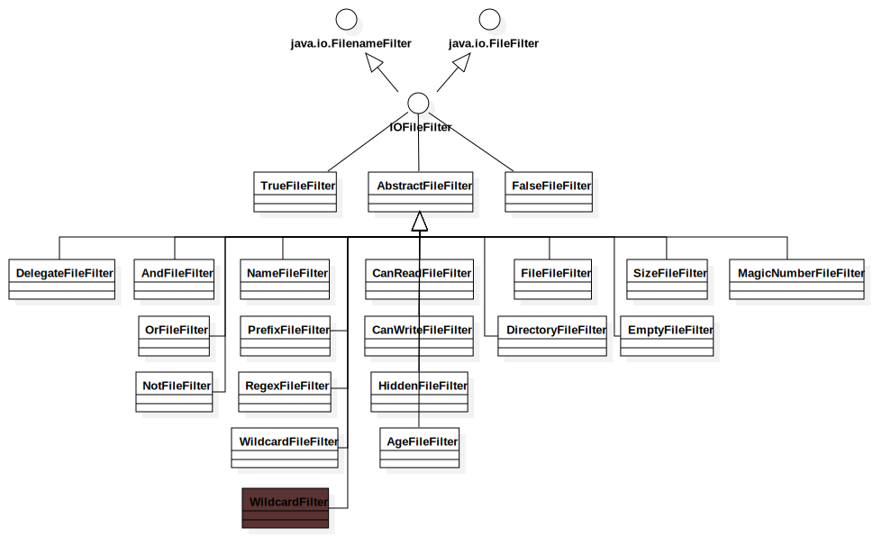

## ileDescriptor

FileDescriptor，顾名思义：“文件描述符”，用来表示开放文件、开放套接字。这个概念来自于`*nux`文件系统，Linux继承Unix **“一切皆文件”** 的概念：

|       文件类型        | 标记符  |
| :---------------: | :--: |
|       普通文件        |  -   |
|  目录文件（directory）  |  d   |
| 字符设备文件（character） |  c   |
|   块设备文件（block）    |  b   |
|   套接字文件（socket）   |  s   |
|    管道文件（pipe）     |  p   |
|    链接文件（link）     |  l   |


POSIX标准中打开文件的函数如下：

```c
// 这里返回的int值就是FileDescriptor
int open(const char *path, int oflag, .../*,mode_t mode */);
```

> 这里返回的int值就是FileDescriptor，它被用来标识一个文件，你可以把它理解为一个“文件句柄”。
>
> 但是只有FileDescriptor，我们是无法读写文件的，我们还需要FileInputStream、FileOutputStream或RandomAccessFile等类来实现文件的读写。这几个类的使用下面会依次讲到。

而操作系统中有三个标准的I/O流：

| FileDescriptor |  名称   | POSIX常量标识(unistd.h) | 标准IO常量标识(stdio.h) |
| :------------: | :---: | :-----------------: | :---------------: |
|       0        | 标准输入流 |    STDIN_FILENO     |       stdin       |
|       1        | 标准输出流 |    STDOUT_FILENO    |      stdout       |
|       2        | 标准错误流 |    STDERR_FILENO    |      stderr       |


FileDescriptor类中也定义了这三个常量：

```java
    public static final FileDescriptor in = standardStream(0);

    public static final FileDescriptor out = standardStream(1);

    public static final FileDescriptor err = standardStream(2);
```

但是通常我们都是通过System中的三个常量来使用标准I/O流，因为它已经帮我们封装好了：

```java
    public final static InputStream in = null;
    public final static PrintStream out = null;
    public final static PrintStream err = null;
    public static void setIn(InputStream in) {
        checkIO();
        setIn0(in);
    }
    public static void setOut(PrintStream out) {
        checkIO();
        setOut0(out);
    }
    public static void setErr(PrintStream err) {
        checkIO();
        setErr0(err);
    }
	private static native void setIn0(InputStream in);
    private static native void setOut0(PrintStream out);
    private static native void setErr0(PrintStream err);
    private static void initializeSystemClass() {
		...
        FileInputStream fdIn = new FileInputStream(FileDescriptor.in);
        FileOutputStream fdOut = new FileOutputStream(FileDescriptor.out);
        FileOutputStream fdErr = new FileOutputStream(FileDescriptor.err);
        setIn0(new BufferedInputStream(fdIn));
        setOut0(newPrintStream(fdOut, props.getProperty("sun.stdout.encoding")));
        setErr0(newPrintStream(fdErr, props.getProperty("sun.stderr.encoding")));
        ...
	}
```

> 有关标准I/O的内容可以参考[《JavaIO总结与巩固》](http://blog.csdn.net/holmofy/article/details/72626387)

## ile

FileDescriptor为文件的读写功能提供了基础，而File则是提供文件的增删查功能。

在Java中File更像是一个文件路径，只是Java在File类中还提供了文件的**增删查**的操作。所以File类是个“大杂烩”，功能相当的丰富。也许正是因为File类功能太多，在Java1.7的NIO2中把它的功能划分成了`Path`和`Files`两个类。

> 有关NIO的内容会在后续的文章中讲到


File的功能大部分是由FileSystem类来实现的，而FileSystem的实现类根据平台分为两种：`WinNTFileSystem`代表微软的Windows系列的操作系统，`UnixFileSystem`代表了BSD，Linux，MaxOS为首遵循POSIX规范的类Unix系统，但FileSystem及其实现类我们无法直接使用它(因为是package访问级别)。

> 注意这里的FileSystem不是`java.nio.file`包中的FileSystem。

File类有四个公有的构造方法：

* `public File(String pathname)`

  路径名可以是相对路径，也可以使绝对路径，pathname不能为null，如果pathname为空字符串，将会构造空的抽象路径


* `public File(String parent, String child)`

* `public File(File parent, String child)`

  两个参数的构造方法中，当父路径为空，构造器不会用当前路径去解析子路径，而是将`FileSystem.getDefaultParent()`方法的返回值作为父路径，在类Unix系统中这个默认父路径为`/`根目录，而在微软的Windows系统中默认父路径为`\\`，也就是当前磁盘根目录。

  > Windows将磁盘分为多个分区，每个分区使用一个磁盘标签。如`C:\`代表C盘根目录，`D:\`代表D盘根目录...
  >
  > 类Unix系统将磁盘分区后，将分区挂载在`/`根目录下。如`/home`可以作为一个分区挂载在`/`根目录下。

* `public File(URI uri)` @since 1.4

  通过解析以`file:`开头的URI来作为文件路径。-


> 以上的构造方法中都调用了`FileSystem.normalize`方法来对文件路径进行解析。

**示例：**

```java
	@Test
	public void test() throws URISyntaxException {
		File file1 = new File("a.txt");
		System.out.println(file1);
		File file2 = new File("");
		System.out.println(file2);
		File file3 = new File("D:/dir/a.txt");
		System.out.println(file3);
		File file4 = new File("D:/dir", "a.txt");
		System.out.println(file4);
		File file5 = new File("", "a.txt");
		System.out.println(file5);
		File file6 = new File(new File("D:/dir"), "a.txt");
		System.out.println(file6);
		File file7 = new File(new File(""), "a.txt");
		System.out.println(file7);
		File file8 = new File(new URI("file:/D:/dir/a.txt"));
		System.out.println(file8);
		File file9 = new File(new URI("file:/a.txt"));
		System.out.println(file9);
	}
```

输出结果：

```shell
a.txt

D:\dir\a.txt
D:\dir\a.txt
\a.txt
D:\dir\a.txt
\a.txt
D:\dir\a.txt
\a.txt
```

> File类会帮我们自动把`/`转成Windows上的`\`。

* 在类Unix系统中目录分隔符为`/`，在Windows上目录分隔符为`\\`(前一个`\`用于转义)。

  类Unix：`/home/user/file`，

  Windows：`D:\dir\file`


* 在类Unix系统中路径分隔符为`:`，在Windows上路径分隔符为`;`。

  类Unix：`export PATH = $PATH:/user/local/Xxx/bin`，`$PATH`是取出PATH变量的值

  Windows：`set PATH = %PATH%;D:\Program Files\Xxx\bin`，`%PATH%`是取出PATH变量的值

## File相关方法

File类的方法可以分为以下几类：

### 1. 路径操作

| Path-component accessors | Period          | Explain     |
| ------------------------ | --------------- | ----------- |
| String getName()         | @since   JDK1.0 | 获取文件名       |
| String getPath()         | @since   JDK1.0 | 获取抽象路径      |
| String getParent()       | @since   JDK1.0 | 获取父目录路径     |
| File getParentFile()     | @since 1.2      | 获取父目录File对象 |

| Path operations           | Period          | Explain                        |
| ------------------------- | --------------- | ------------------------------ |
| boolean isAbsolute()      | @since   JDK1.0 | 路径是否为绝对路径                      |
| String getAbsolutePath()  | @since   JDK1.0 | 获取绝对路径                         |
| File getAbsoluteFile()    | @since 1.2      | 获取绝对路径的File对象                  |
| String getCanonicalPath() | @since   JDK1.1 | 获取权威绝对路径                       |
| File getCanonicalFile()   | @since 1.2      | 获取权威绝对路径的File对象                |
| ~~URL toURL()~~           | @since   1.2    | 将路径转成URL，被弃用(可使用URI.toURL方法转换) |
| URI toURI()               | @since 1.4      | 将路径转成URI                       |

> `getPath`、`getAbsolutePath`与`getCanonicalPath`的区别可用以下概念区别(StackOverflow的一位大神一语道破)：
>
> * `C:\temp\file.txt` - 是Path, 是AbsolutePath，也是CanonicalPath.
> * `.\file.txt` - 是Path，但既不是AbsolutePath，也不是CanonicalPath.
> * `C:\temp\myapp\bin\..\\..\file.txt` - 是Path，也是AbsolutePath，但不是CanonicalPath.
>
> 因为File的路径可能是多个路径字符串拼凑而成，所以绝对路径就有了AbsolutePath和CanonicalPath的分别

**示例：**

```java
package cn.hff.io;

import java.io.File;
import java.io.IOException;
import java.net.URI;
import java.net.URISyntaxException;
import java.util.ArrayList;
import java.util.List;

import org.junit.Before;
import org.junit.Test;

public class FileTest {

	private List<File> files = new ArrayList<File>();

	@Before
	public void setup() throws URISyntaxException {
		files.add(new File("a.txt"));
		files.add(new File(""));
		files.add(new File("D:/dir/a.txt"));
		files.add(new File("D:/dir", "a.txt"));
		files.add(new File("D:/dir/innerdir/", "../a.txt"));
		files.add(new File("", "a.txt"));
		files.add(new File(new File("D:/dir"), "a.txt"));
		files.add(new File(new File(""), "a.txt"));
		files.add(new File(new URI("file:/D:/dir/a.txt")));
		files.add(new File(new URI("file:/a.txt")));
	}

	@Test
	public void testPath() throws IOException {
		for (File file : files) {
			pathOperation(file);
		}
	}

	public void pathOperation(File file) throws IOException {
		System.out.println("----------" + file + "----------");
		System.out.println("Name:" + file.getName());
		System.out.println("Path:" + file.getPath());
		System.out.println("Parent:" + file.getParent());
		System.out.println("IsAbsolute:" + file.isAbsolute());
		System.out.println("AbsolutePath:" + file.getAbsolutePath());
		System.out.println("CanonicalPath:" + file.getCanonicalPath());
		System.out.println("ParentFile:" + file.getParentFile());
		System.out.println("AbsoluteFile:" + file.getAbsoluteFile());
		System.out.println("CanonicalFile:" + file.getCanonicalFile());
		System.out.println("URI:" + file.toURI());
	}
}
```

输出结果：

```shell
----------a.txt----------
Name:a.txt
Path:a.txt
Parent:null
IsAbsolute:false
AbsolutePath:D:\java\Apache Commons\commons-io2.5\a.txt
CanonicalPath:D:\java\Apache Commons\commons-io2.5\a.txt
ParentFile:null
AbsoluteFile:D:\java\Apache Commons\commons-io2.5\a.txt
CanonicalFile:D:\java\Apache Commons\commons-io2.5\a.txt
URI:file:/D:/java/Apache%20Commons/commons-io2.5/a.txt
--------------------
Name:
Path:
Parent:null
IsAbsolute:false
AbsolutePath:D:\java\Apache Commons\commons-io2.5
CanonicalPath:D:\java\Apache Commons\commons-io2.5
ParentFile:null
AbsoluteFile:D:\java\Apache Commons\commons-io2.5
CanonicalFile:D:\java\Apache Commons\commons-io2.5
URI:file:/D:/java/Apache%20Commons/commons-io2.5/
----------D:\dir\a.txt----------
Name:a.txt
Path:D:\dir\a.txt
Parent:D:\dir
IsAbsolute:true
AbsolutePath:D:\dir\a.txt
CanonicalPath:D:\dir\a.txt
ParentFile:D:\dir
AbsoluteFile:D:\dir\a.txt
CanonicalFile:D:\dir\a.txt
URI:file:/D:/dir/a.txt
----------D:\dir\a.txt----------
Name:a.txt
Path:D:\dir\a.txt
Parent:D:\dir
IsAbsolute:true
AbsolutePath:D:\dir\a.txt
CanonicalPath:D:\dir\a.txt
ParentFile:D:\dir
AbsoluteFile:D:\dir\a.txt
CanonicalFile:D:\dir\a.txt
URI:file:/D:/dir/a.txt
----------D:\dir\innerdir\..\a.txt----------
Name:a.txt
Path:D:\dir\innerdir\..\a.txt
Parent:D:\dir\innerdir\..
IsAbsolute:true
AbsolutePath:D:\dir\innerdir\..\a.txt
CanonicalPath:D:\dir\a.txt
ParentFile:D:\dir\innerdir\..
AbsoluteFile:D:\dir\innerdir\..\a.txt
CanonicalFile:D:\dir\a.txt
URI:file:/D:/dir/innerdir/../a.txt
----------\a.txt----------
Name:a.txt
Path:\a.txt
Parent:\
IsAbsolute:false
AbsolutePath:D:\a.txt
CanonicalPath:D:\a.txt
ParentFile:\
AbsoluteFile:D:\a.txt
CanonicalFile:D:\a.txt
URI:file:/D:/a.txt
----------D:\dir\a.txt----------
Name:a.txt
Path:D:\dir\a.txt
Parent:D:\dir
IsAbsolute:true
AbsolutePath:D:\dir\a.txt
CanonicalPath:D:\dir\a.txt
ParentFile:D:\dir
AbsoluteFile:D:\dir\a.txt
CanonicalFile:D:\dir\a.txt
URI:file:/D:/dir/a.txt
----------\a.txt----------
Name:a.txt
Path:\a.txt
Parent:\
IsAbsolute:false
AbsolutePath:D:\a.txt
CanonicalPath:D:\a.txt
ParentFile:\
AbsoluteFile:D:\a.txt
CanonicalFile:D:\a.txt
URI:file:/D:/a.txt
----------D:\dir\a.txt----------
Name:a.txt
Path:D:\dir\a.txt
Parent:D:\dir
IsAbsolute:true
AbsolutePath:D:\dir\a.txt
CanonicalPath:D:\dir\a.txt
ParentFile:D:\dir
AbsoluteFile:D:\dir\a.txt
CanonicalFile:D:\dir\a.txt
URI:file:/D:/dir/a.txt
----------\a.txt----------
Name:a.txt
Path:\a.txt
Parent:\
IsAbsolute:false
AbsolutePath:D:\a.txt
CanonicalPath:D:\a.txt
ParentFile:\
AbsoluteFile:D:\a.txt
CanonicalFile:D:\a.txt
URI:file:/D:/a.txt
```

> Demo输出有点长，区别很细微，最好是自己敲一遍

### 2. 访问属性

| Attribute accessors   | Period          | Explain  |
| --------------------- | --------------- | -------- |
| boolean canRead()     | @since   JDK1.0 | 文件是否可读   |
| boolean canWrite()    | @since   JDK1.0 | 文件是否可写   |
| boolean canExecute()  | @since 1.6      | 文件是否可执行  |
| boolean exists()      | @since   JDK1.0 | 文件是否存在   |
| boolean isDirectory() | @since   JDK1.0 | 是否为目录文件  |
| boolean isFile()      | @since   JDK1.0 | 是否为普通文件  |
| boolean isHidden()    | @since 1.2      | 是否为隐藏文件  |
| long lastModified()   | @since   JDK1.0 | 上次修改的时间戳 |
| long length()         | @since   JDK1.0 | 文件长度     |

上面方法可能在Windows体现不是很明显，Linux上对于读、写、执行的权限管理非常严格。


### 3. 文件操作

| File operations                          | Period          | Explain                                |
| ---------------------------------------- | --------------- | -------------------------------------- |
| boolean createNewFile()                  | @since 1.2      | 创建新文件，类似于`touch`命令                     |
| boolean delete()                         | @since   JDK1.0 | 删除文件，类似于`rm`命令                         |
| void deleteOnExit()                      | @since 1.2      | 程序退出时删除文件(通过添加程序退出是的钩子实现)              |
| String[] list()                          | @since   JDK1.0 | 列出目录下的文件名，类似于`ls`命令                    |
| String[] list(FilenameFilter filter)     | @since   JDK1.0 | 根据文件名过滤器滤出文件名，类似于`ls | grep *.txt`管道过滤 |
| File[] listFiles()                       | @since  1.2     | 列出目录下的文件                               |
| File[] listFiles(FilenameFilter filter)  | @since  1.2     | 根据文件名过滤器滤出文件                           |
| File[] listFiles(FileFilter filter)      | @since  1.2     | 根据文件过滤器滤出文件                            |
| boolean mkdir()                          | @since   JDK1.0 | 创建目录(如果父目录不存在，返回false)，类似于`mkdir`命令    |
| boolean mkdirs()                         | @since   JDK1.0 | 创建目录(如果父目录不存在，递归创建父目录)，类似于`mkdir -p`命令 |
| boolean renameTo(File dest)              | @since   JDK1.0 | 重命名(可用作文件移动)，类似于`mv`命令                 |
| boolean setLastModified(long time)       | @since 1.2      | 设置文件的最后修改时间，类似于`touch -m`命令            |
| boolean setReadOnly()                    | @since 1.2      | 设置文件为只读模式                              |
| boolean setWritable(boolean writable, boolean ownerOnly) | @since 1.6      | 设置文件可写属性(ownerOnly用于设置只针对文件所有者)        |
| boolean setWritable(boolean writable)    | @since 1.6      | setWritable(writable, true);           |
| boolean setReadable(boolean readable, boolean ownerOnly) | @since 1.6      | 设置文件可读属性(ownerOnly用于设置只针对文件所有者)        |
| boolean setReadable(boolean readable)    | @since 1.6      | setReadable(readable, true);           |
| boolean setExecutable(boolean executable, boolean ownerOnly) | @since 1.6      | 设置文件可执行属性(ownerOnly用于设置只针对文件所有者)       |
| boolean setExecutable(boolean executable) | @since 1.6      | setExecutable(executable, true);       |

> Linux中可使用chmod对文件的读、写、执行权限进行修改。

这里有五个目录相关的方法——列出目录下的所有文件(名)

```java
// 目录下的所有文件名
public String[] list() {
    SecurityManager security = System.getSecurityManager();
    if (security != null) {
        security.checkRead(path);
    }
    if (isInvalid()) {
        return null;
    }
    // 调用相应平台的FileSystem对象的list方法
    return fs.list(this);
}
// 根据文件名过滤器指定的规则获取目录下的所有文件
public String[] list(FilenameFilter filter) {
    String names[] = list();// 先获取目录下所有的文件名
    if ((names == null) || (filter == null)) {
        return names;
    }
    List<String> v = new ArrayList<>();
    for (int i = 0 ; i < names.length ; i++) {
        // 根据文件名规则过滤文件
        if (filter.accept(this, names[i])) {
            v.add(names[i]);
        }
    }
    return v.toArray(new String[v.size()]);
}
// 获取目录下所有文件的File对象
public File[] listFiles() {
    String[] ss = list();// 先获取目录下所有的文件名
    if (ss == null) return null;
    int n = ss.length;
    File[] fs = new File[n];
    for (int i = 0; i < n; i++) {
        // 为每个文件名创建File对象
        fs[i] = new File(ss[i], this);
    }
    return fs;
}
// 根据文件名过滤器指定的规则获取目录下的所有文件对应的File对象
public File[] listFiles(FilenameFilter filter) {
    String ss[] = list();
    if (ss == null) return null;
    ArrayList<File> files = new ArrayList<>();
    for (String s : ss)
        // 根据文件名规则过滤文件名
        if ((filter == null) || filter.accept(this, s))
            // 符合要求的文件名创建File对象
            files.add(new File(s, this));
    return files.toArray(new File[files.size()]);
}
// 根据文件过滤器指定的规则获取目录下所有文件对应的File对象
public File[] listFiles(FileFilter filter) {
    String ss[] = list();// 先获取目录下所有的文件名
    if (ss == null) return null;
    ArrayList<File> files = new ArrayList<>();
    for (String s : ss) {
        File f = new File(s, this);
        // 根据文件规则过滤文件
        if ((filter == null) || filter.accept(f))
            files.add(f);
    }
    return files.toArray(new File[files.size()]);
}
```

Apache的`commons-io`库中有各种过滤器的实现，我画了张图概括commons-io中这些接口与类之间的继承关系（暗红色为已弃用的类）：



### 4. 磁盘空间

| Disk usage            | Period      | Explain        |
| --------------------- | ----------- | -------------- |
| long getTotalSpace()  | @since  1.6 | 获取文件所在磁盘的所有空间  |
| long getFreeSpace()   | @since  1.6 | 获取文件所在磁盘的可用空间  |
| long getUsableSpace() | @since  1.6 | 获取文件所在磁盘的不可用空间 |

> 上面三个方法的文件需要存在才能获取空间值，否则会返回0。

> Linux可使用`df`命令查看文件系统的使用情况，`du`命令可查看文件大小

**示例：**

```java
public class FileTest {
	@Test
	public void testDisk() {
		diskUsage(new File("D:\\"));
	}

	public void diskUsage(File file) {
		System.out.println("----------" + file + "----------");
		System.out.println(file.getTotalSpace());
		System.out.println(file.getFreeSpace());
		System.out.println(file.getUsableSpace());
	}
}
```

运行结果：

```shell
----------D:\----------
155342336000
129711624192
129711624192
```

> 注意：返回结果是字节数

###  5. 静态方法

1. 根路径

| Filesystem interface      | Period      | Explain   |
| ------------------------- | ----------- | --------- |
| static File[] listRoots() | @since  1.2 | 列出根路径下的文件 |

**示例：**

```java
	@Test
	public void testStatic() {
		File[] roots = File.listRoots();
		for (int i = 0; i < roots.length; i++) {
			System.out.println(roots[i]);
		}
	}
```

执行结果：

```java
C:\
D:\
E:\
F:\
```

2. 临时文件


| Temporary files                          | Period     | Explain                               |
| ---------------------------------------- | ---------- | ------------------------------------- |
| static File createTempFile(String prefix, String suffix, File directory) | @since 1.2 | 创建临时文件                                |
| static File createTempFile(String prefix, String suffix) | @since 1.2 | createTempFile(prefix, suffix, null); |

prefix标识文件名前缀，suffix标识文件名后缀，directory标识临时文件目录。

来看一下createTempFile的部分源码：

```java
	// 前缀长度不能小于3
	if (prefix.length() < 3)
	    throw new IllegalArgumentException("Prefix string too short");
	// 后缀为空，默认设为.tmp
	if (suffix == null)
	    suffix = ".tmp";

	// 临时文件目录为空时，使用默认的临时目录
	// 默认临时目录可通过java.io.tmpdir系统参数设置
	// 如果未设置，则使用系统环境变量TEMP中指定的目录
	File tmpdir = (directory != null) ? directory
	                                  : TempDirectory.location();
```


> **参考链接：**
>
> * 维基百科：https://en.wikipedia.org/wiki/File_descriptor