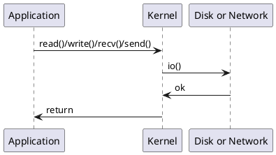
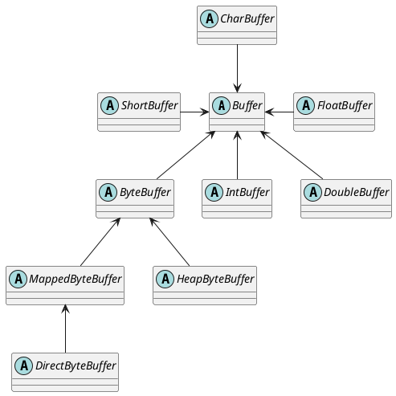
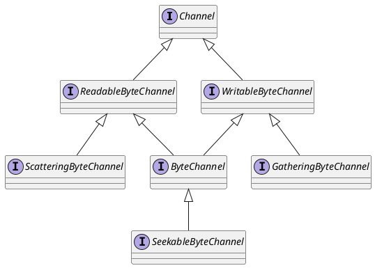
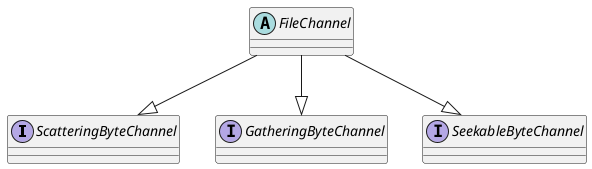
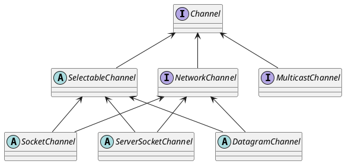

# 计算机存储体系结构


《计算机组成原理》里都学过计算机的存储结构，从CPU -> Cache -> Memory -> Disk 速度逐层递减，容量逐层增大。这主要是由于上层的CPU、Cache的制作成本高昂导致。

早期的计算机架构以南北桥[^1]架构为主，由于南北桥之前传输速率之差逐渐成为整体性能发挥的瓶颈，南北桥架构也就被淘汰了。


北桥被集成到CPU芯片内[^2]，南桥[^3]与其他的I/O功能逐渐演变成PCH(Platform Controller Hub[^4])

# 从PIO到DMA的演进


最早的内存与外围I/O设备的数据传输方式是Programmed input–output(PIO[^5])，它的过程是这样的：

- CPU 请求 I/O 操作；
- I/O 模块执行操作；
- I/O 模块设置状态位；
- CPU 定期检查状态位；

I/O 模块不直接通知 CPU，CPU 可能会等待或稍后返回，在编程下的 I/O 数据传输在CPU视角下非常像内存访问，I/O设备也有自己的地址[^6]，所以它也被叫做**Memory-mapped I/O** (**MMIO**)[^7]（注意：和后面讲的mmap要区分开）。

这种方式严重浪费CPU的时间，所以衍生了中断I/O[^8]：

- CPU 发出读命令
- I/O 模块从外设准备数据，而 CPU 做其他工作
- I/O 模块中断 CPU
- CPU读取数据

中断I/O基于CPU专门为IO设计的一类特殊指令，例如x86的in[^9]和out[^10]指令，这种基于IO端口指令的中断I/O也被叫做**port-mapped I/O** (**PMIO**)。

> 这里可以看[MMIO vs. PMIO相关讨论](https://stackoverflow.com/questions/15371953/memory-mapped-i-o-vs-port-mapped-i-o)


这两种模式都依赖CPU传输，传输过程中CPU不能做其他事情，随着网卡和磁盘等I/O设备需要传输的数据量越来越多，用CPU搬运肯定是忙不过来的。于是计算机科学家们设计了Direct Memory Access（DMA[^11]）来专门负责I/O设备与内存之间的拷贝。

什么是 DMA 技术？简单理解就是，**在进行 I/O 设备和内存的数据传输的时候，数据搬运的工作全部交给 DMA 控制器，而 CPU 不再参与任何与数据搬运相关的事情，这样 CPU 就可以去处理别的事务**。**DMA控制器就类似于一个小的CPU, 有自己的寄存器（记录主存地址和取到的字的count等）**。


# 用户态与内核态

Intel x86系列的第一个CPU 8086[^12]可以寻址1MB的内存(对应着20根地址总线$2^{20}=1MB$)，由于CPU寄存器是16位的，所以8086使用段寄存器和指针寄存器分段[^13]式访问应，用户程序和操作系统没有很明确的界限，都可以访问整个内存；用户程序退出就会到操作系统；用户程序触发软中断就到操作系统，中断处理结束又回到用户程序；用户程序自己可以访问大部分的硬件设备；用户程序甚至可以随意修改属于操作系统的数据。**用户程序的权限过大了，会导致五花八门的问题。**

Intel在80286[^14]地址总线变成了24根，可以寻址16MB，但是寄存器仍然是16位的，为了解决内存访问问题，Intel引入了保护模式[^15]。**保护模式下，内存使用分页方式访问**[^16]，操作系统通过维护一张页表[^17]来翻译用户真实的物理内存地址。这种方式能有效地防止用户程序的内存访问冲突，同时操作系统通过页面置换算法[^18]将物理内存置换到磁盘等外部设备，页面置换算法能将内存分配给最需要的程序，而且对于所有程序来说它们都拥有一个超大的虚拟内存[^19]。有了保护模式后为了兼容老的8086，将原来内存分段访问方式称为实模式（或者叫实地址模式）[^20]，CPU由BIOS启动后默认进入实模式，引导程序[^21]切换到实模式后开始加载操作系统。

操作系统上跑了应用程序，应用程序的访问权限应该收到限制，它不能任意访问计算机上的各种设备，**CPU要怎么区分当前在执行指令的程序到地址操作系统还是用户程序呢**？大多数CPU都提供了至少两种权限级别[^22]。


比如Intel的x86有这几种管理级别[^23]：ring1权限是硬件虚拟化模式([VT-x](https://en.wikipedia.org/wiki/VT-x) 和 [SVM](https://en.wikipedia.org/wiki/Secure_Virtual_Machine))，ring2是系统管理模式[^23]，ring3是[Intel Management Engine](https://en.wikipedia.org/wiki/Intel_Management_Engine) and [AMD Platform Security Processor](https://en.wikipedia.org/wiki/AMD_Platform_Security_Processor)。

用户的代码必须执行系统调用[^24]切换到内核模式，由操作系统的可信任代码执行I/O等一系列任务后将执行结果返回给用户空间。

简单点说，**就是用户程序中的代码只能在用户模式下执行，要执行I/O等操作必须调用系统函数交由内核去执行，内核可以将CPU切换到更高权限的访问级别，访问完成结果由内核返回给用户程序**。

# I/O读写的演进

执行I/O很显然要调用操作系统的接口，而Linux上I/O接口已经经过了很多轮演进

## Buffer I/O

最典型的就是以`read`/ `write`为代表的传统Buffer I/O。

```c
#include <sys/types.h>
#include <sys/uio.h>
#include <unistd.h>

ssize_t pread(int d, void *buf, size_t nbyte, off_t offset);
ssize_t read(int fildes, void *buf, size_t nbyte);

ssize_t pwrite(int fildes, const void *buf, size_t nbyte, off_t offset);
ssize_t write(int fildes, const void *buf, size_t nbyte);

#include <sys/socket.h>

ssize_t recv(int socket, void *buffer, size_t length, int flags);
ssize_t recvfrom(int socket, void *restrict buffer, size_t length, int flags, struct sockaddr *restrict address, socklen_t *restrict address_len);
ssize_t recvmsg(int socket, struct msghdr *message, int flags);

ssize_t send(int socket, const void *buffer, size_t length, int flags);
ssize_t sendmsg(int socket, const struct msghdr *message, int flags);
ssize_t sendto(int socket, const void *buffer, size_t length, int flags, const struct sockaddr *dest_addr, socklen_t dest_len);
```

```java
java.io.InputStream.read0();
java.io.OutputStream.writeBytes();
java.net.SocketInputStream.socketRead0();
java.net.SocketOutputStream.socketWrite0();
java.net.PlainDatagramSocketImpl.send0();
java.net.PlainDatagramSocketImpl.receive0();
java.nio.FileChannel.read(ByteBuffer dst);
java.nio.FileChannel.write(ByteBuffer src);
```

默认情况下这些接口读写I/O都会经过内核维护的缓冲区，比如对于文件读写内核维护一个Page Cache[^25]，这个PageCache的目的主要是为了加快硬盘文件的读写。


## Vectored I/O

[Vectored I/O](https://en.wikipedia.org/wiki/Vectored_I/O)也被称作**scatter/gather I/O**。就是一个调用读取多个缓冲区中写入文件，或者读取文件写入多个缓冲区。

```c
ssize_t preadv(int d, const struct iovec *iov, int iovcnt, off_t offset);
ssize_t readv(int d, const struct iovec *iov, int iovcnt);
ssize_t writev(int fildes, const struct iovec *iov, int iovcnt);
ssize_t pwritev(int fildes, const struct iovec *iov, int iovcnt, off_t offset);

struct iovec {
  char   *iov_base;  /* Base address. */
  size_t iov_len;    /* Length. */
};
```

```java
FileChannel.read(ByteBuffer[] dsts);
FileChannel.read(ByteBuffer[] dsts, int offset, int length);
FileChannel.write(ByteBuffer[] srcs);
FileChannel.write(ByteBuffer[] srcs, int offset, int length)
```

这几个API都是[POSIX标准](https://pubs.opengroup.org/onlinepubs/9699919799/functions/readv.html)定义的，主要目的有以下几个：

- [原子性](https://en.wikipedia.org/wiki/Atomicity_(programming))：如果特定的Vectored I/O 实现支持原子性，则进程可以在一组缓冲区中写入或读取文件，而不会存在另一个[线程](https://en.wikipedia.org/wiki/Thread_(computer_science))或[进程](https://en.wikipedia.org/wiki/Computer_process)可能对同一文件执行 I/O 的风险，损害输入的完整性
- 连接输出：想要在内存中写入非顺序放置数据的应用程序可以在一个Vectored I/O 操作中完成。例如，可以通过单个向量 I/O 操作将固定大小的标头及其关联的负载数据写入内存中，这些数据以非顺序方式放置在内存中，而无需先将标头和负载连接到另一个缓冲区。
- 效率：一个Vectored I/O读或写可以代替很多普通的读或写，从而节省[系统调用](https://en.wikipedia.org/wiki/Syscall)的开销

## mmap

不管是普通的Buffer I/O还是Vectored I/O，都会经过内核的PageCache。复制一个文件，也就意味着有2次CPU拷贝和2次DMA拷贝以及4次用户态到内核态的切换。从PageCache拷贝到用户缓冲区的这次CPU拷贝其实是没必要的，所以Linux提供了mmap[^26]的方式，将内核缓冲区的PageCache直接映射到用户缓冲区。对于使用者来说访问硬盘就好像访问内存一样。mmap也是[POSIX标准](https://pubs.opengroup.org/onlinepubs/9699919799/functions/mmap.html)中定义的接口


```c
#include <sys/mman.h>

void* mmap(void *addr, size_t len, int prot, int flags, int fd, off_t offset);
int munmap(void *addr, size_t len);
int msync(void *addr, size_t length, int flags);

// how to use
const char str1[] = "string 1";
const char str2[10] = {0};
int fd = open("/dev/zero", O_RDWR, 0);
char* buf = (char*)mmap(NULL, 4096, PROT_READ|PROT_WRITE, MAP_ANON|MAP_SHARED, -1, 0);
strcpy(buf, str1); // 可以直接往里面写
strcpy(str2, buf); // 也可以直接从里面读
munmap(buf, 4096); // 断开映射，操作系统会把脏页写入硬盘，具体什么时候刷到硬盘根据操作系统不同实现而定。
```

```java
java.nio.MappedByteBuffer java.nio.channels.FileChannel.map(MapMode mode, long position, long size);

// 使用mmap读取文件
public static String readFileAsString(String path, Charset charset) throws IOException {
  if (charset == null) charset = Charset.defaultCharset();
  try (FileChannel fc = FileChannel.open(Paths.get(path))) {
    MappedByteBuffer bb = fc.map(FileChannel.MapMode.READ_ONLY, 0, fc.size());
    return charset.decode(bb).toString();
  }
}
```

**优缺点**

使用 mmap 访问文件的好处很明显：

1. 读写文件不需要使用 read/write 系统调用。
2. 可以减少用户空间和内核空间的内存拷贝。
3. 如果有多个进程以只读的方式访问同一个文件的数据，这个时候所有的进程共享同一个内核空间的物理内存，可以节省大量空间。

同时 mmap 也存在一些缺点：

1. PageCache的页大小是固定的，对于特别小的文件，可能会导致空间浪费，比如对于4KB的Cache页，文件只有几十个字节，那将会浪费三千多个字节的空间。
2. 对于大文件的拷贝，会导致PageCache缓存算法失效，加载进缓存意味着另一份缓存被替换出去，导致其他真正需要缓存机制的文件IO效率下降。

## Direct I/O

传统的读/写和 mmap 都涉及内核页缓存，并将内核的 I/O 延迟调度。 当应用程序希望自己调度 I/O（至于原因我们稍后将解释），它可以使用 Direct I/O。 这涉及使用 **O_DIRECT 标志打开文件**[^27]，`O_DIRECT`是Linux 2.4.10引入的，在FreeBSD[^28]等Unix操作系统上也有支持，但在MacOS和Windows上还没有得到支持。

简单的说Direct I/O就是**在open文件的时候加上`O_RIRECT`标志可以直接跟DMA打交道，读数据时DMA直接从磁盘缓冲区[^29]拷贝到用户缓冲区，不需要经过内核PageCache缓冲**。这个好处是读取大文件时避免对其他文件的PageCache的影响，因为基于PageCache缓存读写文件时，文件会竞争内存空间，会导致其他数据被挤出内存。所以**对于那些具有高吞吐量的顺序I/O的文件读写可以用Direct I/O，对于那些需要频繁读写的文件可以用mmap有效加快读写速度**。总之呢，在Direct I/O和mmap之间选择时，先权衡一下操作系统的PageCache是否对文件读写有显著提升。去看kafka和RocketMQ这些项目会发现像offset索引这类数据的存取用的都是mmap，因为这类数据对缓存友好，存在频繁读取。


> 关于Direct I/O的讨论可以参考一下几片文章：
>
> https://www.ibm.com/docs/vi/aix/7.2?topic=tuning-direct-io
>
> https://www.flamingbytes.com/2021/03/09/buffered-direct-io/

```c
int fd = open("/path/to/file", O_RDONLY | O_DIRECT);
char *buf = malloc(BUF_SIZE);
read(disk, buf, BUF_SIZE);
//...
```

```java
FileChannel fc = FileChannel.open(Paths.get("/path/to/file"),StandardOpenOption.READ,ExtendedOpenOption.DIRECT);
ByteBuffer buf = new ByteBuffer();
fc.read(buff);
```

需要注意的是由于Direct I/O在有些操作系统上并没有实现，所以jdk中的`java.nio.file.StandardOpenOption`并没有这个选项，而是在`com.sun.nio.file.ExtendedOpenOption`中提供的。

> [github](https://github.com/smacke/jaydio)上有一个库，实现了DirectIO，当然和sun提供的ExtendedOpenOption一样，兼容性并不好。

## sendfile

sendfile[^30]是在Linux 2.2中引入的，直接把拷贝任务交给操作系统。目的是为了减少mmap方式拷贝过程中的用户态与内核态的切换。

> 有关内容可以参看[linux社区关于sendfile的讨论](https://yarchive.net/comp/linux/sendfile.html)。

```c
#include <sys/sendfile.h>

ssize_t sendfile(int out_fd , int in_fd , off_t * offset , size_t count );
```

```java
FileChannel.transferTo(long position, long count, WritableByteChannel target);
// 注意java为了跨平台，会在transferTo的时候尝试不同的方式

// 如果内核支持sendfile，就用最直接的方式传输
if ((n = transferToDirectly(position, icount, target)) >= 0)
  return n;

// 尝试mmap进行拷贝
if ((n = transferToTrustedChannel(position, icount, target)) >= 0)
  return n;

// 否则用通用的Buffer I/O read/write方式拷贝
return transferToArbitraryChannel(position, icount, target);
```


需要注意sendfile不是POSIX标准接口，在[BSD系列的定义](https://www.freebsd.org/cgi/man.cgi?query=sendfile&sektion=2)是这样的：

```c
#include <sys/types.h>
#include <sys/socket.h>
#include <sys/uio.h>

int sendfile(int fd, int s, off_t offset, size_t nbytes, struct	sf_hdtr	*hdtr, off_t *sbytes, int flags);

struct sf_hdtr {
  struct iovec *headers;  /* pointer to header iovecs */
  int hdr_cnt;            /* number of header iovecs */
  struct iovec *trailers; /* pointer to trailer iovecs */
  int trl_cnt;            /* number of trailer iovecs */
};
```

## sendfile+Scatter/Gather DMA 

sendfile方式仍然需要一次内核空间的数据拷贝，所以更甚者进入了Scatter/Gather DMA，将这次拷贝交由DMA控制器处理，CPU完全解放了。


`sendfile()` + DMA Scatter/Gather 的零拷贝方案虽然高效，但是仍然有两个缺点：

1. 这种方案需要引入新的硬件支持；
2. 虽然 `sendfile()` 的输出文件描述符在 Linux kernel 2.6.33 版本之后已经可以支持任意类型的文件描述符，但是输入文件描述符依然只能指向文件。


参考链接:

* https://zhuanlan.zhihu.com/p/308054212
* https://zhuanlan.zhihu.com/p/357820303
* https://zhuanlan.zhihu.com/p/374626979
* https://www.pianshen.com/article/3904354027/
* https://www.cnblogs.com/xiaolincoding/p/13719610.html
* https://juejin.cn/post/6844903949359644680
* https://en.wikipedia.org/wiki/History_of_Unix
* https://man7.org/linux/man-pages/man7/standards.7.html
* https://www.zhihu.com/question/306127044/answer/555327651
* https://www.gnu.org/software/libc/manual/html_mono/libc.html#Low_002dLevel-I_002fO

# IO处理模式

上面提到的是内核层面怎么处理与用户程序的I/O读写，但用户程序怎么处理I/O也有很多讲究。

## 阻塞式IO

传统的文件与socket I/O接口都是阻塞式的，读写文件会阻塞到数据读取完成



对于磁盘I/O这个可能还能忍受，但是网络I/O速度非常不稳定，阻塞了意味着这个线程暂时不能干别的事儿了。所以不论是Windows、MacOS或者Web，在GUI开发中都会避免在UI线程中执行I/O操作，否则窗口页面刷新不流畅会给用户带来极差的体验。所以前端大多是另起一个线程负责处理IO，IO完成后回调给UI线程。

对于后端如果只是用一个线程，那意味着服务只能给一个人服务，要想同时服务多个人就需要起多个线程或者使用线程池处理。

```c
void echo(int client_fd) {
    char buff[BUFFER_SIZE];
    do {
        int read_bytes = recv(client_fd, buff, BUFFER_SIZE, 0);
        if (read_bytes <= 0) {
            printf("Failed to read client");
            break;
        }

        printf("Read from client %d: %s \n", client_fd, buff);
        if (send(client_fd, buff, read_bytes, 0) < 0) {
            printf("Failed to write client");
            break;
        }
        bzero(buff, read_bytes);
    } while (strncmp(buff, "bye\r", 4) != 0);
    printf("Connection closed: %d\n", client_fd);
    close(client_fd);
}
```

```java
public class EchoServer {
	private ServerSocket serverSocket;

	public void start(int port) {
		serverSocket = new ServerSocket(port);
        while (true){
            Socket clientSocket = serverSocket.accept();
            echo(clientSocket);
        }
	}

	private void echo(Socket clientSocket) {
		try(PrintWriter out = new PrintWriter(clientSocket.getOutputStream(), true);
		BufferedReader in = new BufferedReader(new InputStreamReader(clientSocket.getInputStream()))){
			String line;
			while(null != (line=in.readLine())){
				out.println(line);
			}
		}catch(Exception e){
            System.error.println("client closed");
        }
	}

	public static void main(String[] args) {
		EchoServer server=new EchoServer();
		server.start(6666);
	}
}
```

## 非阻塞式IO

Linux在打开文件描述中提供了一个`O_NONBLOCK`属性，这个属性与`O_DIRECT`类似。标记了`O_NONBLOCK`属性的文件描述符，调用read和write的时候，如果没有数据或缓冲区已满，将不会阻塞，而是返回-1并将全局变量**errno**设置为`EAGAIN`。这就是所谓的[非阻塞式IO](https://en.wikipedia.org/wiki/Non-blocking_I/O_%28Java%29)。

你可以在open方法的参数中带上`O_NONBLOCK`的flag，也可以调用[fcntl接口](https://man7.org/linux/man-pages/man2/fcntl.2.html)进行修改，在POSIX标准化之前的程序也有在用[ioctl](https://man7.org/linux/man-pages/man2/ioctl.2.html)来修改为非阻塞模式。

```c
#include <unistd.h>
#include <fcntl.h>

int fcntl(int fd, int cmd, ... /* arg */ );

int flags = fcntl(fd, F_GETFL);
int newflags = flags | O_NONBLOCK;
fcntl(fd, F_SETFL, newflags)
  
#include <sys/ioctl.h>

int ioctl(int fd, unsigned long request, ...);

int on = 1;
ioctl(listen_sd, FIONBIO, (char *)&on);
```

```java
java.nio.channels.SelectableChannel.configureBlocking(blocking);
```

阻塞的问题解决了，但是每个连接都排一个线程去检查是否有数据，还是不太高效。[多路复用(Multiplex)](https://en.wikipedia.org/wiki/Multiplexing)便是解决这个问题的。

## IO多路复用

多路复用来是计算机网络中的词汇，指的是一个共享介质处理多个信道信息。而**IO多路复用指的就是单个事件循环中处理多个I/O通道的事件。**


这就好比到餐厅吃饭，传统的阻塞式IO就是一个服务员服务一桌客人，从你进餐厅到结账全程一对一的VIP服务。对于餐厅老板来说这个成本太高了，1000桌就得聘请1000个服务员。而且服务员在为客人服务的过程中并不是一直都忙着，客人点完菜，上完菜，吃着的这段时间，服务员就闲下来了，可是这个服务员还是被这桌客人占用着，不能为别的客人服务。

IO多路复用让一个服务员作为前台专门负责收集客人的需求，登记下来，比如有客人进来了、客人点菜了，客人要结帐了，都先记录下来按顺序排好。每个服务员到这里领一个需求，比如点菜，就拿着菜单帮客人点菜去了。点好菜以后，服务员马上回来，领取下一个需求，继续为别人客人服务去了。这种方式服务质量就不如一对一的服务了，当客人数据很多的时候可能需要等待。但好处也很明显，由于在客人正吃饭着的时候服务员不用闲着了，服务员这个时间内可以为其他客人服务了，原来10个服务员最多同时为10桌客人服务，现在可能为50桌，60客人服务了。

> 上面这个比喻引用自CSDN博主[zhouhl_cn](https://blog.csdn.net/zhouhl_cn/article/details/6568119)的一篇文章

IO多路复用机制尽可能满足：

* **协调者消耗最少的系统资源**；

* **最小化FD的等待时间**（尽可能地缩短客户的等待时间）；

* **最大化FD的数量**（尽可能地服务更多的客户）；

* **任务处理线程最少的空闲**（尽可能地压榨服务员，能少雇一个服务员就少雇一个）；

* **多快好省完成任务等**。

### poll与select

[poll](https://pubs.opengroup.org/onlinepubs/9699919799/basedefs/poll.h.html)和[select](https://pubs.opengroup.org/onlinepubs/9699919799/basedefs/sys_select.h.html)是最早的多路复用技术，select[^31]是1983年BSD Unix分支引入的，而poll是1986年SVR3 Unix分支引入的，分别代表着以伯克利大学为首的开源派和[AT&T的SystemV](https://en.wikipedia.org/wiki/UNIX_System_V)为首的商业闭源两个Unix大分支。

> 有兴趣的可以看wikipedia上[关于Unix的历史](https://en.wikipedia.org/wiki/History_of_Unix)。

目前[select](https://pubs.opengroup.org/onlinepubs/9699919799/functions/pselect.html)和[poll](https://pubs.opengroup.org/onlinepubs/9699919799/functions/poll.html)接口都被定义在POSIX标准中。

两者提供的功能基本相同，只在一些细节上有略微差异：

**select**

```c
#include <sys/select.h>
#include <sys/time.h>

int select(int max_fd, fd_set *readset, fd_set *writeset, fd_set *exceptset, struct timeval *timeout)
FD_ZERO(int fd, fd_set* fds)   //清空集合
FD_SET(int fd, fd_set* fds)    //将给定的描述符加入集合
FD_ISSET(int fd, fd_set* fds)  //判断指定描述符是否在集合中
FD_CLR(int fd, fd_set* fds)    //将给定的描述符从文件中删除  
```

select用一个`fd_set`来存储新来的请求，`fd_set`是一个比特集合，如果4号文件描述符有请求过来，那第4个bit位置为1。程序轮训所有的文件描述符，用`FD_ISSET(fd,fds)`一个个对比过来，发现4号文件描述符有请求，那就开始接受数据开始处理。

这里[github](https://github.com/holmofy/echo-server/blob/master/tcp-non-blocking-select-echo-server.c)上有相关代码的实现示例。

**poll**

```c
#include <poll.h>

int poll(struct pollfd fds[], nfds_t nfds, int timeout);
```

而poll则相对简洁，用了一个pollfd的结构体，分别存了文件描述符和对应事件

```c
struct pollfd {
  int    fd;       /* file descriptor */
  short  events;   /* events to look for */
  short  revents;  /* events returned */
};
```

这里[github](https://github.com/holmofy/echo-server/blob/master/tcp-non-blocking-poll-echo-server.c)上有相关代码实现示例。

**select和poll的问题**

* 它们都用线性方式扫描所有的文件描述符，文件描述符越多，速度就越慢。
* select第一个参数是max_fd，这个值随着连接的客户端越来越多，只会不断的增大，关闭的文件描述符，仍然需要扫描；而poll相对较好的是pollfd数组决定能处理多少文件描述符，当有文件描述符关闭的时候，可以compact掉已关闭的文件描述符。
* select由于使用bit mask实现的，占用空间小，而poll用结构体实现，每个`pollfd`就得64bit=8byte。
* select的`FD_SETSIZE`默认值是1024，默认`fd_set`是32个int数组，也就是说最多能处理32*32=1024个文件描述符。

不过select和poll兼容性都挺好，几乎所有操作系统都有实现。

参考链接：

* https://daniel.haxx.se/docs/poll-vs-select.html

> Windows支持[select API](https://docs.microsoft.com/en-us/windows/win32/api/winsock2/nf-winsock2-select)，因为Windows最早支持tcp/ip的时候就用的是BSD系列的实现，可以看到[WinSock](https://docs.microsoft.com/en-us/windows/win32/winsock/winsock-functions) API中提供的以小写字母命名的函数和Unix是完全一样的。但是由于select的缺点，poll api又是商业公司的没有开源，所以Windows从Windows Vista版本开始还提供了类似于poll api的[WSAPoll](https://docs.microsoft.com/en-us/windows/win32/api/winsock2/nf-winsock2-wsapoll)接口，从命名可以看出是微软风格的函数接口。

### epoll,kqueue和IOCP

由于select和poll的种种问题，现在基本都被epoll[^32]（Linux）、kqueue[^33]（BSD Unix）、IOCP[^34]（Windows）取代了。

**Linux的epoll**

[epoll](http://man7.org/linux/man-pages/man7/epoll.7.html)是Linux 2.5.44中引入的，将原来`select`和`poll`那种需要遍历所有文件描述符的O(n)算法，改造成了从就绪列表中读取event的，时间复杂度降至O(1)。

```c
#include <sys/epoll.h>

// 让内核创建一个epoll相关的结构
int epoll_create(int size);
// 添加或删除fd
int epoll_ctl(int epfd, int op, int fd, struct epoll_event *event);
// 阻塞等待内核返回一个可读写的事件
int epoll_wait(int epfd, struct epoll_event *events, int maxevents, int timeout);

typedef union epoll_data {
  void    *ptr;
  int      fd;
  uint32_t u32;
  uint64_t u64;
} epoll_data_t;

struct epoll_event {
  uint32_t     events;    /* Epoll events */
  epoll_data_t data;      /* User data variable */
};
```

以下我基于自己的认识画的原理图，有兴趣的可以自行阅读[linux源码](https://github.com/torvalds/linux)。这里有[基于epoll实现的echo server](https://github.com/holmofy/echo-server/blob/master/tcp-non-blocking-epoll-echo-server.c)示例代码。


> 有意思的是社区有一个基于Windows的IOCP的开发的[wepoll](https://github.com/piscisaureus/wepoll)能在Windows上提供兼容epoll的api，底层也是用红黑树和双向链表实现，不过由于是在用户层模拟的，所以提供了epoll_close接口释放资源。epoll也被jdk使用了。如果觉得Linux源码太多不太容易找到对应的代码，可以看看这个wepoll项目。项目很简单只有不到三千行代码。

**BSD的kqueue**

[kqueue](https://www.freebsd.org/cgi/man.cgi?query=kqueue&sektion=2)是[FreeBSD](https://en.wikipedia.org/wiki/FreeBSD) 4.1引入的，kqueue与epoll基本类似，不过kqueue用两个api就能搞定。

```c
#include <sys/types.h>
#include <sys/event.h>
#include <sys/time.h>

// 创建kqueue
int kqueue(void);

// 读取或发送消息，发送消息主要是添加或删除文件描述符
int kevent(int kq, const struct kevent *changelist, int nchanges, struct kevent *eventlist, int nevents, const struct timespec *timeout);
int kevent64(int kq, const struct kevent64_s *changelist, int nchanges, struct kevent64_s *eventlist, int nevents, unsigned int flags, const struct timespec *timeout);
// MacOS的内核darwin添加的api
int kevent_qos(int kq, const struct kevent_qos_s *changelist, int nchanges, struct kevent_qos_s *eventlist, int nevents, void *data_out, size_t *data_available, unsigned int flags);

struct kevent {
  uintptr_t       ident;          /* identifier for this event */
  int16_t         filter;         /* filter for event */
  uint16_t        flags;          /* general flags */
  uint32_t        fflags;         /* filter-specific flags */
  intptr_t        data;           /* filter-specific data */
  void            *udata;         /* opaque user data identifier */
};

struct kevent64_s {
  uint64_t        ident;          /* identifier for this event */
  int16_t         filter;         /* filter for event */
  uint16_t        flags;          /* general flags */
  uint32_t        fflags;         /* filter-specific flags */
  int64_t         data;           /* filter-specific data */
  uint64_t        udata;          /* opaque user data identifier */
  uint64_t        ext[2];         /* filter-specific extensions */
};

struct kevent_qos_s {
  uint64_t        ident;          /* identifier for this event */
  int16_t         filter;         /* filter for event */
  uint16_t        flags;          /* general flags */
  uint32_t        qos;            /* quality of service when servicing event */
  uint64_t        udata;          /* opaque user data identifier */
  uint32_t        fflags;         /* filter-specific flags */
  uint32_t        xflags;         /* extra filter-specific flags */
  int64_t         data;           /* filter-specific data */
  uint64_t        ext[4];         /* filter-specific extensions */
};

// 几个宏定义，来填充event结构体
EV_SET(&kev, ident, filter, flags, fflags, data, udata);
EV_SET64(&kev, ident, filter, flags, fflags, data, udata, ext[0], ext[1]);
EV_SET_QOS(&kev, ident, filter, flags, qos, udata, fflags, xflags, data, ext[0], ext[1], ext[2], ext[3]);
```

这里有基于[kqueue的echo server实现代码](https://github.com/holmofy/echo-server/blob/master/tcp-non-blocking-kqueue-echo-server.c)。

**Windows的IOCP**

[IOCP](https://docs.microsoft.com/zh-cn/windows/win32/fileio/i-o-completion-ports)是Windows上处理处理多个文件句柄的API，这里不去详细介绍，感兴趣的可以看看Windows官方给的[Demo](https://github.com/microsoft/Windows-classic-samples/blob/master/Samples/Win7Samples/netds/winsock/iocp/serverex/IocpServerex.Cpp)。


参考链接：

* https://zhuanlan.zhihu.com/p/87843750


### libevent,libuv

由于每个平台的接口都不一致，而且用原生接口编程真的非常繁琐（可以看看我用每个接口写的[示例](https://github.com/holmofy/echo-server)，循环调度需要自己写），所以就有了[libevent](https://github.com/libevent/libevent)和[libuv](https://github.com/libuv/libuv)、[libev](https://github.com/enki/libev)这样跨平台的库，以及用C++封装的[Boost.Asio](https://github.com/chriskohlhoff/asio)，[uvw](https://github.com/skypjack/uvw)（基于libuv封装）库。

* libevent :名气最大，应用最广泛，历史悠久的跨平台事件库，很多著名的项目都在使用这个库。

  > 可以在[github](https://github.com/libevent/libevent/tree/master/sample)上看到官方提供的示例demo。

* libev: libevent简化版，设计更简练，性能更好（可以看官方提供的[benchmark](http://libev.schmorp.de/bench.html)），按照[stackoverflow](https://stackoverflow.com/questions/9433864/whats-the-difference-between-libev-and-libevent)的一位大神的评价，符合Unix哲学，只做一件事儿，并尽可能做好。缺点是不支持Windows的IOCP。

* libuv: 因为[node.js](https://nodejs.org/en/docs/meta/topics/dependencies/#libuv)一炮而红，node.js中所有的异步IO都是基于libuv实现。据传node.js最早是基于libev开发的，由于libev不支持Windows，所以就另外开发了libuv。

  > 这里有[libuv tutorial](https://github.com/delaemon/libuv-tutorial)及相关代码。

[github](https://github.com/holmofy/echo-server)有使用这三者实现的echo-server示例代码。


参考链接：

* 《[Windows核心编程](https://book.douban.com/subject/3235659/)》

* 《[Linux/UNIX系统编程手册](https://book.douban.com/subject/25809330/)》

* 《[UNIX环境高级编程](https://book.douban.com/subject/25900403/)》

* https://docs.microsoft.com/zh-cn/windows/desktop/FileIO/i-o-concepts

* https://docs.microsoft.com/zh-cn/windows/desktop/FileIO/synchronous-and-asynchronous-i-o

* https://en.wikipedia.org/wiki/Asynchronous_I/O

* https://tinyclouds.org/iocp-links.html


<!-- 

## 异步IO

[AIO](http://man7.org/linux/man-pages/man7/aio.7.html)

https://pubs.opengroup.org/onlinepubs/9699919799/basedefs/aio.h.html

https://docs.microsoft.com/en-us/windows/desktop/WinSock/windows-sockets-start-page-2

-->


# Java NIO

Java在1.4中提供了[JSR-51](https://jcp.org/en/jsr/detail?id=51)要求的新版IO，也就是所谓的[Non-blocking I/O](https://en.wikipedia.org/wiki/Non-blocking_I/O_%28Java%29)。

## buffer

NIO中提供了行为被限制的buffer：主要是为了让内存映射(mmap)的MappedByteBuffer和Java堆内存中的HeapByteBuffer行为统一。



## channel

还有新的I/O抽象——Channel



新的文件FileChannel



FileChannel中提供了各种基于操作系统接口的传输功能：

```java
// 基于mmap的文件映射
MappedByteBuffer FileChannel.map(MapMode mode, long position, long size)

// 基于sendfile的文件发送
try(FileChannel in = FileChannel.open(source, StandardOpenOption.READ);
    FileChannel out = FileChannel.open(target, StandardOpenOption.WRITE) // out也可以是SocketChannel
){
    // 将根据操作系统的兼容性选择sendfile,mmap,read/write
    in.transferTo(0, in.size(), out);
}
```

与文件I/O接口统一的网络I/O：



## selector

基于I/O多路复用的Selector。SelectorProvider会根据不同的操作系统，选用epoll(linux)，kqueue(macOSx)，wepoll(windows)和兼容性更好的poll(unix/windows)。JDK的好处就是不用关心底层到底使用哪种实现，java程序猿真幸福😊。

```java
import java.io.IOException;
import java.net.InetSocketAddress;
import java.nio.ByteBuffer;
import java.nio.channels.SelectionKey;
import java.nio.channels.Selector;
import java.nio.channels.ServerSocketChannel;
import java.nio.channels.SocketChannel;
import java.util.Iterator;
import java.util.Set;

import lombok.SneakyThrows;

public class EchoServer {

    private static final int PORT = 5454;
    private static final String CLOSE_ACTION = "close";

    public static void main(String[] args) throws IOException {
        Selector selector = Selector.open();
        ServerSocketChannel serverSocket = ServerSocketChannel.open();
        serverSocket.bind(new InetSocketAddress(PORT));
        serverSocket.configureBlocking(false);
        serverSocket.register(selector, SelectionKey.OP_ACCEPT);
        System.out.println("server bind on " + serverSocket.getLocalAddress());

        ByteBuffer buffer = ByteBuffer.allocate(256);
        while (true) {
            selector.select();
            Set<SelectionKey> selectedKeys = selector.selectedKeys();
            Iterator<SelectionKey> iter = selectedKeys.iterator();
            while (iter.hasNext()) {
                SelectionKey key = iter.next();

                if (key.isAcceptable()) {
                    onAccept(key);
                }

                if (key.isReadable()) {
                    onRead(buffer, key);
                }
                // NOTE: must remove
                iter.remove();
            }
        }
    }

    @SneakyThrows
    private static void onAccept(SelectionKey key) {
        ServerSocketChannel server = (ServerSocketChannel) key.channel();
        SocketChannel client = server.accept();
        client.configureBlocking(false);
        client.register(key.selector(), SelectionKey.OP_READ);
        System.out.println("accept new client from " + client.getLocalAddress());
    }

    @SneakyThrows
    private static void onRead(ByteBuffer buffer, SelectionKey key) {
        SocketChannel client = (SocketChannel) key.channel();
        client.read(buffer);
        String receiveString = new String(buffer.array());
        System.out.println("Receive string: " + receiveString);
        if (CLOSE_ACTION.equals(receiveString.trim())) {
            client.close();
            System.out.println("Not accepting client messages anymore");
        } else {
            buffer.flip();
            client.write(buffer);
            buffer.clear();
        }
    }

}
```


<--

# Netty, Mina

-->


[^1]: https://baike.baidu.com/item/%E5%8D%97%E5%8C%97%E6%A1%A5 南北桥
[^2]: https://en.wikipedia.org/wiki/Northbridge_%28computing%29 Northbridge
[^3]: https://en.wikipedia.org/wiki/Northbridge_%28computing%29 Southbridge
[^4]: https://en.wikipedia.org/wiki/Platform_Controller_Hub Platform Controller Hub
[^5]: https://en.wikipedia.org/wiki/Programmed_input%E2%80%93output Programmed input–output
[^6]: https://en.wikipedia.org/wiki/Input/output_base_address Input/output base address
[^7]: https://en.wikipedia.org/wiki/Memory-mapped_I/O Memory-mapped I/O
[^8]: https://en.wikipedia.org/wiki/Interrupt Interrupt
[^9]: https://c9x.me/x86/html/file_module_x86_id_139.html x86 in Instruction
[^10]: https://c9x.me/x86/html/file_module_x86_id_222.html x86 out Instruction
[^11]: https://en.wikipedia.org/wiki/Direct_memory_access Direct memory access

[^12]: https://en.wikipedia.org/wiki/Intel_8086 Intel 8086
[^13]: https://en.wikipedia.org/wiki/X86_memory_segmentation X86 memory segmentation
[^14]: https://en.wikipedia.org/wiki/Intel_80286 Intel 80286
[^15]: https://en.wikipedia.org/wiki/Protected_mode Protected Mode
[^16]: https://en.wikipedia.org/wiki/Memory_paging Memory Paging
[^17]: https://en.wikipedia.org/wiki/Page_table Page Table
[^18]: https://en.wikipedia.org/wiki/Page_replacement_algorithm Page replacement algorithm
[^19]: https://en.wikipedia.org/wiki/Virtual_memory Virtual Memory
[^20]: https://en.wikipedia.org/wiki/Real_mode Real Mode
[^21]: https://en.wikipedia.org/wiki/Bootloader BootLoader
[^22]: https://en.wikipedia.org/wiki/Protection_ring Protection ring
[^23]: https://en.wikipedia.org/wiki/Protection_ring#IOPL Privilege level
[^24]: https://en.wikipedia.org/wiki/System_Management_Mode System Management Mode
[^24]: https://en.wikipedia.org/wiki/System_call System Call
[^25]: https://en.wikipedia.org/wiki/Page_cache Page Cache
[^26]: https://en.wikipedia.org/wiki/Mmap mmap
[^27]: https://man7.org/linux/man-pages/man2/open.2.html open file
[^28]: https://www.freebsd.org/cgi/man.cgi?query=open&sektion=2&format=html FreeBSD open flag O_DIRECT
[^29]: https://en.wikipedia.org/wiki/Disk_buffer DIsk Buffer
[^30]: https://man7.org/linux/man-pages/man2/sendfile.2.html sendfile
[^31]: https://en.wikipedia.org/wiki/Select_%28Unix%29 Unix Select API
[^32]: https://en.wikipedia.org/wiki/Epoll Epoll
[^33]: https://en.wikipedia.org/wiki/Kqueue Kqueue
[^34]: https://en.wikipedia.org/wiki/Input/output_completion_port IOCP

