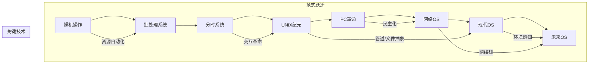

操作系统的变革历史是一部计算技术的进化史诗，每一次突破都重塑了人机交互的边界。在UNIX操作系统出现之前打纸带的裸机时代再到批处理时代，还没有操作系统这么个概念。直到贝尔实验室参与IBM的Multics项目失败后，Ken Thompson将其简化促使了UNIX的诞生。

Unix的设计哲学确立了核心范式：

* "一切皆文件"：设备、进程通过文件接口访问
* 管道（|）：进程间通信范式
* C语言重写（1973）：实现跨平台移植

维基百科上有一个张Unix发展历史的简化图：

图里面包含了重要的两个Unix分支演化：

* 开源的BSD（1977）：实现了TCP/IP协议栈、虚拟内存
* 商业化的System V（1983）：信号量、共享内存

以下是DeepSeek按技术范式划分的关键阶段：

### **一、史前时代：裸机操作（1940s-1950s）**
- **无操作系统**：早期计算机（如ENIAC）通过物理开关/纸带输入程序
- **痛点**：每次只能运行一个程序，人工切换效率极低

### **二、批处理系统：效率革命的起点（1950s）**
- **GM-NAA I/O（1956）**：首个批处理系统（IBM 704）
- **核心创新**：
  - **作业队列**：操作员批量提交任务
  - **常驻监控程序**：自动加载/卸载程序
- **代表系统**：IBM OS/360（1966），支持磁带/磁盘存储

### **三、分时系统：交互时代的曙光（1960s）**
- **革命性概念**：多用户通过终端**共享CPU时间片**
- **里程碑系统**：
  - **CTSS（1961，MIT）**：首个分时系统，支持3用户
  - **Multics（1969，贝尔实验室）**：首次引入**分层文件系统**和**动态链接库**
- **影响**：直接催生UNIX的诞生（Ken Thompson因Multics复杂而开发简化版）

### **四、UNIX纪元：现代OS的奠基（1970s）**
- **UNIX V6（1975）** 确立核心范式：
  - **"一切皆文件"**：设备、进程通过文件接口访问
  - **管道（|）**：进程间通信范式
  - **C语言重写（1973）**：实现跨平台移植
- **分支演化**：
  - **BSD（1977）**：TCP/IP栈、虚拟内存
  - **System V（1983）**：信号量、共享内存

### **五、个人计算机革命：OS民主化（1980s）**
| 系统          | 突破性创新                     | 历史意义                  |
|---------------|--------------------------------|-------------------------|
| **MS-DOS** (1981) | FAT文件系统、命令行批处理       | IBM PC标配，普及x86生态  |
| **Macintosh** (1984) | 首个商用GUI（基于施乐Alto理念） | 定义桌面交互标准          |
| **Windows 3.0** (1990) | 保护模式内存管理、协同多任务     | 图形化PC操作全民化        |

### **六、网络操作系统：连接世界（1990s）**
- **服务器OS进化**：
  - **Novell NetWare**：基于IPX协议的PC局域网共享
  - **Windows NT（1993）**：微内核架构、NTFS日志文件系统
- **互联网基石**：
  - **BSD Socket API**（1983）成为网络编程标准
  - **Linux+Apache**（1995）开启Web服务器时代

### **七、现代操作系统范式（2000s至今）**
#### **1. 移动操作系统颠覆**
- **iOS（2007）**：电容触控+App Store生态
- **Android（2008）**：Linux内核+Java框架，开源策略制胜

#### **2. 虚拟化与云原生**
- **Hypervisor突破**：
  - **VMware ESX（2001）**：裸金属虚拟化
  - **KVM（2007）**：Linux内核级虚拟化
- **容器化革命**：Docker（2013）利用cgroups/namespaces实现轻量隔离

#### **3. 微内核复兴**
- **QNX**（黑莓车载系统）：消息传递架构，毫秒级实时响应
- **Fuchsia OS**（Google）：Zircon微内核，面向IoT跨设备生态

#### **4. 安全范式升级**
- **可信执行环境**：Intel SGX（2015）、ARM TrustZone
- **零信任架构**：Windows 11 Pluton安全芯片

### **八、未来趋势：AI与量子重塑OS**
1. **AI原生操作系统**：
   - 微软**Windows Copilot**（2023）：系统级AI助手
   - 谷歌**Project Astra**（2024）：多模态OS交互
2. **量子操作系统**：
   - **QuOS**（MIT）：管理量子比特纠错
   - **微软LIQUi|>**：量子算法调度框架
3. **泛在计算OS**：
   - 华为**HarmonyOS**：分布式软总线实现跨设备协同
   - **ROS 2**（机器人OS）：实时控制+AI感知融合

### **技术哲学启示**
操作系统的演进本质是**资源抽象层级**的升维：
1. **硬件层**：从管理单CPU到异构计算（CPU/GPU/TPU/量子芯片）
2. **交互层**：命令行→GUI→语音/手势→脑机接口
3. **生态层**：封闭系统→开源社区→AI代理协作网络

## Linux简史

1991年Linus在MINIX启发下开发了自由开源Linux操作系统，经过二三十年的发展，几乎已经统治了操作系统市场的半壁江山。

Linux的每一次变革都深刻影响了整个技术世界。以下是其关键历史节点和技术演进：

### **1. 诞生与开源奠基（1991-1992）**
- **1991年8月**：芬兰大学生 **Linus Torvalds** 在Usenet发布公告，宣布开发一个“免费的操作系统”（仅是内核雏形）。
- **关键转折**：采用 **GPLv2协议**（1992年），允许自由修改和分发。这一决策吸引了全球开发者参与，奠定了开源协作的基石。

### **2. 生态成型：发行版与桌面革命（1993-1999）**
- **早期发行版**：
  - **Slackware**（1993）：首个广泛传播的发行版。
  - **Debian**（1993）：确立社区治理模式，衍生出Ubuntu等主流系统。
- **桌面环境崛起**：
  - **KDE**（1996）和**GNOME**（1999）的出现让Linux具备了图形化能力，挑战Windows/Mac的桌面垄断。

### **3. 企业级突破：服务器与开源商业化（1998-2004）**
- **技术里程碑**：
  - **Linux 2.0内核**（1996）：支持SMP（对称多处理）和更多硬件架构，迈入企业服务器领域。
  - **ext3文件系统**（2001）：引入日志功能，大幅提升数据可靠性。
- **商业公司入场**：
  - **Red Hat上市**（1999）：首个Linux企业IPO，验证开源商业模式。
  - **IBM投资10亿美元**（2001）：将Linux引入大型机（zSeries），彻底改变企业市场格局。

### **4. 内核革新与移动崛起（2003-2010）**
- **Linux 2.6内核**（2003）：
  - 支持超大规模SMP（数千CPU）、实时调度（RT-Preempt），满足电信和工业控制需求。
  - 引入 **cgroups**（2007）：成为容器技术（Docker/LXC）的基石。
- **移动领域颠覆**：
  - **Android**（2008）：基于Linux内核的移动操作系统，迅速统治智能手机市场（2023年全球份额超70%）。

### **5. 云计算与容器化时代（2010至今）**
- **云基础设施**：
  - **AWS EC2**（2006起）等云平台90%以上实例运行Linux，成为云计算事实标准。
- **容器革命**：
  - **Docker**（2013）：利用cgroups/namespace技术引爆容器生态。
  - **Kubernetes**（2014）：容器编排标准，彻底改变应用部署方式。
- **内核持续进化**：
  - **BPF**（2014）：实现内核级动态追踪和网络加速（eBPF），性能监控能力飞跃。
  - **WireGuard**（2020）：内置VPN协议，提升安全与效率。

### **6. 新兴领域统治（2020s）**
- **超级计算机**：Linux包揽**Top500超算榜单**全部席位（2017至今）。
- **嵌入式与IoT**：从路由器到智能汽车（特斯拉车载系统），无处不在。
- **开源协作模型**：Git（由Linus开发）+ 邮件列表 + 社区评审，成为开源项目的黄金标准。

### **核心驱动力：开源生态的胜利**
- **开发模式**：全球超10万贡献者（2023年内核贡献者超2000人/版本），企业（Google、Intel、Red Hat）与个人协同。
- **许可协议**：GPLv2的“传染性”保障代码持续开放，避免碎片化。
- **标准化**：LSB（Linux标准规范）、systemd（2010）统一了基础服务管理。

### **影响深远的启示**
Linux的变革证明：**开源协作不仅能构建技术，更能重塑行业规则**——从个人设备到航天任务（SpaceX龙飞船使用Linux），其“自由共享、持续迭代”的哲学已超越软件领域，成为数字文明的底层基因。未来在AI、量子计算等前沿领域，Linux的适应性仍将引领创新浪潮。
