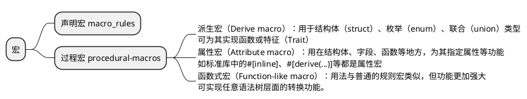

## 什么是宏？

宏是一种元编程的方式，和Java1.6引进的AnnotationProcessor类似，它可以在编译时生成源代码。这种元编程技术可以让我们从样板代码中解脱出来，比如Lombok。

Java主流的元编程方式是Java1.1就有的运行时反射机制，基于反射可以实现诸如动态代理、序列化/反序列化(如json)等功能。在[Golang](https://golang.google.cn/blog/laws-of-reflection)、[Modern C++](https://en.cppreference.com/w/cpp/experimental/reflect)(虽然兼容性不好，但有很多[社区实现版本](https://github.com/fffaraz/awesome-cpp?tab=readme-ov-file#reflection))等语言也有反射机制。另外由于Java是介于编译型和解释型之间的语言，所以还可以使用Cglib或更低层的ASM等工具实现运行时生成字节码的功能。

这些运行时的元编程方式，Rust通通没有，甚至早期计划的[反射机制还被干掉了](https://github.com/rust-lang/rfcs/pull/379)。

不要失望，Rust的宏编程能力非常强大。Rust追求的是极致的性能，运行时的反射由于JIT无法对其优化，所以在性能上具有致命缺陷，这个肯定是Rust要规避的。

Rust对标的是C/C++，C/C++中也有宏（Macro）的概念，可以简单地理解为：宏即编译时将执行的一系列指令。其重点在于「**编译时**」，尽管宏与函数（或方法）形似，**函数是在运行时发生调用的，而宏是在编译时执行的**。

不同于C/C++中的宏，Rust的宏并非简单的文本替换，而是在词法层面甚至语法树层面作替换，其功能更加强大，也更加安全。

如下所示的一个C++的宏SQR的定义

```cpp
#include <iostream>
#define SQR(x) (x * x)
int main() {
    std::cout << SQR(1 + 1) << std::endl;
    return 0;
}
```

我们希望它输出4，但很遗憾它将输出3，因为SQR(1 + 1)在预编译阶段通过文本替换展开将得到(1 + 1 * 1 + 1)，并非我们所期望的语义。

而在Rust中，按如下方式定义的宏：

```rust
macro_rules! sqr {
    ($x:expr) => {$x * $x}
}

fn main() {
    println!("{}", sqr!(1 + 1));
}
```

将得到正确的答案4。这是因为Rust的宏展开发生在语法分析阶段，此时编译器知道sqr!宏中的$x变量是一个表达式（用$x:expr标记），所以在展开后它知道如何正确处理，会将其展开为((1 + 1) * (1 + 1))。

C/C++中宏很容易出现莫名其妙的问题，所以在很多场景不推荐使用宏。而Rust改进了这点，而且提供了更多的功能，让Rust有了更灵活的表达方式。

## Rust中的宏



## 声明宏

先挑声明宏这个软柿子捏，声明宏的语法和match的语法非常类似，区别是使用了`macro_rules!`关键字。

```rust
match target {
    模式1 => 表达式1,
    模式2 => {
        语句1;
        语句2;
        表达式2
    },
    _ => 表达式3
}
```

以一个简化版的vec!为例：
```rust
#[macro_export]
macro_rules! vec {
    ( $( $x:expr ),* ) => {
        {
            let mut temp_vec = Vec::new();
            $(
                temp_vec.push($x);
            )*
            temp_vec
        }
    };
}
```

`#[macro_export]` 注释将宏进行了导出，这样其它的包就可以将该宏引入到当前作用域中，然后才能使用。可能有同学会提问：我们在使用标准库`vec!`时也没有引入宏啊，那是因为 Rust 已经通过`std::prelude`的方式为我们自动引入了。

紧接着，就使用`macro_rules!`进行了宏定义，需要注意的是宏的名称是`vec`，而不是`vec!`，后者的感叹号只在调用时才需要。

vec 的定义结构跟 match 表达式很像，但这里我们只有一个分支，其中包含一个模式 `( $( $x:expr ),* )`，跟模式相关联的代码就在`=>`之后。一旦模式成功匹配，那这段相关联的代码就会替换传入的源代码。

由于 vec 宏只有一个模式，因此它只能匹配一种源代码，其它类型的都将导致报错，而更复杂的宏往往会拥有更多的分支。

虽然宏和 match 都称之为模式，但是前者跟后者的模式规则是不同的。如果大家想要更深入的了解宏的模式，可以查看[官方文档](https://doc.rust-lang.org/reference/macros-by-example.html)。

### 模式解析

而现在，我们先来简单讲解下`( $( $x:expr ),* )`的含义。

首先，我们使用圆括号`()`将整个宏模式包裹其中。紧随其后的是`$()`，跟括号中模式相匹配的值(传入的Rust源代码)会被捕获，然后用于代码替换。在这里，模式`$x:expr`会匹配任何 Rust 表达式并给予该模式一个名称`$x`。

`$()`之后的逗号说明在`$()`所匹配的代码的后面会有一个可选的逗号分隔符，紧随逗号之后的`*`说明`*`之前的模式会被匹配零次或任意多次(类似正则表达式)。

当我们使用`vec![1, 2, 3]`来调用该宏时，`$x`模式将被匹配三次，分别是1、2、3。为了帮助大家巩固，我们再来一起过一下：

1、`$()`中包含的是模式`$x:expr`，该模式中的`expr`表示会匹配任何Rust表达式，并给予该模式一个名称`$x`

2、因此`$x`模式可以跟整数`1`进行匹配，也可以跟字符串`"hello"`进行匹配: `vec!["hello", "world"]`

3、`$()`之后的逗号，意味着`1`和`2`之间可以使用逗号进行分割，也意味着`3`既可以没有逗号，也可以有逗号：`vec![1, 2, 3,]`

4、`*`说明之前的模式可以出现零次也可以任意次，这里出现了三次

接下来，我们再来看看与模式相关联、在 => 之后的代码：

```rust
{
    {
        let mut temp_vec = Vec::new();
        $(
            temp_vec.push($x);
        )*
        temp_vec
    }
};
```

这里就比较好理解了，`$()` 中的`temp_vec.push()`将根据模式匹配的次数生成对应的代码，当调用`vec![1, 2, 3]`时，下面这段生成的代码将替代传入的源代码，也就是替代`vec![1, 2, 3]`:

```rust
{
    let mut temp_vec = Vec::new();
    temp_vec.push(1);
    temp_vec.push(2);
    temp_vec.push(3);
    temp_vec
}
```
如果是`let v = vec![1, 2, 3]`，那生成的代码最后返回的值`temp_vec`将被赋予给变量`v`，等同于 :

```rust
let v = {
    let mut temp_vec = Vec::new();
    temp_vec.push(1);
    temp_vec.push(2);
    temp_vec.push(3);
    temp_vec
}
```

至此，我们定义了一个宏，它可以接受任意类型和数量的参数，并且理解了其语法的含义。

对于`macro_rules`来说，它是存在一些问题的，因此，Rust 计划在未来使用新的声明式宏来替换它：工作方式类似，但是解决了目前存在的一些问题，在那之后，`macro_rules`将变为 deprecated 状态。

[知乎](https://zhuanlan.zhihu.com/p/494952481)也有一篇文章介绍macro_rules目前存在的一些问题，可以看看这本书 “The Little Book of Rust Macros”。


