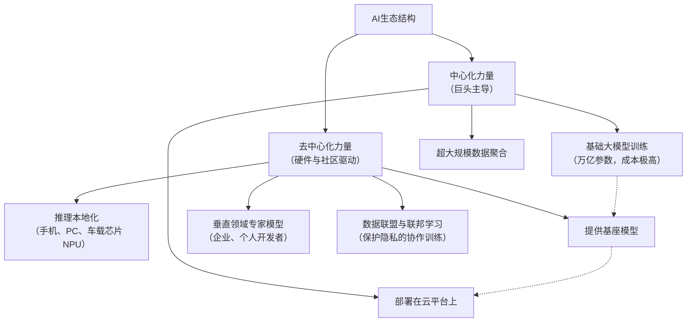

记录一下我和DeepSeek针对AI发展趋势的一些对话：

```
AI这次技术变革，和历史上的互联网、移动互联网的变革有什么异同？AI大模型及其生态和互联网中涌现的PC操作系统、浏览器、搜索引擎，移动互联网中涌现的手机终端、移动App有什么异同？
```

> 好的，用户问的是AI技术变革和之前互联网、移动互联网的异同，还有大模型生态和PC操作系统、浏览器这些的对比。首先得确定用户是谁，可能是科技行业的从业者或者研究者，想了解技术演进背后的逻辑，方便做决策或者投资。
> 用户可能不仅想知道表面区别，更想洞察背后的趋势和机会，比如AI生态里哪些环节类似过去的浏览器或操作系统，有没有新的创业机会。深层需求可能是想判断如何布局，避免错过类似移动互联网初期的红利。
> 得先拆解问题，分两部分：技术变革的异同和生态组成的对比。技术方面，AI的核心是认知能力，而前两次是连接和信息分发。生态上，大模型更像基础设施，比如操作系统，但更集中化，而且竞争门槛更高。
> 还要考虑用户可能没明说的担忧，比如AI是否真的像以前那样有开放生态，还是会被大公司垄断。需要对比封闭和开放的可能性，以及开发者和用户角色的变化。
> 最后得总结，强调AI的颠覆性和不同之处，帮助用户理解这不是简单的延续，而是范式转移，需要新的思维模式来应对。
这是一个非常精彩且深刻的问题，它触及了技术革命的核心。我们可以从两个层面来剖析：一是**技术变革本身的异同**，二是**生态关键组件（Keystone）的异同**。

### 一、技术变革的异同

AI大模型浪潮与互联网、移动互联网一样，都是一次**范式转移**，但它们改变世界的“轴心”不同。

| 维度 | **互联网 (1990s-2000s)** | **移动互联网 (2007年iPhone发布后)** | **AI大模型 (2020年GPT-3后)** |
| :--- | :--- | :--- | :--- |
| **核心变革** | **信息的连接** | **信息的随时随地获取与生成** | **信息的理解与生成** |
| **关键突破** | TCP/IP协议、Web协议 | 3G/4G、触摸屏、传感器、GPS | Transformer架构、海量算力、海量数据 |
| **改变的对象** | **连接**人与信息、人与人 | **延伸**人的感知与交互（位置、视觉、触觉） | **重塑**人与知识的交互方式 |
| **交互方式** | 键盘、鼠标 → 点击链接 | 触摸、语音、摄像头 → 滑动App | **自然语言** → 对话、指令 |
| **商业模式** | 门户广告、电子商务、在线服务 | 应用商店分成、移动广告、O2O服务 | **模型即服务 (MaaS)**、AI原生应用、生产力提升 |
| **门槛与权力** | 相对分散，个人可建站 | 相对集中，受制于苹果/谷歌应用商店 | **极度集中**，需要巨量资本、数据和算力 |

**相同点：**

1.  **基础性**：三者都是**基础性技术**，像水电煤一样，会渗透到所有行业，重塑社会经济。
2.  **生态性**：都催生了庞大的技术生态，从硬件到软件，从底层基础设施到上层应用。
3.  **创造性破坏**：都创造了新行业、新巨头（Google/Facebook, Uber/TikTok, OpenAI/Midjourney），同时颠覆了旧行业（纸媒、传统零售、部分白领工作）。
4.  **投资狂热**：都引发了巨大的资本泡沫和投资热潮（.com泡沫、App创业潮、当前的AI投资热）。

**不同点：**

1.  **变革的本质**：
    *   **互联网/移动互联网**：本质是**连接**和**分发**的革命。它们解决了信息“在哪里”和“如何获取”的问题，是**渠道的革命**。
    *   **AI大模型**：本质是**认知**和**生成**的革命。它开始解决信息“是什么”和“如何创造”的问题，是**生产力的革命**。它不是在修更快的路（渠道），而是在造更智能的车（生产力工具）。

2.  **技术门槛与集中度**：
    *   建设一个网站在互联网早期是可能的；开发一个App在移动互联网时代也是许多小团队可以做到的。
    *   但训练一个具有竞争力的千亿参数大模型，需要数亿美金的计算成本和顶尖人才，这导致**权力高度集中于科技巨头（Google, Meta, OpenAI+Microsoft, Amazon）和少数初创公司**。生态的**底层更加中心化**。

3.  **与人交互的维度**：
    *   互联网/移动互联网时代，人需要**学习如何与机器交互**（学习使用浏览器、学习App的操作逻辑）。
    *   AI时代，机器开始**学习如何与人交互**（用最自然的语言、语音、图像）。交互变得**直觉化**和**人性化**。

---

### 二、生态关键组件的异同

你的类比非常准确，AI生态中的组件确实在扮演类似历史上关键节点的角色，但内涵已大不相同。

| **互联网时代** | **移动互联网时代** | **AI大模型时代** | **核心异同分析** |
| :--- | :--- | :--- | :--- |
| **PC操作系统**<br>(Windows/macOS) | **手机终端/OS**<br>(iOS/Android) | **基础大模型**<br>(GPT-4, Llama, Gemini) | **相似**：都是**生态基石**，向下管理硬件资源（算力），向上为应用提供运行环境。<br>**不同**：操作系统是**固定的程序**，逻辑由开发者预设；大模型是**“活”的智能**，其能力通过训练涌现，并非完全预设。 |
| **浏览器**<br>(Chrome/Safari) | **超级App/OS应用**<br>(微信/支付宝) | **AI智能体/平台**<br>(ChatGPT, Copilot, Claude) | **相似**：都是**主要交互入口**和**信息聚合器**。用户通过它们访问更广阔的世界（网站/小程序/AI功能）。<br>**不同**：浏览器是**被动工具**，用户主动输入指令；AI智能体是**主动助手**，可以理解意图、推荐答案甚至代为执行任务。 |
| **搜索引擎**<br>(Google/Baidu) | **应用商店搜索**<br>(App Store Search) | **……（演进中）** | **相似**：都是**信息与服务的索引和分发中心**，是流量的核心枢纽。<br>**不同**：搜索引擎返回**链接列表**，需要用户自行筛选；AI大模型直接生成**答案和结果**（但可靠性待考）。未来可能出现新的“AI原生搜索引擎”，它不再是检索，而是**综合与创造**。 |
| **网站/Web应用** | **移动App** | **AI原生应用**<br>(Midjourney, Github Copilot, AI客服) | **相似**：都是**满足用户需求的最终价值呈现**，是生态繁荣的体现。<br>**不同**：传统应用是**功能导向**的，用户需要学习使用其功能；AI原生应用是**任务导向**或**创作导向**的，用户用语言描述目标，应用调用AI能力来完成。**App正在从“功能集装箱”变为“能力魔法棒”**。 |
| **（无完美对应）** | **（无完美对应）** | **矢量数据库/工具**<br>(为AI提供外部知识) | **独特之处**：这是AI生态**新增的关键层**。大模型像人脑，需要外部知识（记忆簿、工具书）来增强其能力，矢量数据库等工具就扮演了这个角色。 |

### 总结与展望

*   **互联网**构建了**信息公路**。
*   **移动互联网**将公路铺到了每个人的**口袋**，并增加了无数传感器作为“入口匝道”。
*   **AI大模型**则是在这些公路上部署**自动驾驶车队**，它们不仅能更高效地运输信息，还能直接帮你加工信息、制造货物（内容）、甚至替你开车（自动执行任务）。

AI大模型变革的深远程度可能超过前两次，因为它第一次直接触及了人类独有的“认知”领域。它的生态结构既**继承**了前两次变革的某些模式（分层、有入口、有应用），又因其技术内核的根本不同而**演化**出新的特点（高度中心化的底层、自然语言的交互、从“功能”到“智能”的应用范式转变）。

最终，AI生态很可能不是完全重复互联网的“开放”之路，而是在**开放与封闭、中心化与去中心化**之间找到一种新的平衡，其最终形态仍在激烈演变中。

```
你提到中心化与去中心化，互联网的搜索引擎是一种中心化的Web信息检索系统，而进入移动互联网后移动App开始去中心化。现在的大模型也是一种由巨头垄断的基础设施，未来随着硬件的发展会不会也出现去中心化的过程？
```

您提出了一个极其重要且富有前瞻性的问题，这恰恰是当前AI领域核心的争论之一。我的判断是：**未来AI生态的发展，不会是非黑即白的完全中心化或去中心化，而更可能是一种“分层博弈”的混合形态。硬件发展是推动去中心化的关键动力，但无法完全颠覆中心化的优势。**

让我们来深入剖析这个过程。

### 为什么当前大模型是高度中心化的？

首先，我们要承认现状的合理性。中心化并非偶然，而是由当前技术阶段的“三高”门槛决定的：

1.  **高算力门槛**：训练GPT-4这样的模型需要价值数千万甚至上亿美金的专用AI芯片（如NVIDIA H100）集群运行数月。这笔投入是绝大多数机构无法承担的。
2.  **高数据门槛**：需要爬取和清洗万亿级别的token文本数据，涉及庞大的存储、清洗和合规成本。
3.  **高技术与人才门槛**：需要世界顶级的AI研究员和工程团队，进行复杂的算法设计、调优和分布式训练。

这“三高”门槛自然地导致了权力集中于拥有资本、数据和人才的科技巨头（如OpenAI+微软、Google、Meta、Amazon）。

### 硬件发展如何催化去中心化？

硬件进步确实会在以下几个层面极大地推动去中心化进程，这与移动互联网的发展有相似之处：

1.  **推理本地化（最直接、最先发生）**：
    *   **现状**：现在使用ChatGPT，你的输入要被发送到OpenAI的云端服务器进行运算（推理），再将结果返回给你。这涉及延迟、隐私和数据安全风险。
    *   **未来**：随着手机、电脑、甚至汽车上的芯片（如高通骁龙、苹果M系列、Intel Ultra）集成更强大的专用NPU（神经网络处理单元），**很多推理任务完全可以在本地设备上完成**。
    *   **类比**：这类似于早期计算机需要连接大型机，后来PC本身性能强大，很多软件可以离线运行。你的手机现在可以本地处理照片、语音识别，而不需要总是联网。
    *   **影响**：保护隐私、降低延迟、减少网络依赖。未来一个“AI版Photoshop”可能完全在你的电脑上运行。

2.  **微调与适配民主化**：
    *   **现状**：从头训练一个大模型是巨头的游戏。
    *   **未来**：但基于一个现有的开源基础模型（如Llama 3），**使用你自己的数据对它进行微调（Fine-tuning）**，让它 specialized 于某个特定领域（如法律、医疗、你公司的内部知识库），这个过程的算力需求会大大降低。
    *   **硬件角色**：强大的消费级GPU（如RTX 4090）甚至未来的专用AI硬件，可以让小公司、甚至个人开发者在自己办公室或家里完成高质量的微调。这催生了**垂直领域的小型专家模型**。

3.  **训练边缘化（远期可能）**：
    *   这是一个更远期的愿景。通过**联邦学习**等技术，可以在不交换原始数据的情况下，利用分布在千万台设备上的数据共同改进模型。例如，谷歌的Gboard输入法就是通过联邦学习在用户手机本地学习打字习惯，聚合模型更新而非原始数据。
    *   如果硬件足够强大，能高效处理本地训练任务，那么“众包”式的模型训练将成为可能，进一步打破数据垄断。

### 中心化与去中心化将长期共存、分层博弈

未来的AI生态不会是一极，而是一个复杂的混合体。我们可以用下图来清晰地展示这一“分层博弈”的生态结构：



### 结论：一个“中心化基座，去中心化创新”的生态

**硬件的发展不会导致中心化模型的消亡，而是会重塑生态的竞争格局。**

1.  **中心化力量**将继续主导**最前沿的基础大模型研发**，因为物理和经济的天花板始终存在。它们将成为“AI时代的发电厂”，提供最强大的基座模型。
2.  **去中心化力量**将在**应用、适配、垂直领域和隐私敏感场景**中蓬勃发展。基于开源模型或通过API调用基座模型，无数创新将在边缘发生。

这类似于今天的计算生态：我们既有AWS、Azure这样的集中式云计算巨头，同时每个人的手机和电脑也拥有前所未有的本地处理能力。两者互补，共同构成了繁荣的生态。

因此，未来的AI世界更可能是一个 **“中心化基座，去中心化创新”** 的混合生态。硬件进步是解放生产力和激发创新的关键钥匙，但它不会关闭中心化的大门，而是打开了去中心化的另一扇窗。

```
在这次AI技术浪潮中开发者有什么机会？
```

> 好的，用户问的是开发者在这次AI浪潮中的机会。之前已经讨论了AI变革与互联网、移动互联网的异同，以及中心化与去中心化的问题，现在需要具体到开发者能做什么。
> 用户可能是开发者或者想进入这领域的学习者，想知道从哪里切入。深层需求可能包括：如何不被淘汰、如何找到高价值机会、是否需要完全转向AI开发、以及如何利用现有技能过渡。
> 首先得区分不同背景的开发者，比如前端、后端、移动端，他们各有不同的切入点。然后要考虑机会的层次，比如是做底层模型还是上层应用，或者工具和生态。
> 还要提到学习路径，因为用户可能担心需要从头学起，但其实整合API和微调模型门槛不同，现有开发者可以逐步深入。最后得强调AI原生思维的重要性，不仅是技术，更是产品范式的转变。

这是一个所有开发者都在思考的核心问题。这次的AI技术浪潮，特别是大模型，带来的不是单一机会，而是一次**整个软件开发和交互范式的重构**。这意味着机会遍布于各个层面，从基础设施到最终应用。

对于开发者来说，机会可以分为以下几个战略层级：

### 1. 顶层：AI原生应用（AI-Native Applications）
这是最直接、最大量的机会所在。目标是利用AI作为核心引擎，解决以前无法解决或解决成本很高的问题。

*   **“副驾驶” for Everything**：为每一个职业、每一个垂直领域开发智能助手。
    *   **例如**：律师AI（审阅合同、检索案例）、程序员AI（写代码、debug）、设计师AI（生成UI草图、设计图标）、财务AI（自动对账、分析报表）。
*   **全新交互形式的应用**：
    *   **自然语言交互**：构建完全通过对话来操作的复杂软件。用户不需要学习菜单和按钮，只需“告诉”软件要做什么。
    *   **多模态应用**：结合文本、图像、语音、视频的生成与理解能力。例如，一款营销视频生成App，你输入文案，它自动生成口播视频、字幕和背景音乐。
*   **内容生成与个性化**：
    *   **游戏**：动态生成剧情、对话、关卡甚至整个游戏世界。
    *   **教育**：为每个学生生成个性化的学习材料、练习题和解释。
    *   **电商**：为每个商品自动生成不同风格的营销文案和图片。

**对开发者的要求**：更强调**产品思维、领域知识（Domain Knowledge）和对人类工作流的深度理解**。技术实现上，更多的是通过API调用模型能力，并巧妙地将其集成到用户体验中。

### 2. 中间层：模型增强与定制（Model Enhancement & Customization）
大多数开发者不会去从头训练基础大模型，但基于现有模型进行优化和定制是一个巨大的机会。

*   **提示工程（Prompt Engineering）与AI工程**：如何设计最有效的提示（Prompt）来稳定地激发模型的最佳性能，正在成为一个专门的 discipline。这包括构建清晰的结构化提示、思维链（Chain-of-Thought）等。
*   **检索增强生成（RAG - Retrieval-Augmented Generation）**：这是当前企业级应用最热门、最实用的技术。**核心思路**是让大模型连接外部知识库（如公司内部的文档、数据库、网站），让模型基于这些最新、最准确的信息来回答问题，而不是只依赖它训练时的陈旧知识。
    *   **机会**：为企业搭建RAG系统，解决大模型的“幻觉”和知识陈旧问题。这需要开发者有向量数据库、Embedding、知识管理等方面的技能。
*   **模型微调（Fine-Tuning）**：使用特定领域的数据对开源模型（如Llama 3, Mistral）进行微调，得到更专业、性能更好的“专家模型”。
    *   **机会**：为法律、医疗、金融等垂直领域微调模型。随着开源模型的强大和微调工具的简化，这个门槛正在降低。

**对开发者的要求**：需要更深入的**机器学习/大模型知识**，了解模型的工作原理、微调技术、向量数据库等。这是向“AI工程师”演进的关键路径。

### 3. 基础层：工具与基础设施（Tools & Infrastructure）
“淘金热中，卖铲子和牛仔裤最赚钱”。当所有人都在冲向上层应用时，为他们提供开发工具和支持系统同样机会巨大。

*   **LLMOps（大语言模型运维）**：类似于过去的DevOps和MLOps。如何高效地管理提示版本、评估模型性能、监控成本、部署模型管道，这是一个正在形成的巨大工具市场。
*   **评估与测试工具**：如何科学地评估一个AI应用的好坏？需要新的测试框架、基准数据集和自动化评估工具。
*   **中间件与API管理**：帮助开发者更简单、更经济地调用不同模型（OpenAI, Anthropic, 开源模型）的API，实现负载均衡、故障转移、缓存等。

**对开发者的要求**：深厚的**后端工程、分布式系统、云计算**功底。这部分机会更适合有经验的基础设施开发者。

### 4. 底层：参与开源模型生态（Open-Source Ecosystem）
虽然训练超大模型是巨头的游戏，但开源社区正在飞速发展。

*   **贡献与优化**：参与诸如Llama、Mistral、Bloom等开源模型的社区，贡献代码、优化性能、开发新的应用方式。
*   **模型量化与蒸馏**：将大模型“缩小”，让它能在更小的设备（手机、笔记本）上高效运行，这是一个非常热门且实用的方向。
*   **构建开源替代品**：开发某个热门闭源服务（如Midjourney, ChatGPT）的开源替代方案。

**对开发者的要求**：需要**顶尖的机器学习研究和工程能力**，通常需要在研究机构或大型AI团队工作。

### 给开发者的行动建议

1.  **不要试图造基础模型**：这是巨头的游戏，除非你身在顶级实验室。
2.  **从“API调用者”开始**：立即开始使用OpenAI、Claude等API构建小应用。**亲手实践**是最好的学习方式。从构建一个简单的聊天机器人或文本总结工具开始。
3.  **深入学习Prompt Engineering和RAG**：这是目前应用层开发最核心、最实用的技能组合。
4.  **成为“AI+领域”的专家**：你不需要成为AI理论专家，但你可以成为“最懂AI的律师”或“最懂AI的医生”。**你的领域知识+AI能力将成为你最强大的护城河**。
5.  **关注开源模型**：特别是如何在消费级硬件上运行和微调它们（如通过Ollama, LM Studio等工具）。这能让你摆脱对闭源API的完全依赖，降低成本并增加灵活性。

**总结一下**：本次AI浪潮对开发者而言，**广度上的机会在于用AI重塑所有现有行业（AI原生应用），深度上的机会在于深入技术栈底层，为企业提供定制化和优化方案（RAG、微调）**。最大的机会属于那些能同时理解“技术可能性”和“真实世界需求”的开发者。
