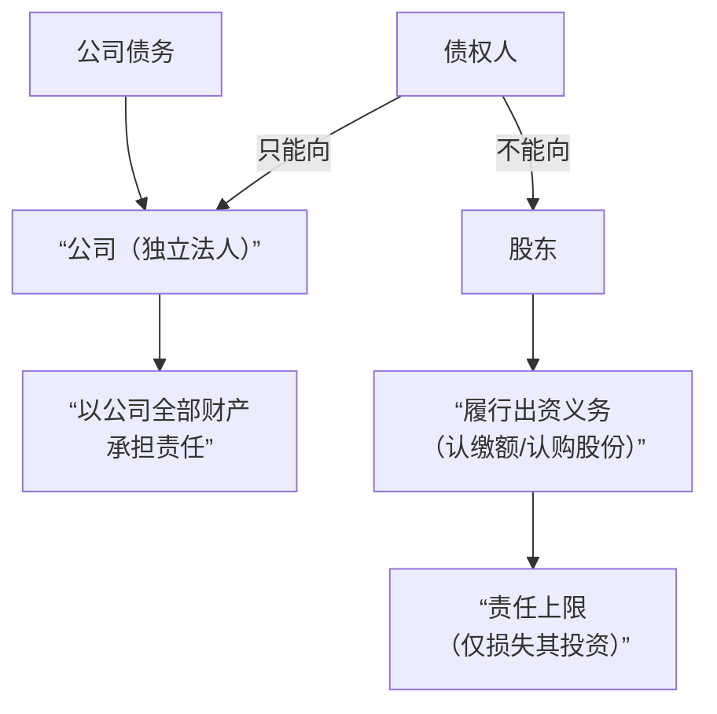

### 一、公司的有限责任内涵

“有限责任”是公司制度的基石，它包含两个相互关联但又独立的层面，理解这一点至关重要。

**1. 公司自身的责任 - 独立法人责任**

*   **内涵**：公司是独立的**企业法人**，拥有独立的法人财产。这意味着公司在法律上被视为一个独立的“人”，拥有独立的人格，能够以自己的名义拥有财产、签订合同、起诉和应诉。
*   **责任承担**：公司以其**全部财产**对自己的债务承担责任。这里的“全部财产”包括公司的**注册资本、经营积累的固定资产、现金、知识产权等所有资产**。
*   **简单来说**：公司的债，用自己的家当来还。

**2. 股东的责任 - 有限出资责任**

*   **内涵**：股东在履行其出资义务后，其对公司的责任即告完成。
*   **责任承担**：
    * 有限责任公司的股东以其**认缴的出资额**为限对公司承担责任。
    * 股份有限公司的股东以其**认购的股份**为限对公司承担责任。
*   **简单来说**：股东对公司债务的责任，上限就是他们投资进去的钱。如果公司资不抵债破产，股东最多损失全部投资，但**其个人财产与公司债务完全隔离**，债权人无权要求股东用个人财产来偿还公司债务。

**核心关系图示：**

**举例说明：**
小明、小红和小刚三人共同出资100万元成立了一家“创想科技有限公司”，小明认缴50万，小红认缴30万，小刚认缴20万。公司经营中欠下供应商500万元债务，但公司全部资产只剩80万元。

*   **公司责任**：创想公司需用这80万元资产来偿还债务，不足部分，因公司无力偿还，可以破产清算。
*   **股东责任**：小明、小红和小刚**无需**用自己的个人存款、房产或车辆来偿还剩余的420万元债务。他们最多就是损失了自己已经投入的50万、30万和20万。
*   **这就是“有限责任”的保护作用**：它鼓励了投资和创业，将股东的风险控制在其出资范围之内。

### 二、有限责任的例外：“刺破公司面纱”或“法人人格否认”

“有限责任”不是绝对的护身符。如果股东滥用这层“保护罩”来从事不法行为、损害他人利益，法律就会揭开这层面纱，让躲在公司背后的股东直接承担责任。这就是“**法人人格否认**”制度。

根据中国《公司法》第23条（2023年修订版）的规定，主要有以下两种例外情况：

**1. 纵向人格否认：股东滥用公司独立人格**

*   **情形**：公司股东**滥用公司法人独立地位和股东有限责任**，逃避债务，**严重损害公司债权人利益**的。
*   **法律后果**：该股东应当对**公司债务**承担**连带责任**。
*   **常见行为**：
    *   **人格混同**：公司与股东在财产、业务、人员、场所等方面界限不清，无法区分。俗称“一套人马，两块牌子”。（**这是最常见的类型**）
        * **表现**：公司账户与股东个人账户混用，公款私用；公司业务与股东个人业务不分；公司账簿与股东账簿不分。
    *   **过度控制与支配**：股东像操作木偶一样完全操控公司，使公司失去独立意志，成为股东谋取私利的工具。
    *   **资本显著不足**：股东投入的资本与公司经营所隐含的风险相比明显不匹配，实质上是利用少量资本从事高风险业务，将风险转嫁给债权人。

**2. 横向人格否认：股东滥用股东有限责任**

*   **情形**：公司股东利用其控制的**两个以上公司**实施上述滥用行为，逃避债务，严重损害公司债权人利益的。
*   **法律后果**：各公司应当对**任何一个公司的债务**承担**连带责任**。
*   **常见行为**：
    *   股东设立多个“兄弟公司”或“母子公司”，彼此之间财产、利益随意输送。
    *   当其中一个公司负债时，迅速将资产转移至其他公司，导致债权人无法执行。

## 法人人格否认制度的历史沿革

**中国法律上的“法人人格否认”制度在2023年新《公司法》修订之前就已经确立并存在了多年。** 下面我们来详细梳理一下这个制度的发展历程：

### 一、 制度起源与确立（2005年）

在2005年之前，中国法律并没有成文法的明确规定“法人人格否认”制度。但在司法实践中，已经出现了一些基于公平原则和禁止权利滥用原则的类似判决。

**里程碑式的节点是2005年《公司法》的修订。**

*   **2005年《公司法》第二十条：**
    > **公司股东应当遵守法律、行政法规和公司章程，依法行使股东权利，不得滥用股东权利损害公司或者其他股东的利益；不得滥用公司法人独立地位和股东有限责任损害公司债权人的利益。**
    >
    > **公司股东滥用股东权利给公司或者其他股东造成损失的，应当依法承担赔偿责任。**
    >
    > **公司股东滥用公司法人独立地位和股东有限责任，逃避债务，严重损害公司债权人利益的，应当对公司债务承担连带责任。**

*   **意义**：
    *   这是中国**首次在成文法中明确确立“法人人格否认”（或“刺破公司面纱”）制度**，具有划时代的意义。
    *   它为解决实践中普遍存在的股东滥用公司独立人格和有限责任的问题提供了明确的法律武器。

### 二、 制度的司法实践与发展（2005-2023）

在2005年《公司法》生效后，最高人民法院通过一系列司法解释和指导性案例，进一步细化和发展了这一制度的适用规则。

1.  **《公司法》司法解释（二）**（2008年）：在清算环节，规定了股东因怠于履行义务导致公司无法清算时，应对公司债务承担连带责任，这被视为法人人格否认在清算程序中的具体化。
2.  **《公司法》司法解释（三）**（2011年）：规定了股东出资不足、抽逃出资等情况下的责任，也为否认公司人格提供了相关依据。
3.  **《九民纪要》**（2019年）：这是**司法实践中关于法人人格否认最重要的指导性文件之一**。
    *   **明确了判断标准**：它详细阐述了如何认定“人格混同”，核心标准是“公司是否已丧失独立意志”，最关键的判断因素是**财产混同**（如公司账户与股东账户不分，公款私用等）。
    *   **强调了审慎适用原则**：要求法官必须严格掌握适用标准，不能轻易否认公司的独立人格。
    *   **明确了横向否认**：《九民纪要》虽然不属于司法解释，但它首次在官方文件中系统地提出了“横向刺破公司面纱”的思路，即当多个关联公司人格高度混同，难以区分时，可以判令它们相互之间承担连带责任。

### 三、 2023年新《公司法》的完善与升级

2023年修订的《公司法》（2024年7月1日生效）在总结近二十年司法实践经验的基础上，对法人人格否认制度进行了**系统的整合和升级**。

*   **新《公司法》第二十三条**：
    > **公司股东滥用公司法人独立地位和股东有限责任，逃避债务，严重损害公司债权人利益的，应当对公司债务承担连带责任。**
    >
    > **股东利用其控制的两个以上公司实施前款规定行为的，各公司应当对任何一个公司的债务承担连带责任。**

*   **主要变化和进步**：
    1.  **结构整合**：将原本散见于不同条款和司法解释中的精神，整合为一个更为精炼和核心的条款。
    2.  **明文规定“横向否认”**：这是**最大的进步**。新法第二款明确将《九民纪要》中探索的“横向人格否认”**正式写入法律**，使其有了明确的法律依据。这意味着，不仅股东和公司之间可以被“刺破”，关联公司之间也可以被“刺破”。
    3.  **法律位阶提升**：将实践中已经成熟适用的规则从司法解释层面提升到了基本法律层面，权威性更高。

### 总结

| 时间阶段 | 法律状态 | 核心内容 |
| :--- | :--- | :--- |
| **2005年之前** | 无法条依据 | 司法实践中偶有基于民法基本原则的探索。 |
| **2005-2023年** | **制度确立与实践期** | **2005年《公司法》第20条**首次确立纵向否认。最高法院通过司法解释和《九民纪要》细化规则，并探索横向否认。 |
| **2024年7月1日起** | **制度完善与升级期** | **2023年新《公司法》第23条**整合并明确了纵向否认，并**将横向否认正式写入成文法**。 |

中国的法人人格否认制度自**2005年**起就已正式确立，并经过近二十年的司法实践不断丰富和发展。2023年的修订是对这一成熟制度的法定化、系统化和升级，使其更能适应复杂的商业实践，更好地保护债权人的合法权益。

## **总结与实践提示**

| 场景 | 责任原则 | 法律后果 |
| :--- | :--- | :--- |
| **正常经营** | **有限责任** | 股东以其出资为限承担责任，公司以其全部财产承担责任。 |
| **股东滥用权利 (人格混同、逃避债务等)** | **例外：法人人格否认** | **刺破公司面纱**，滥用权利的股东需对公司债务承担**连带责任**。 |

**给创业者和公司股东的建议：**

1.  **尊重公司的独立性**：建立独立的财务制度，公司账户与股东个人账户严格分开。
2.  **规范治理**：按时召开股东会，制作并保存完整的会议记录和财务报告。
3.  **避免公私不分**：不要随意将公司资金用于个人消费，也不要把个人财产和公司财产混为一谈。
4.  **依法出资**：按时足额缴纳认缴的出资，避免“空壳”运营。

**有限责任是法律赋予的“保护伞”，但绝不是“欺诈的护身符”。** 一旦被法院认定为人格混同或滥用公司形式，这层保护将瞬间消失，股东将面临无限连带责任的风险。
