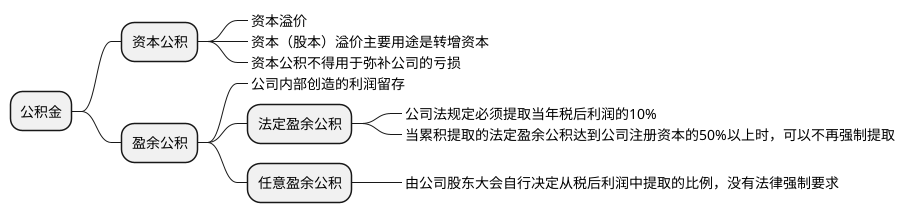

### 资本公积 vs. 盈余公积：核心区别总结

| 对比维度 | **资本公积** | **盈余公积** |
| :--- | :--- | :--- |
| **来源** | **投资者投入**（超过股本部分）或**资本性利得** | 从**税后净利润**中提取 |
| **性质** | **资本性积累**，非经营所得 | **收益性积累**，是经营成果的留存 |
| **强制性** | 自然形成，无提取比例要求 | **法定盈余公积**强制提取（10%）；**任意盈余公积**自愿提取 |
| **主要用途** | **转增资本** | **弥补亏损**、**转增资本**、在特定条件下**发放股利** |
| **与利润关系** | 无关 | 直接相关，是利润分配的一个环节 |

### 举例说明

假设“XYZ科技有限公司”发生以下业务：
1.  **资本公积形成**：公司增发100万股，每股面值1元，发行价8元。共收到资金800万元。
    *   **会计处理**：借记“银行存款”800万；贷记“**股本**”100万，贷记“**资本公积——股本溢价**”700万。
2.  **盈余公积提取**：当年公司实现税后净利润（净利润）500万元。
    *   **提取法定盈余公积**：500万 × 10% = 50万元。
    *   **会计处理**：在利润分配时，借记“利润分配——提取法定盈余公积”50万；贷记“**盈余公积——法定盈余公积**”50万。
3.  **用途**：公司第二年亏损100万元。
    *   **用盈余公积补亏**：经股东大会批准，用盈余公积弥补全部亏损。
    *   **会计处理**：借记“**盈余公积**”100万；贷记“利润分配——盈余公积补亏”100万。

### 核心关系与逻辑框架

这些项目的根本联系在于它们共同构成了公司的**自有资金**和**积累**，但它们代表了资金的不同来源和不同限制。

**1. 来源关系图**

我们可以用一棵“所有者权益”大树来理解它们的来源关系：

```
所有者权益 (股东权益)
│
├── 投入资本 (来自外部)
│   ├── 股本 / 实收资本 (按面值计算)
│   └── 资本公积 (投入的溢价部分)
│
└── 留存收益 (来自内部经营利润)
    ├── 盈余公积 (已限定用途的利润)
    │   ├── 法定盈余公积 (强制留存)
    │   └── 任意盈余公积 (自愿留存)
    │
    └── 未分配利润 (未限定用途的利润)
```

**2. 利润分配流程关系**

从一个年度的净利润到最终形成积累，流程如下：

**税后净利润**
↓
**弥补以前年度亏损** (如有)
↓
**提取法定盈余公积** (强制，按10%)
↓
**提取任意盈余公积** (自愿，按股东大会决议比例)
↓
**向股东分配现金股利**
↓
**剩余部分 → 转入“未分配利润”**

这个流程年复一年地滚动，“未分配利润”账户的余额就是历年这样滚存下来的结果。

### 总结

**资本公积**和**盈余公积**共同构成了公司所有者权益中非常重要的“蓄水池”和“稳定器”。
*   **资本公积**是公司的“资本老本”，反映了股东愿意为公司的未来付出多少溢价，主要用于壮大资本实力。
*   **盈余公积**是公司的“利润积蓄”，是公司自我造血能力的体现，主要用于抵御风险、以丰补歉和未来发展。

理解这两者，对于分析一家公司的财务状况、资本实力和股利政策至关重要。一家盈余公积丰厚的公司，通常意味着其经营稳健，抗风险能力强，且有持续分红的潜力。
