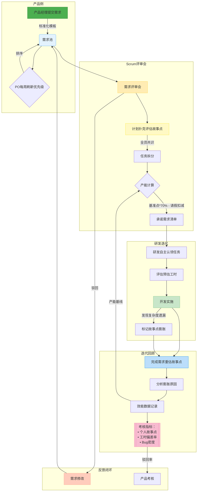
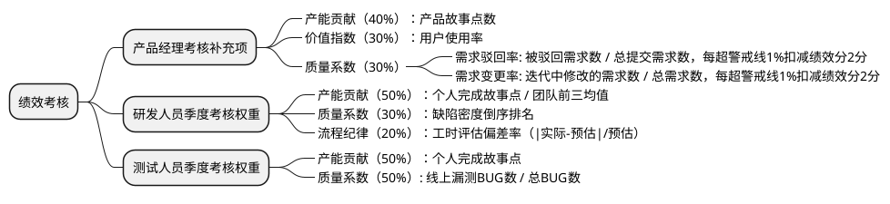

### 背景

公司目前存在的问题：

1. 团队产出无法量化考核指标，绩效考核不公平导致团队效率低下，凝聚力不足
2. 产品需求质量不高导致研发反复返工

针对公司的问题设计了一套相对完整的敏捷开发流程，重点在于以下三个制度的联动:

* **需求池管理（产品需求按优先级排队，研发可驳回质量不高的需求）**
* **故事点评估（客观故事点与主观工时脱钩，用计划扑克避免羊群效应）**
* **绩效考核（记录需求驳回次数作为产品考核），基于故事点实现产研双向考核**

### 需求池管理与Scrum团队协作制度

**目标**：建立透明高效的需求流转机制，平衡产品创新与研发效率，量化团队效能

### 一、需求池管理规则

1. **入口标准**
    - 产品经理通过标准化模板提交需求（含业务目标、用户场景、原型/逻辑说明）
    - 强制字段：`业务优先级(P0-P3)`、`预期价值`、`关联业务模块`

2. **优先级排序**
    - **动态调整机制**：每周由产品负责人根据市场变化刷新需求优先级排序
    - **紧急通道**：<10%的需求可标注`紧急插入`（需CTO联合签署说明需求）

3. **需求驳回机制**
    - **驳回条件**：
        - 逻辑矛盾（与已有功能冲突）
        - 需求描述不完整（关键流程缺失）
        - 技术不可实现（当前架构限制，研发可以先提技术改造需求排入需求池，完成技术改造需求后再接产品需求）
    - **考核指标**：
        - 产品经理季度驳回率 = `被驳回需求数/总提交需求数`（警戒线≥15%）

### 二、迭代规划流程

#### （1）需求评审会（每个迭代周期1次，时长≤4小时）

| 环节            | 规则                                   |
|-----------------|--------------------------------------|
| **任务认领**    | 研发评审会自主领取任务（禁止分配），需标注`预估工时`（精确到0.5天） |
| **任务执行**    | 研发每日站会，Scrum Master及时监控需求工时完成情况      |
| **故事点膨胀**  | 开发中新增未评估复杂度 → 即时标记`风险点`，在每日站会同步      |
| **变更控制**    | 迭代开始后禁止新增需求（紧急需求需消耗团队`故事点储备池`）       |

> 
> **计划扑克执行要点**：
> - 每轮评估后差异≥3点需辩论（例：A说8点，B说3点 → A陈述技术风险，B提出简化方案）
> - **强制规则**：必须达成全员共识（禁止平均取值）。为了降低沟通成本，Scrum团队成员以3~5个后端，2~3个前端，1~2个测试为准，团队成员不可超过10人。

#### （2）迭代承诺

- 计算团队产能基准：`基准故事点 = 近3次迭代平均完成点`
- 扣减因子：`成员请假天数 × 0.5故事点/人/日`
- **输出**：`本期承诺需求清单` + `总故事点范围`（如：85-92点）

### 三、迭代执行监控

| 环节            | 规则                                                                 |
|-----------------|----------------------------------------------------------------------|
| **任务认领**    | 研发每日站会自主领取任务（禁止分配），需标注`预估工时`（精确到0.5天）|
| **故事点膨胀**  | 开发中新增未评估复杂度 → 即时标记`风险点`，在每日站会同步            |
| **变更控制**    | 迭代开始后禁止新增需求（紧急需求需消耗团队`故事点储备池`）           |

### 四、迭代回顾会（核心数据闭环）

1. **故事点重估**
    - 对实际完成需求重新打牌评估故事点
    - 若`实际点 > 原始点`，责任研发说明膨胀原因（如：未预见的兼容性问题）
    - **记录**：`需求ID | 原始点 | 重估点 | 膨胀原因`

2. **效能数据采集**

   | 指标                | 计算方式                          | 用途                     |
   |---------------------|-----------------------------------|--------------------------|
   | 个人完成故事点      | ∑(认领需求重估故事点)            | 团队产能基线                 |
   | 个人工时效率        | ∑任务实际工时 / ∑任务预估工时     | 计划能力评估（目标0.9-1.1） |
   | 缺陷密度            | 本期产生BUG数 / 个人完成故事点    | 质量系数（警戒线≥0.5个/点） |

### 五、绩效考核关联设计

* 产品目前没有与研发的考核互动。
* 研发考核的难点在于：维度多，单纯评估工时会出现极大的不公，单纯评估故事点无法保证质量。
* 测试考核的难点在于：单纯追求bug数量会鼓励过度报无效缺陷，只看测试用例数量又可能忽视实际效果。需要设计一个既能体现测试价值，又能促进团队协作的体系。

### 六、风险控制清单

1. **故事点通胀预防**
    - 建立`复杂度对照库`（例：简单CRUD=3点，跨系统集成=8点）
    - ScrumMaster每月审计重估需求膨胀原因TOP3
    - 防止Scrum团队集体抬升故事点

2. **防止考核扭曲**
    - 故事点上限封顶（个人单迭代≤35点，避免超负荷承诺）
    - 剔除无效故事点（如：因产品变更导致的需求作废）

### 其他可探索的制度设计

* Scrum Master轮岗制度
* 其他意见

> 制度设计是动态的，也要随着公司发展不断迭代
