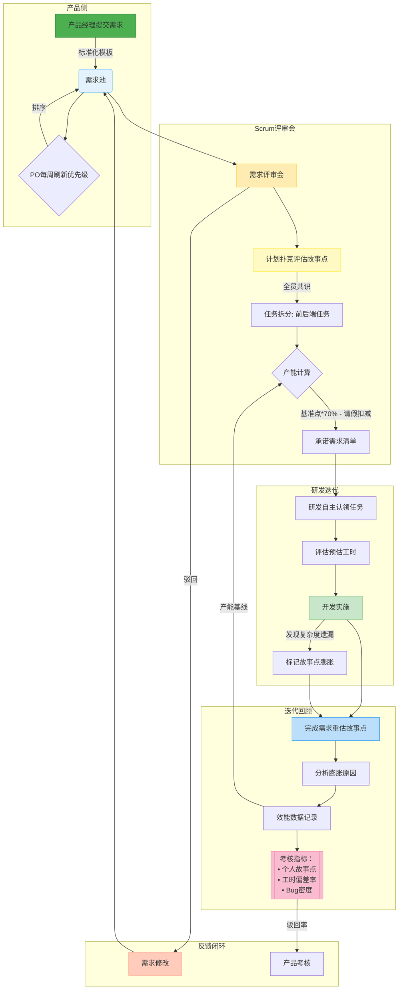
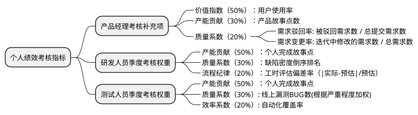

### 背景

公司目前存在的问题：

1. 团队产出无法量化考核指标，绩效考核不公平导致团队效率低下，凝聚力不足
2. 产品需求质量不高导致研发反复返工
3. 迭代经常延期，甚至出现前后多个迭代重叠并行的问题
4. 没有合理的职级晋升和薪酬激励制度，干多干少一个样，员工积极性不高

针对公司的问题设计了一套相对完整的敏捷开发流程，重点在于以下三个制度的联动:

* **需求池管理（产品需求按优先级排队，研发可驳回质量不高的需求）**
* **故事点评估（客观的故事点与主观的工时脱钩，用计划扑克避免羊群效应）**
* **绩效考核（记录需求驳回次数作为产品考核），基于故事点实现产研双向考核和晋升激励机制**

  | 职级            | 迭代完成故事点 | 工时                |
  |-----------------|---------|---------------------|
  | 高级            | 15个故事点  | 80h                 |
  | 中级            | 12个故事点  | 80h                 |
  | 初级            | 10个故事点  | 80h                 |

### 需求池管理与Scrum团队协作制度

**目标**：建立透明高效的需求流转机制，平衡产品创新与研发效率，量化团队效能

### 一、需求池管理规则

1. **入口标准**
    - 产品经理通过标准化模板提交需求（含业务目标、用户场景、原型/逻辑说明）
    - 强制字段：`业务优先级(P0-P3)`、`预期价值`、`关联业务模块`

2. **优先级排序**
    - **动态调整机制**：每周由产品负责人根据市场变化刷新需求优先级排序
    - **紧急通道**：<10%的需求可标注`紧急插入`（需Scrum Master联合签署说明需求）

3. **需求驳回机制**
    - **驳回条件**：
        - 逻辑矛盾（与已有功能冲突）
        - 需求描述不完整（关键流程缺失）
        - 技术不可实现（当前架构限制，研发可以先提技术改造需求排入需求池，完成技术改造需求后再接产品需求）
        - 需求讨论超过20分钟，仍没有达成一致的故事点，说明需求描述不完善
    - **考核指标**：
        - 产品经理季度驳回率 = `被驳回需求数/总提交需求数`（警戒线≥15%）

### 二、迭代规划流程

#### （1）需求评审会（每个迭代周期1次，时长≤4小时）

| 环节          | 执行动作                                  | 输出物                  |
|---------------|------------------------------------------|------------------------|
| **需求讲解**  | 产品逐条说明需求场景与技术边界            | 需求确认清单           |
| **故事点评估**| 全员使用计划扑克（Fibonacci数列：1,2,3,5,8...） | 带共识故事点的需求列表 |
| **任务拆分**  | 前后端协作拆解技术任务（API/组件/数据模型）| 任务树状图             |

> 
> 
> **计划扑克执行要点**：
> 1. 每一个团队成员拿取一套花色卡
> 2. 产品负责人描述需要预估的backlog项目，并回答团队成员的问题
> 3. 团队讨论(在评审会议前，研发可提前看需求文档，准备问题，特别是针对复杂的需求)
> 4. 每一名团队成员根据自己的预估，挑选出一张卡牌，倒扣在桌上
> 5. 所有团队成员选好自己的牌以后，大家同时把牌翻转过来
> 6. 如果所有人都选择了同样面值的牌，那么这个数字被确定为预估工作量
> 7. 如果团队成员预估不相同，团队需要对预估进行讨论
> 8. 重复上述过程，直到达成一致意见
> 9. 产品负责人选择进行下一个项目
> 
> - 每轮评估后差异≥3点需辩论（例：A说8点，B说3点 → A陈述技术风险，B提出简化方案）
> - 一个需求讨论不能超过30分钟，超过30分钟说明需求不明确。
> - 需求由研发自主认领，第一轮出牌点数最少的优先领取，产品和Scrum Master只负责协调监督，不能分派。
> - **强制规则**：必须达成全员共识（禁止平均取值）。为了降低沟通成本，Scrum团队成员以3~5个后端，2~3个前端，1~2个测试，1~2个产品为准，团队成员不可超过10人。
> - 如果出现多个scrum团队间沟通的问题，可以套娃使用Scrum of Scrums的模式。
> 

#### （2）迭代承诺

- 计算团队产能基准：`基准故事点 = 近3次迭代平均完成点`
- 扣减因子：`成员请假天数 × 0.5故事点/人/日`
- **输出**：`本期承诺需求清单` + `总故事点范围`（如：85-92点）

### 三、迭代执行监控

| 环节            | 规则                                   |
|-----------------|--------------------------------------|
| **任务认领**    | 研发评审会自主领取任务（禁止分配），需标注`预估工时`（精确到0.5天） |
| **任务执行**    | 研发每日站会，Scrum Master及时监控需求工时完成情况      |
| **故事点膨胀**  | 开发中新增未评估复杂度 → 即时标记`风险点`，在每日站会同步      |
| **变更控制**    | 迭代开始后禁止新增需求（紧急需求需消耗团队`故事点储备池`）       |

**看板与每日站会**

每日站会时长≤15分钟，内容包括：
- 昨天完成了什么任务？
- 今天计划做什么任务？
- 有什么阻碍需要帮助解决吗？

> 任务的完成进度通过敏捷看板进行可视化
> 
> 
> 
> 
>
> 

### 四、迭代回顾会（核心数据闭环）

1. **故事点重估**
    - 对实际完成需求重新打牌评估故事点
    - 若`实际点 > 原始点`，责任研发说明膨胀原因（如：未预见的兼容性问题）
    - **记录**：`需求ID | 原始点 | 重估点 | 膨胀原因`

2. **效能数据采集**

   | 指标                | 计算方式                          | 用途                     |
   |---------------------|-----------------------------------|--------------------------|
   | 个人完成故事点      | ∑(认领需求重估故事点)            | 团队产能基线                 |
   | 个人工时效率        | ∑任务实际工时 / ∑任务预估工时     | 计划能力评估（目标0.9-1.1） |
   | 缺陷密度            | 本期产生BUG数 / 个人完成故事点    | 质量系数（警戒线≥0.5个/点） |

### 五、绩效考核关联设计

* 产品目前没有与研发的考核互动。
* 研发考核的难点在于：维度多，单纯评估工时会出现极大的不公，单纯评估故事点无法保证质量。
* 测试考核的难点在于：单纯追求bug数量会鼓励过度报无效缺陷，只看测试用例数量又可能忽视实际效果。需要设计一个既能体现测试价值，又能促进团队协作的体系。

### 六、风险控制清单

1. **故事点通胀预防**
    - 建立`复杂度对照库`（例：简单CRUD=3点，跨系统集成=8点）
    - ScrumMaster每月审计重估需求膨胀原因TOP3
    - 防止Scrum团队集体抬升故事点

2. **防止考核扭曲**
    - 故事点上限封顶（个人单迭代≤35点，避免超负荷承诺）
    - 剔除无效故事点（如：因产品变更导致的需求作废）

### 其他可探索的制度设计

* Scrum Master轮岗制度
* 前端借调制度(应对偶然出现的团队内前后端故事点差异过大的问题)
* 其他意见

> 制度设计是动态的，也要随着公司发展不断迭代

## 激励制度

> 没有科学的激励机制，再多的制度设计也是空中楼阁

|岗位| 薪酬                            |
|---|-------------------------------|
|初级研发| 基础薪酬8K + 绩效奖金1K               |
|中级研发| 基础薪酬12K + 绩效奖金1K + 年终奖        |
|高级研发| 基础薪酬15K + 绩效奖金1K + 年终奖 + 股权激励 |

|岗位| 薪酬                            |
|---|-------------------------------|
|初级测试| 基础薪酬6K + 绩效奖金1K               |
|中级测试| 基础薪酬10K + 绩效奖金1K + 年终奖        |
|高级测试| 基础薪酬13K + 绩效奖金1K + 年终奖 + 股权激励 |

|岗位|薪酬|
|---|----|
|初级产品|基础薪酬10K + 绩效奖金1K|
|中级产品|基础薪酬14K + 绩效奖金1K + 年终奖|
|高级产品|基础薪酬18K + 绩效奖金1K + 年终奖 + 股权激励|

> 股权激励是“金手铐”，通过长期持有公司股份，绑定核心员工的利益，提升员工的归属感和忠诚度，从而促进公司的长期发展。
> 关于股权激励，涉及到《公司法》和公司股权架构的设计，在保证控制权的同时，给予核心员工足够的激励空间，建议咨询专业的财务、法务顾问进行设计。
