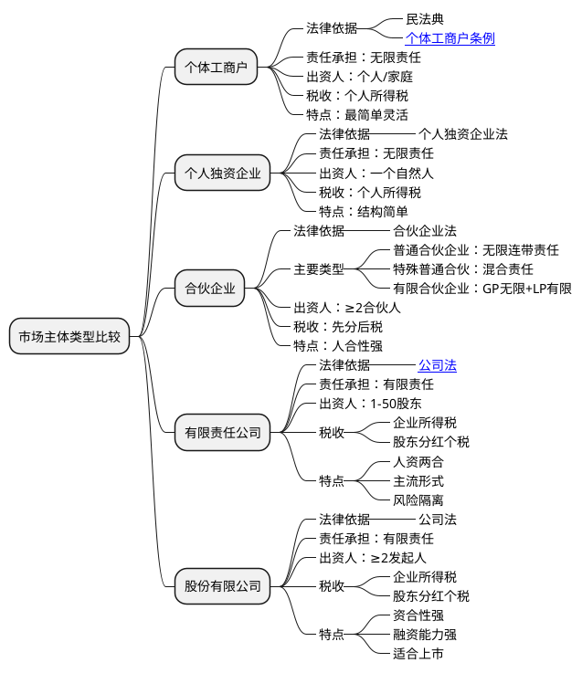

### 核心区别一览表

| 项目 | **个体工商户** | **个人独资企业** | **合伙企业** | **有限责任公司** | **股份有限公司** |
| :--- | :--- | :--- | :--- | :--- | :--- |
| **法律地位** | 不具有法人资格 | 不具有法人资格 | 不具有法人资格 | **具有法人资格** | **具有法人资格** |
| **责任承担** | **无限责任** | **无限责任** | **无限连带责任** （特殊普通合伙、有限合伙除外） | **有限责任** | **有限责任** |
| **出资人/股东** | 经营者（个人或家庭） | 一个自然人 | 合伙人（≥2人） | 股东（1-50人） （可为自然人或法人） | 发起人（≥2人，上限200人） 上市公司股东无上限 |
| **设立依据** | 《民法典》 《个体工商户条例》 | 《个人独资企业法》 | 《合伙企业法》 | **《公司法》** | **《公司法》** |
| **税收制度** | 个人所得税 | 个人所得税 | **先分后税** （合伙人交个税） | **企业所得税** +  股东分红个税 | **企业所得税** +  股东分红个税 |
| **特点** | 最简单、最灵活、设立成本最低 | 结构简单，易于控制 | “人合性”强， 灵活（可约定利润分配） | **“人资两合”**， 治理结构规范， 是市场主体的**主流形式** | **“资合性”** 强， 融资能力强， 股份转让便捷 |

### 详细解释

#### 1. 个体工商户

*   **概念**：由自然人或家庭从事工商业经营，无法人资格。
*   **责任承担**：**无限责任**。经营者以其**个人或家庭全部财产**对债务承担责任。如果欠债，不仅投入生意的钱要赔进去，个人的房子、车子等也可能被用于抵债。
*   **法律依据**：主要由《中华人民共和国民法典》（“非法人组织”章节）和《个体工商户条例》规范。
*   **适用场景**：小规模的零售、餐饮、维修、网店等。适合初创、试水或规模很小的经营。

#### 2. 个人独资企业

*   **概念**：由一个自然人投资，财产为投资人个人所有，无法人资格。
*   **责任承担**：**无限责任**。与个体工商户类似，投资人对企业债务承担无限责任。
*   **法律依据**：《中华人民共和国个人独资企业法》。
*   **与个体工商户的区别**：
    *   **组织性**：个人独资企业更像一个“企业”，可以有更规范的企业名称、组织机构，对外形象更好。
    *   **税务**：在税收征管实践中，两者都缴纳个人所得税，但具体计算可能略有差异。
    *   **法律适用**：适用专门的企业法，比个体工商户更规范。

#### 3. 合伙企业

*   **概念**：由两个或两个以上合伙人订立合伙协议，共同出资、经营、共享收益、共担风险，无法人资格。
*   **责任承担**：**普遍为无限连带责任**，但有特殊形式：
    *   **普通合伙企业**：所有合伙人对企业债务承担**无限连带责任**。
    *   **特殊的普通合伙企业**：主要用于会计师事务所、律师事务所等。一个合伙人或数个合伙人在执业活动中因故意或重大过失造成合伙企业债务的，应当承担无限责任或无限连带责任，其他合伙人则仅以其在合伙企业中的财产份额为限承担责任。
    *   **有限合伙企业**：由**普通合伙人（GP）** 和**有限合伙人（LP）** 组成。GP执行合伙事务，承担**无限连带责任**；LP不执行事务，以其认缴的出资额为限承担**有限责任**。这种形式常用于**风险投资/私募基金（VC/PE）**。
*   **法律依据**：《中华人民共和国合伙企业法》。
*   **税收**：**穿透实体，先分后税**。合伙企业本身不缴纳企业所得税，利润直接“穿透”到各合伙人，由合伙人根据所得类型缴纳个人所得税或企业所得税。
*   **适用场景**：律师事务所、会计师事务所、投资基金管理企业等。

#### 4. 有限责任公司

*   **概念**：依法设立的企业法人，有独立的法人财产。
*   **责任承担**：**有限责任**。这是其最核心的优势。**公司以其全部财产对公司债务承担责任**，而**股东仅以其认缴的出资额为限**对公司承担责任。这意味着，如果公司破产，股东最多损失其投资额，个人其他财产受到保护。
*   **法律依据**： **《中华人民共和国公司法》** （2023年修订，2024年7月1日施行）。
*   **税收**： **双重征税**。公司层面需要就利润缴纳**企业所得税**；税后利润分红给股东时，股东还需要缴纳**个人所得税**。
*   **适用场景**：**这是目前最主流、最普遍的企业形式**。适用于绝大多数初创企业和中小企业，平衡了风险隔离和治理成本。

#### 5. 股份有限公司

*   **概念**：公司资本被划分为等额股份，股东以其认购的股份为限对公司承担责任的企业法人。
*   **责任承担**：**有限责任**。与有限责任公司相同。
*   **法律依据**： **《中华人民共和国公司法》**。
*   **与有限责任公司的核心区别**：
    *   **资合性**：更强，不强调股东间的信任关系（人合性），股份转让更自由。
    *   **规模与融资**：通常规模更大，可以通过公开发行股份（上市）向全社会募集资金，融资能力极强。
    *   **治理结构**：要求更严格、更规范，必须设立董事会、监事会。
*   **适用场景**：大型企业，特别是计划未来上市、进行大规模融资的企业。

### 总结与选择建议

*   **想简单试水，不怕风险**：选择**个体工商户**。
*   **个人创业，希望有企业形象，但仍不怕风险**：选择**个人独资企业**。
*   **几个人合伙，追求灵活和税务优势（如专业人士合伙）**：选择**普通合伙企业**或**特殊的普通合伙企业**。
*   **用于风险投资，有人出钱有人出力**：选择**有限合伙企业**。
*   **创业的主流选择，希望在个人资产和公司债务之间建立“防火墙”**：选择**有限责任公司**。**这是绝大多数创业者的首选。**
*   **目标远大，计划融资上市，成为行业巨头**：选择**股份有限公司**。
