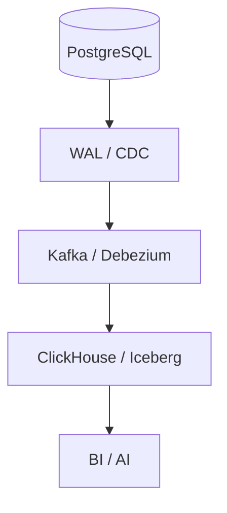
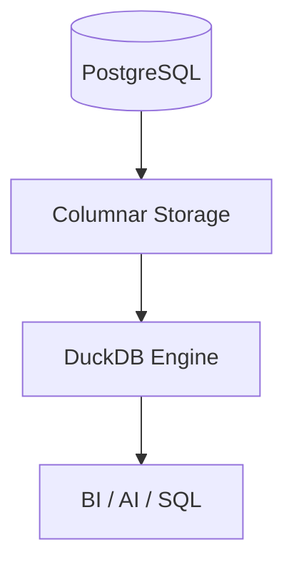
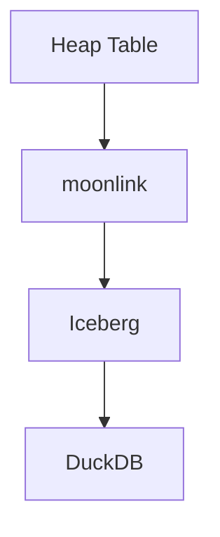
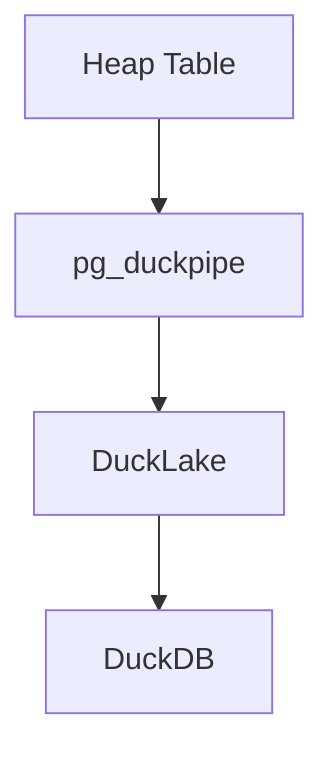
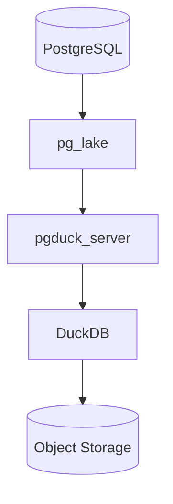
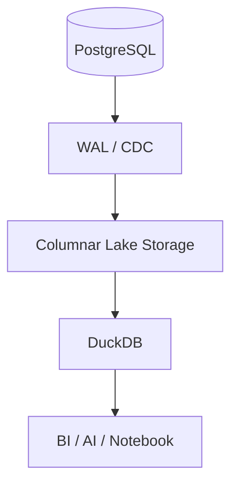
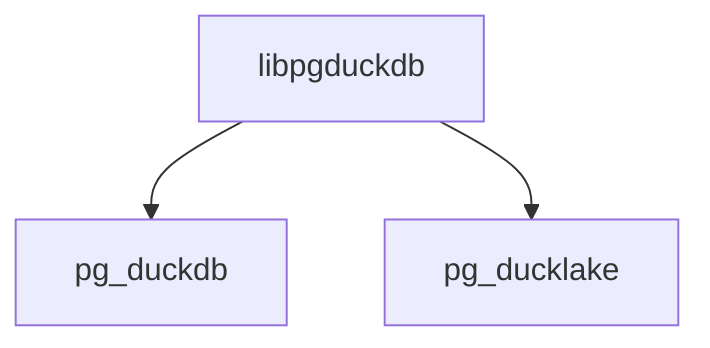
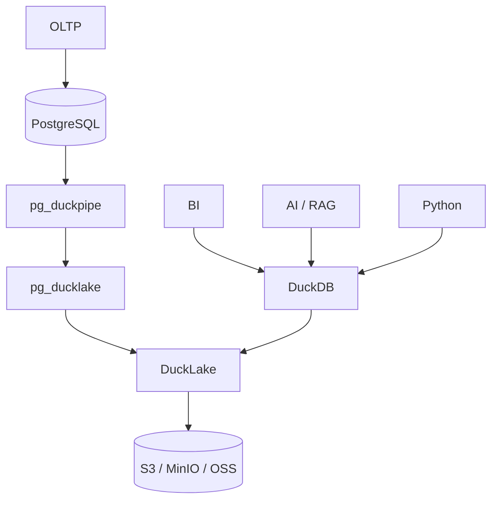
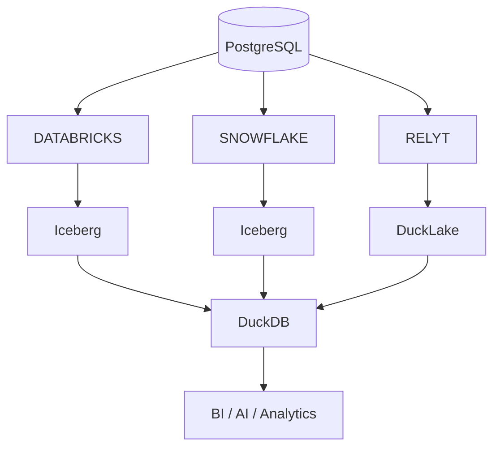

最近在研究 PostgreSQL 实时分析（HTAP/Lakehouse）的时候，我发现了一件很有意思的事情。

不同公司的产品，看起来越来越像了。

例如：

* pg_mooncake + moonlink（Mooncake Labs）
* pg_ducklake + pg_duckpipe（RelytCloud）
* pg_lake（Snowflake）

虽然来自不同公司，但仔细分析之后会发现，它们实际上都在解决同一个问题。

> **如何让 PostgreSQL 同时拥有 OLTP 和实时 OLAP 能力。**

---

## 从 PostgreSQL 到 Lakehouse

传统架构中，我们通常会这样部署：

这个方案已经非常成熟，但也存在明显的问题：

* 部署组件多
* CDC 链路长
* 运维复杂
* 数据一致性难保证
* 延迟较高

于是最近两年出现了另一种思路：

整个系统仍然以 PostgreSQL 为核心，但分析能力交给 DuckDB。

这就是目前几个项目共同探索的方向。

---

# 三条技术路线

## 第一条：Mooncake

最早让我注意到的是 Mooncake Labs。

他们发布了两个项目：

* pg_mooncake
* moonlink

其中：

**pg_mooncake**

负责在 PostgreSQL 内提供列存分析能力。

**moonlink**

负责把普通 Heap Table 的数据实时同步到 Iceberg。

整体架构如下：

当时这个设计让我眼前一亮。

PostgreSQL 负责事务。

DuckDB 负责分析。

Iceberg 负责数据湖。

职责划分非常清晰。

遗憾的是，Mooncake Labs 后来被 Databricks 收购。

团队加入了 Databricks Lakebase 项目之后，公开开源项目基本停止了快速迭代。

技术路线并没有错。

只是公开版本已经很难再作为长期投入对象。

---

## 第二条：RelytCloud

后来我发现了 RelytCloud。

他们几乎沿着同样的路线重新做了一遍。

对应关系非常明显：

| Mooncake    | RelytCloud  |
| ----------- | ----------- |
| pg_mooncake | pg_ducklake |
| moonlink    | pg_duckpipe |

整体思想完全一致：

* PostgreSQL 做 OLTP
* DuckDB 做分析
* WAL CDC 做同步

最大的区别在于：

Mooncake 选择了 Iceberg。

Relyt 选择了 DuckLake。

架构如下：

DuckLake 是 DuckDB 官方推动的新一代 Lake Format。

相比 Iceberg：

* 元数据更轻量
* 与 DuckDB 深度集成
* 不依赖 Java 生态
* 更适合中小规模分析

随着 DuckLake 发布 1.0，pg_ducklake 也发布了 v1.0 正式版。

我认为，这意味着它已经进入了可以生产使用的阶段。

当然，这里的“生产”更适合：

* Dashboard
* BI
* 实时分析
* AI/RAG 数据分析
* 数据探索

而不是立即替代企业最核心的数据仓库。

数据库产品真正的考验不是发布 v1.0，而是未来三到五年的持续维护能力。

---

## 第三条：Snowflake

后来 Snowflake 又开源了 pg_lake。

这让我有些意外。

Snowflake 并没有重新发明轮子。

它同样选择了：

PostgreSQL + DuckDB。

但是工程实现更加激进。

它并不是简单的 PostgreSQL Extension。

而是：

DuckDB 被放到了独立 Server 中。

这样可以：

* 避免污染 PostgreSQL 进程
* 发挥 DuckDB 多线程优势
* 更容易水平扩展

代价也很明显。

整个系统已经更像一个数据库，而不是一个 Extension。

部署、运维、调试复杂度都会明显增加。

从工程角度来看，我认为它是目前设计最成熟的一套方案。

但也是学习成本最高的一套方案。

---

# 为什么大家越来越像？

最有意思的是：

这三家公司最终都得出了几乎相同的结论。

大家真正竞争的已经不是：

> 是否使用 DuckDB。

而是：

* Lake Format
* CDC
* Catalog
* Storage
* 云平台整合

分析引擎基本已经统一到了 DuckDB。

这说明 DuckDB 已经成为 PostgreSQL 实时分析方向的事实标准执行引擎。

---

# Iceberg 还是 DuckLake？

目前形成了两条路线。

## Iceberg 派

代表：

* Snowflake
* Databricks（Mooncake）

优势：

* 生态成熟
* Spark/Flink 支持丰富
* 企业接受度高

缺点：

* 元数据复杂
* Java 生态较重

---

## DuckLake 派

代表：

* RelytCloud

优势：

* 更轻量
* DuckDB 原生支持
* 部署简单
* 更适合分析型应用

目前最大的挑战不是技术。

而是生态。

如果未来越来越多项目支持 DuckLake，那么它完全有机会成为 Iceberg 之外的重要选择。

---

# 为什么我更关注 RelytCloud？

原因其实很简单。

首先，项目足够活跃。

其次，v1.0 已经发布。

再次，他们开始把公共能力抽离出来，例如：

说明项目已经开始考虑长期维护，而不是简单实现功能。

相比之下。

Mooncake 的公开版本已经明显放缓。

Snowflake 的 pg_lake 虽然工程能力很强，但整体架构相对复杂，更像一个完整数据库系统。

而 pg_ducklake 更符合 PostgreSQL Extension 的使用习惯。

对于很多中小团队来说，上手成本更低。

---

# 我认为未来会形成什么格局？

未来几年，我更看好这样一种统一架构：

其中：

PostgreSQL 负责事务。

DuckDB 负责分析。

对象存储负责持久化。

DuckLake 负责统一数据格式。

AI、BI、Notebook 都直接读取同一份数据。

整个系统没有复杂的数据同步链路，也不需要额外维护 Kafka、Debezium、ClickHouse 等多个组件。

---

# 结语

过去几年，数据库行业一直在讨论 Lakehouse。

而我越来越觉得，真正正在形成的新趋势不是 Lakehouse 本身，而是：

> **PostgreSQL + DuckDB。**

无论是 Databricks、Snowflake，还是 RelytCloud，都不约而同地选择了这条路线。

真正的竞争已经不再是分析引擎，而是谁能把 PostgreSQL、列式存储、对象存储和 DuckDB 整合成一个稳定、高性能、易维护的整体系统。

如果一定要说我目前最看好的开源项目，我会选择 **pg_ducklake**。

不是因为它一定会赢，而是因为它已经具备了几个重要特征：

* 技术路线清晰；
* 社区持续活跃；
* 已发布 v1.0；
* 工程设计开始走向长期维护；
* 与 DuckDB 官方生态保持一致。

当然，数据库是一个需要时间验证的领域。真正决定一个项目能否成功的，不是第一个版本有多惊艳，而是五年后是否仍然有人持续维护、持续迭代，并持续获得社区和用户的信任。

也许几年后回头再看，这一轮竞争的赢家还会发生变化。但可以确定的是，**PostgreSQL + DuckDB** 已经不再只是几个独立项目的尝试，而正在演变成一个值得整个数据库行业关注的新方向。
