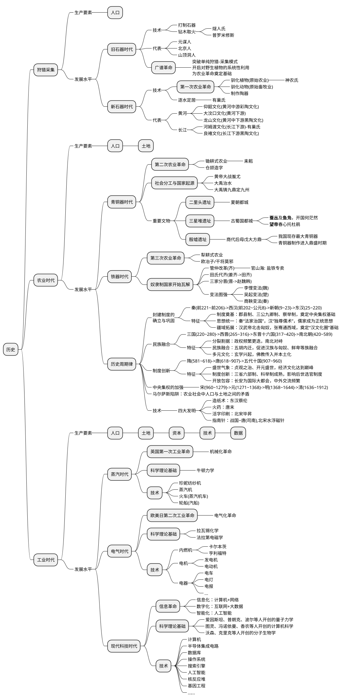
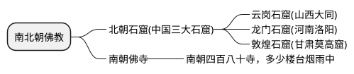

> 人猿相揖别。只几个石头磨过，小儿时节。铜铁炉中翻火焰，为问何时猜得？不过几千寒热。人世难逢开口笑，上疆场彼此弯弓月。流遍了，郊原血。
>
> 一篇读罢头飞雪，但记得斑斑点点，几行陈迹。五帝三皇神圣事，骗了无涯过客。有多少风流人物？盗跖庄屩流誉后，更陈王奋起挥黄钺。歌未竟，东方白。
>
> 贺新郎·读史————毛泽东

## 农业革命：狩猎采集走向定居农耕

主流的生物学里把人定义为能制造并使用工具的一种动物。但是有研究发现猩猩等灵长类、乌鸦等鸟类也会制造并使用工具。我觉得人类与其他生物的区别有以下几个关键因素：

1. **制造工具**。制造工具确实是人的一大长处，人类发展至今，制造了各种工具改造自然。与其他动物不同的是，人类对自然的认识越深刻，制造的工具就越强大。从最原始的弓箭长矛、到农耕时代的牛车马车水车铁犁、再到工业时代的火车电车电灯电话、再到如今的计算机互联网。人类制造的工具越来越复杂，甚至于仅凭一个人已无法制造出现代工具。**人类的劳动分工，使得人类越来越社会化**。
2. **投掷能力**。人类的投掷能力，使其可以进行远距离攻击。其他动物有利爪、獠牙、毒液等攻击武器，灵长类动物却另辟蹊径进化出了灵活的四肢和抓握能力，而作为灵长类的智人率先将这一能力最大化的利用起来，进化出了远距离攻击的投掷能力。但是随着人类从原始狩猎时代走向农耕时代再到工业时代，这一能力被逐渐弱化甚至已经丧失，现在只有在运动会田径赛场上见到人类发挥这一能力。
3. **社会性**。自然界的生物使用视觉信号(光、电磁波)、听觉信号(声音、机械波)、嗅觉信号(信息素、化学物质)、触觉信号(皮肤感受压力和温度)等方式交流通讯。人类在声信号维度不断进化，出现了语言，使得人类之间能传递更加复杂的信息。系统的语言体系让人类个体间能团队协作，实现社会分工，完成难度更高的任务。在昆虫界也普遍存在这样的社会性，蚂蚁、蜜蜂可以通过信息素交流从而团队协作战胜大自己数倍的敌人。

正是这种**社会性**成为人类超越各种体型比自己更大的猛兽站在食物链顶端的决定性因素之一。

**我把语言的出现看作人类的第一次信息革命**。由于语言本质是声音，是一种能量波，没有稳定的物质载体，现今的考古学也无法论证语言的起源。

人类第一次深刻的改造自然的技术是钻木取火。火的利用不仅改变了人类的饮食习惯，还为陶器、青铜器等制造技术奠定了基础。中国历史上的“燧人氏”发明了钻木取火，因此被称为“三皇之首”，西方神话中也把普罗米修斯视为人类之师。**我把生“火”技术看作人类的第一次能量革命**。恩格斯说：“就世界的解放作用而言，摩擦生火还是超过了蒸汽机。因为摩擦生火第一次使得人支配了一种自然力，从而最后与动物界分开。”赵朴初也作诗赞道：“燧人取火非常业，世界从此日日新。”

石斧磨缺，人猿揖别，但此时的智人还处在迁徙状态，哪里有食物，就往哪里走。那是什么让人类开始定居下来？是农业。想象一下，远古的某个人类族群在费尽心力追丢猎物垂头丧气的时候，看着脚下的野麦子，想到了另一种活下去的方式。由于狩猎采集的食物不容易储存，打猎获得的肉、采集的野果容易腐烂，于是人类开始**驯化五谷**。人类因为学会了使用“火”，才能煮烂五谷，谷物淀粉含量高，干燥适合长期储存，因此五谷也逐渐成为人类的主食。种植五谷需要稳定的水源，所以人类逐水而居，刀耕火种，这就是大河文明的起源。中国历史上的三皇之一“神农氏”就是教会人们学会种植五谷，制作陶器的部落。

然后，人类发明了最原始的文字，中国历史上记载文字起源的事件是“仓颉造字”。人类因为有了文字，才有了可记载的历史，因此仓颉也被称为“史皇氏”。

**人类的第一次技术革命——“农业革命”**，发生在新石器时代，因此也被叫做“新石器革命”：人类开始由狩猎采集转向定居农牧，谷物的驯化让人类可以从植物的光合作用中获取能量，第一次实现了生产力的跃迁，告别了和猩猩那样吃了上顿没下顿的日子。这次技术革命中，陶器和磨制石器的发明是材料革命，火和五谷的驯化是能源革命，语言和文字的出现是信息革命。

这个时候的人类靠农业生产勉强可以养活整个氏族。把此时的生产力定为1，也就是氏族的劳动力人口干活刚刚好够养活氏族的人口(考虑到有尚无劳动能力的幼儿)。这个时候的社会能实现所谓的民主，应该还不能叫做社会，氏族群体人口还比较少，信息沟通成本比较低。只有能让整个氏族利益最大化的人才会被推举为氏族领袖。与此同时，人类还驯化了家禽、家畜、家蚕等动物，拓宽了食物的来源和能量的利用效率。驯化的禽畜相比于过去狩猎得来的肉类更易存储，活物不会腐败，相当于把过剩的能量储存在驯化的动物体中，这样可以细水长流地维持人类生存生活的需要。

随着冶炼技术的发展，从青铜器到铁器技术的演进，铁犁等各种工具的出现以及牛马等畜力的驯化使得生产力得到提高。人类也从刀耕火种的粗旷式生产转变为精耕细作。人口也会因为生产力的提高而增多。青铜时代和铁器时代分别代表着材料革命的两个跨时代的技术。

## 家庭、私有制与国家的起源

> 危楼还望，叹此意、今古几人曾会？鬼设神施，浑认作、天限南疆北界。一水横陈，连岗三面，做出争雄势。六朝何事，只成门户私计！
>
> 因笑王谢诸人，登高怀远，也学英雄涕。凭却长江，管不到、河洛腥膻无际。正好长驱，不须反顾，寻取中流誓。小儿破贼，势成宁问强对！
>
> 念奴娇·登多景楼——陈亮（南宋）

原始氏族公社施行公有制，是因为饮血茹毛的原始人通过个人无法单独生产，个人必须加入集体生产才可能存活；其次，由于没有先进的食物保存方式，狩猎采集的食物容易腐烂，所以多余的食物会尽可能分享给其他成员。原始社会的生产生活方式和狼群、狮群等社会性动物区别不大，男性负责集体狩猎、女性负责采集果实养育子女，此时的公有制是生产力水平极其低下而导致的原始公有制，但实际上这种大家族公社是以家族血缘为纽带的，公社间并不实现打猎的石器、盛物的容器等生产资料的共享。

此时由于认知水平和生产力的低下，人类族群还处在迁徙状态，没有固定的居所，内部实行着群婚制。族群内部按年龄辈分通婚，也就是兄妹、堂兄妹等生育下一代。

到了旧石器晚期，有巢氏带领人类进入巢居文明。人们逐渐对两性关系有所认识，同时由于近亲繁殖会导致遗传病概率的加大，人类开始实行族外群婚制。导致新出生的人类只知其母不知其父，这也就是所谓的“母系氏族公社”。

在新石器时期，人类进入农业社会，生产力水平得到发展。在定居的农业社会，由于男性天然的体力优势，更适合繁重的农业耕作，女性开始依附于男性生存，母系氏族公社逐渐演进为男女婚娶的父系氏族公社。

正因对偶制婚制的形成，以家庭为单位的生产关系出现；同时由于农业社会生产力的发展使得劳动形成了劳动剩余。过去靠打猎、采集野果为生，食物不容易储存，能打到猎物就能饱餐一顿，猎物追丢了就得饿肚子，这种饥一顿饱一顿的生存状态，也就没有所谓的劳动剩余；农业时代，五谷和禽畜的驯化，使得食物更容易储存，劳动剩余随之产生。此时**劳动剩余的权属和继承问题成为新的社会矛盾，以家庭为单位的私有制因此出现，原来那种为了防止过剩的食物腐烂而尽可能分享给其他人的原始公有制也随之瓦解**。

**第一次社会大分工：畜牧业与农业分离**。原始部落进入农业社会过程中，由于地理环境等生产资料的不同，有的部落学会了驯化牛、羊，形成大规模蓄群，从而成为游牧文明；有的部落学会驯化五谷，大规模的种植从而形成农耕文明。由于劳动分工，商品交易也在此时出现。

**第二次社会大分工：手工业与农业分离**。进入青铜时代和铁器时代后，分工进一步细化，制作生产工具的手工业出现，石匠、铁匠、木匠等工种出现，商品经济进入第二阶段。

**第三次社会大分工：商业与农业分离**。随着商品经济的发展，不从事生产，只从事交换的商人阶级出现。他们作为生产者之间的中间人，促进了商品的生产与交换。

其次，由于农业生产需要水资源，水利灌溉设施等大工程的修建与维护，使得**一部分人为了维护公共利益脱离农业生产，形成公权力**。公权力的范围逐渐扩大，如国防安全(炎黄战蚩尤，大禹逐共工征三苗)、兴修水利(大禹治水)。

**公权力与劳动者分离，逐步形成国家**。国家为了维持运转需要财税支持，此时存在一些非农业人口，也就出现了一群人供养另一群人的现象，农业税因此出现，《尚书•禹贡》中就记载了大禹治水后定九州并制定税赋的历史，这也是中国第一部成文税法，被称为“五服之贡”。此时税赋还比较原始，直到春秋时期鲁国“初税亩”的出现，才初具雏形。而中国的农业税直到2006年才被废除，农业税一直伴随着中华文明几千年。

当国家统治者的家庭脱离社会生产时间长了，便不再愿意继续从事劳动生产，这是由俭入奢易、由奢入俭难的人性使然，这种现象被称为“棘轮效应”。大禹治水成功后威望空前，于涂山之会铸九鼎定九州。从此一个阶级统治另一个阶级的阶级社会出现，夏启袭位使得国家从公天下开始演变为家天下。

约公元前1600年，鸣条之战，商汤伐桀，建立商王朝；公元前1046年，牧野之战，武王伐纣，建立周朝。周朝吸取前朝教训，为了维护家天下的统治，将国家土地[分封](https://baike.baidu.com/item/周朝诸侯国/19272776)给各个兄弟一起建设，也就是所谓的封建社会。《荀子》记载：“兼制天下，立七十一国，姬姓独居五十三人”，建国功臣们都被分封到了偏远的齐国、楚国、越国、秦国。诸侯国也有公、侯、伯、子、男明确的等级划分。周朝的农业税以井田制的形式出现，公田的产出归国家，私田的产出归私人家庭所有，孟子说“夏后氏五十而贡、殷人七十而助、周人百亩而彻，其实皆什一也”，说的就是夏商周都是十分之一的税率。

此时的农业社会以父权至上，中国上古时期出现的姓氏，“姓”指代母系（“女”人所“生”），氏指代父系，先秦时期姬,姚,妫,姒,姜,嬴,姞,妘等上古姓以女字旁为主，而氏以地名、国名、官名等为主，通常只有贵族才有氏。这也就是所谓的“男子称氏，女子称姓；姓别婚姻，氏分贵贱”。比如春秋五霸中齐桓公姜姓吕氏名小白（姜子牙吕尚后代），晋文公姬姓晋氏名重耳，秦穆公嬴姓赵氏名任好，吴王阖闾姬姓吴氏名光，越王勾践姒姓名鸠浅。这种姓氏并存的现象正是由母系氏族公社演变到父系氏族的遗留产物。

封建社会发展到数百年后，统治者血缘关系开始逐渐疏远，同时由于人口的不断增长和土地资源的有限，人口和土地的矛盾开始出现，分封的诸侯国之间开始通过战争进行兼并。由于频繁的战争，土地权属经常发生变化，井田制随之瓦解，国家征税不再有公田私田之分。各国开始变法图强，奴隶主贵族的利益逐渐被削弱，奴隶制也随之瓦解。

秦始皇为了国家不再出现战乱分裂，废除分封施行郡县制，加强中央集权，从此进入帝制王朝时代。

秦国之所以胜出，在于秦国施行的商鞅变法认为农民是农业社会最重要的生产者，想要富国强兵必须扩大农业人口比重，保持非农业人口比重不超过10%，把人口不断增长而不从事生产的奴隶主贵族打压到底层从事劳动生产或参军；废井田开阡陌，这里的“开阡陌”就是在原来井田的基础上开出小路，把田地分给底层奴隶，以激发劳动积极性。土地不再属于贵族们的私产，国家鼓励私田买卖和开垦荒地以提高积极性，能者多劳就获得买更多的土地，同时提供军功授爵的阶级快速上升通道，国家机器得到高效率的运转。此时的生产力可定为1.1。

秦国以此兴，也以此亡。当秦国统一六国后，能耕种的优质土地已基本开垦完，战争也结束，阶级出现固化，此时高压的行政手段（修长城、修驰道、重徭役、覆压三百余里的阿房宫）必然激化阶级矛盾，一声“王侯将相宁有种乎”如星火燎原，瞬间激发，这也是历史记载的第一个农民起义。

## 农业时代的生产力瓶颈与王朝的周期兴替

> 劝君少骂秦始皇，焚坑事件要商量。祖龙魂死业犹在，孔学名高实秕糠。百代都行秦政法，十批不是好文章。熟读唐人封建论，莫从子厚返文王。——毛泽东七律·读《封建论》呈郭老
>
> 二千年来之政，秦政也，皆大盗也；二千年来之学，荀学也，皆乡愿也。——谭嗣同

在农业社会之前的狩猎采集时代，所有人都得参加劳动，不劳动就会饿死。**狩猎采集时代唯一的生产要素就是人的劳动力**。此时的生产力受周围的环境制约，周围有河就以渔为生，有猎物就以狩猎为生，有果树就以野果为生。

经历农业革命，人类拥有了改造自然的能力。**在农业社会中，农耕畜牧成为新的生产生活方式，此时土地成为新的生产要素**。阶级随着国家的诞生出现，统治阶级为了获得劳动力要素，战争从过去杀人留地演变为留人留地，而“留”下来的战俘成了统治阶级的奴隶。毫无疑问奴隶制社会中，统治阶级的人口增长速度肯定快于被统治阶级的人口增长速度的。到了战国时期人口总数飙升，而劳动人口不足，为了发展生产力，以商鞅变法为代表的变革出现，允许土地私有并支持土地自由买卖，奴隶制社会随之瓦解。

农业是以土地为基础，中国历史上自秦朝后的**王朝治乱兴衰的历史周期律本质上都是土地生产力有瓶颈导致的**。秦朝以前没有出现这种现象(更准确的来说是战国以前)，是因为土地还没有被完全开拓，西周时期南方还是蛮荒地区，人口稀少，楚国还被称为“荆蛮”。到了战国人口增多土地资源紧张，国家兼并出现。秦帝国奋六世之余烈，括四海，扫六合，平八荒，南取百越，北击匈奴，将大陆所有肥沃的土地收入囊中，自此便进入了土地和人口的周期循环：

* 王朝初期，人口凋敝，百废待兴。人均土地充足，老百姓丰衣足食，人口以指数形式迅速恢复，两三代人后便会迎来王朝的盛世。
* 王朝中期，人口攀升到顶峰，进入王朝最鼎盛的时候。经历几代人的发展，由于个体能力的差异，贫富分化也开始出现。
* 王朝末期，人口的继续上涨，导致土地产出不足以养活这么多人，人们在吃饱和吃不饱的临界点徘徊。只要一旦出现洪涝、干旱、蝗灾等自然灾害，就会出现饿死人的现象，大饥荒人相食曾多次出现在史书中，春秋《左传》中就有易子而食的描写，明朝末年诗人屈大均有一首《[菜人哀](https://baike.baidu.com/item/菜人哀/56105069)》描写了王朝末年社会底层人民面对生存危机的无奈与悲哀。此时朝廷如果未能及时救灾安抚，农民起义就可能会在这个时期频繁出现。

历史上多次引进玉米等高产农作物提高了生产力。如张骞出塞引进了葡萄、石榴、胡萝卜、胡椒、胡瓜(黄瓜)、胡蒜(大蒜)、胡麻(芝麻)、胡豆(蚕豆)、胡桃(核桃)、胡菜(香菜)。张骞作为第一个睁眼看世界的汉人为中国开辟了陆上丝绸之路，后人引进了很多其他农作物，如西瓜(西域)、菠菜(波斯)、茄子、棉花等。另外，由于造船技术和指南针的发明，中国又开辟了海上丝绸之路引进了玉米、番瓜(南瓜)、番薯、番茄(西红柿)、番椒(辣椒)、洋番薯(马铃薯)、洋白菜、洋葱等。

> “胡”字辈大多为两汉两晋时期由西北陆路引入; “番”字辈大多为明朝时期由“番舶”(外国船只)带入; “洋”字辈则大多由清代乃至近代由环球航海的西洋人引入。
>
> [陈益](https://baike.baidu.com/item/陈益/20412)是番薯引进第一人，随着明代科学家徐光启的推广，高产的番薯也让中国人口翻了几倍。徐光启的《农政全书》中有记载：西瓜，种出西域，故之名。甘𫉄，即俗名红山药也。异物志曰：甘𫉄似芋，亦有巨魁。剥去皮，肌肉正白如脂肪。南人专食以当米谷。

也正因为农业生产力的不断提高，中国古代王朝鼎盛时期能容纳的人口也在不断攀升：两汉巅峰期人口6千多万人，唐朝8千万，宋朝鼎盛时期(宋徽宗赵佶时期，靖康之乱前夕)人口突破1亿，元朝只有9千万(还是蒙古人觉得汉人杀不完的情况下)，明朝鼎盛时期(万历年间)人口1.5亿，清朝鼎盛时期(乾隆盛世)人口超过3亿。现在能养活14亿人口，得感谢袁隆平等科学家的育种技术以及化肥技术的推广。

除了土地生产力的因素外，制约王朝寿命的另一个因素是以税收为代表的分配制度：

* 王朝初期，均田制度实现了相对公平，王朝重新焕发活力，纳税人口占总人口的比例较大，国家税基也相对充盈。
* 王朝中期，由于个人天赋与能力的差异，出现贫富分化：弱者由于天灾或者人祸，为了活下去被迫卖田；强者或者最开始掌握优质土地的人使用积累的劳动剩余，购置了更多的田地。这其中特别是士绅贵族以及官僚阶级有免税的特权，使得他们能拥有更多的田地，更甚者他们使用手中的特权进行**土地兼并**——巧取豪夺百姓的田地。此时国家税基开始萎缩，国家的税负压在了普通百姓的身上。
* 王朝末期，土地兼并无以复加，失地的农民被迫沦为地主的佃农依附于地主，以官僚阶级为代表的地主占有大量土地，不事生产的食利阶级越来越多，此时富者田连阡陌，贫者无立锥之地。国家税收已无力维持国防军事、民生赈济等开支。此时王朝极度脆弱，任何外敌入侵、水灾旱灾等问题都会成为压死骆驼的最后一根稻草。不加税无力征兵导致被外族击溃，加税则官逼民反，届时农民起义四起，王朝崩溃，新的轮回重新开始。

朝廷如果有足够的税收救灾安抚受灾群众或者及时扑灭农民起义的火苗，王朝还能续命，但是明君也只能通过打击士绅豪强，合理分配财富、增加税基延缓这个进程，并不能逆转这个进程，因为人口增长和自私都是刻在人基因里的天性，老子在《道德经》中有云：天之道，损有余而补不足；人之道，损不足以奉有余。这种人类系统熵增的马太效应是社会规律，不以个人意志为转移。

农业时期商品经济十分简单，同时中国士农工商的历史传统导致商业发展受限。但是我们从农业社会发展的本质中发现两个点：

1、土地是生产资料，是农业社会财富的来源。所以历史上的明君都是通过土地改革解放农业生产力的，如清朝雍正的摊丁入亩、官绅一体当差纳粮，使得之后乾隆盛世人口能达到3亿以上。

2、人多地少是农业社会永恒的矛盾。这是古代王朝周期循环，不超过300年的根本原因。这是客观规律不以个人意志为转移，明君昏君只能延缓或加速这个进程，却无法逆转，如荀子所说“天行有常，不为尧存，不为桀亡”。

农业社会的两个核心生产要素是人口和土地，人口越多，生产力越高，但人口达到土地生产力承载的极限后，过多的人口并不会带来生产力的提升，这个规律被西方总结为“马尔萨斯陷阱”。

正是农业社会生产力进展缓慢，导致中国王朝不到300年就会陷入王朝周期律。

但西方国家并没有300年的桎梏，这是为何？这在于中国自秦以后大部分时间是大一统帝国，大一统国家的小农经济虽然从长期来看会导致贫富两极分化，但短期来看却异常的稳定，因此王朝建立后往往能经历很长的一段和平年代；其次，中国周边都是不适合农耕的土地，西边是青藏高原和西域大沙漠，北边是西伯利亚高寒带，东边是汪洋大海，这导致中原文明形成一个封闭的大系统，每到王朝末期，土地集中于大地主后，底层人又无法对外扩张开拓新的适合耕作的土地，只能内部消耗，推翻地主阶级的统治，重新分配土地。改朝换代不仅调整了产权结构，而且大规模的战争使得人口减少，马尔萨斯陷阱和分配的极端不平等问题都得到了解决。

而西方更像中国的春秋战国时期，小国林立。即使凯撒和他的养子屋大维统一了整个地中海地区建立了[罗马帝国](https://baike.baidu.com/item/古罗马/888289)，但罗马帝国并不像中国的家天下，上层贵族为了争夺[罗马皇帝](https://baike.baidu.com/item/罗马皇帝/416182)的最高权力不断有内斗现象，内部频繁发生战乱和王朝更替，没有稳定的中央集权。地中海北部[欧洲三大蛮族](https://baike.baidu.com/starmap/view?nodeId=4b0ae63d1c01d37ca302c30c)的原始部落也逐渐崛起，特别是东西罗马分裂后，西罗马帝国被北欧的日耳曼民族击溃，更加四分五裂。欧洲战争的频繁程度远比长期统一的中原大帝国高的多，这使得欧洲人口不像中国王朝更替一样出现周期性的波动。

|东方|西方|
|--|--|
|春秋(前770年～前476年)|古希腊(前800年左右~前146年) 罗马王政时代(前753～前509年)|
|战国(前476年～前221年)|罗马共和国(前509～前27年)|
|秦(前221年～前207年) 汉(前202年～220年)|罗马帝国(前27年~1453年)【屋大维】|
|魏晋南北朝(220年~280年,265年－420年,420年—589年)|东西罗马分裂(395年~476年【西】/1453年【东：拜占廷帝国】)|

那为什么中国能实现长期中央集权的大一统国家，而欧洲不行呢？除了小农经济的稳定性外，还得益于秦始皇的统一文字，中国的汉字是表意文字，即使有方言上的读音区别，但不影响汉字的理解，换句话说**中国的语言和文字是相对分离的体系**。

**文字是人类历史上继语言出现后的“第二次信息革命”，也让信息有了载体**，文字的出现提高了信息传播的时间和空间的广度，使得信息从口口相传变为基于甲骨、竹简、锦帛、纸张等载体的传播。时间上，文字可以记录历史上发生过的事件，使人类可以回溯过去的历史，提升认知；空间上，文字可以像政令一样进行大范围的传播，提高了信息的传播的效率和准确性。[中国方言](https://baike.baidu.com/item/中国方言)众多，各自有各自的体系，大的如普通话、粤语、客家话等，小的像赣语、吴语等甚至出现“十里不同音”的现象。而秦始皇统一的汉字使得这些不同体系的方言产生了语义的关联，历史上被人诟病的“焚书坑儒”其实是为了消灭其余六国的文字和史书，所谓的坑杀儒生数百人和历史上的各种战争相比不值一提，正如清朝著名学者龚自珍所说“欲亡其国，必先亡其史，欲灭其族，必先灭其文化”。正是占据人口大多数的汉族人通用汉字，使得中国经历了数次外族入侵，外族统治者都选择了汉化，因为只有使用汉字才可能让统治者的政令传递到基层。

而西方则不同，**欧洲的拉丁文字是表音文字，语言和文字耦合度过高**。罗马国家建立之后，[拉丁语](https://baike.baidu.com/item/拉丁语/747781)成为官方语言，但随着罗马帝国的逐渐分裂，拉丁语也随着各地方言的差异不断分裂，这使得在中国出现的“分久必合”无法在欧洲出现。

另外作为中国四大发明的“纸”使得文字信息的传播效率大大提高。东汉初期的蔡伦改进了造纸技术，让纸能用于书写，纸的出现不仅代替了竹简和锦帛等信息载体，也造就了中国璀璨的书法艺术：东汉草书鼻祖张芝改章草为小草；汉末行书鼻祖刘德升创效率和辨识度兼备的行书；三国楷书鼻祖钟繇创章法分明的楷书；东晋书圣王羲之、王献之、王珣；后世欧颜柳赵，苏黄米蔡更是书就了一个个书法艺术的明珠。这种书法艺术造就的文化认同，也增加了国家的凝聚力。

在西方，造纸术和活字印刷使得书籍广泛传播，为文艺复兴、科学革命奠定了基础。可以说**造纸术和活字印刷术是人类第三次信息革命，革新了信息的载体，提高了信息传播效率**，纸的成本极低，书写方便，远远超过以前的甲骨、竹简、锦帛。

## 道德、法律和宗教的目的是维护社会秩序

> 天地不仁，以万物为刍狗；圣人不仁，以百姓为刍狗。——老子《道德经》
>
> 仓廪实而知礼节，衣食足而知荣辱——管仲《牧民》
>
> 我翻开历史一查，这历史没有年代，歪歪斜斜的每页上都写着“仁义道德”几个字。 我横竖睡不着，仔细看了半夜，才从字缝里看出字来，满本都写着两个字是“吃人”！——鲁迅《狂人日记》

在狩猎采集时代，人类是没有国家、道德和法律的，此时人类的价值观是暴力至上。

伦理道德最早是人类从群婚制演变为对偶婚制过程中产生的，最早追溯到人文始祖伏羲制定婚姻制度，目的是避免近亲繁殖出现遗传疾病，同时通过道德约束合理分配劳动所得使男性能承担起养育后代的责任。可以看到，中原文明对未能遵守这项道德的部落或国家称为未开化的蛮夷，最开始是楚国荆蛮，接着是西戎蛮夷，匈奴蛮夷……

**对偶婚制和劳动剩余的出现催生以家庭为单位的生产关系，正是家庭的出现，使得私有制产权关系的伦理道德出现**。公权力与劳动者分离形成国家，国家还需要帮每个人维护“私人财产”————私有财产神圣不可侵犯。此时，维护私有制财产的法律出现了。人类第一部成文法律《汉谟拉比法典》于公元前1776年在中东两河流域的巴比伦国出现。

**私有制成为了人类奋斗的动力，也是人类历史周期循环的驱动力**。马克思设想的公有制只有在这种伦理道德消灭后才可能出现，而彼时父子、母子、夫妻等社会关系也将不复存在，此时的人类或许以另一种方式繁衍或者得到永生，这个我不得而知，有很多科幻作品(如《美丽新世界》)曾想象过这样的时代。

**道德规范的是人的主观意识，只能约束有道德的人；法律规范的是人的客观行为，可以惩罚不遵守规则秩序的人**。先秦儒家就是主张以道德治国的主要流派，法家就是主张以法律治国的流派。道德没有强约束力，每个人每个时代的道德观念差别也很大，没有统一的标准。用道德可以约束自己达到自律，但模糊的道德无法约束所有人。因为儒家的理想主义没有考虑人性的幽暗，最终战国主张儒家的国家都灭亡了。法律约束力强，白纸黑字明文规定。特别是税法是是社会财富分配的工具，统治者通过鼓励耕战等社会利益的分配手段，能打造出秦国这样军国主义的战争机器，但严刑峻法也剥夺了个体的人性，使人成为社会机器。而且人客观造成的犯罪，有时并非主观意愿，法律过于严苛死板，法不容情，容易造成冤假错案。另外执法人员也是芸芸众生的一员，也有人的局限性，法家没有考虑执法者内心的幽暗，执法者可能成为破坏社会秩序的力量。中国古代有能力的统治者结合两者，慢慢发展出外儒内法的制度。而现代法律也结合了法治与德治的思想：定罪以客观行为为准，论迹不论心；量刑以主观意识为依据，结合犯罪主体实际情况酌情处理，如犯罪行为分故意犯罪和过失犯罪，刑事责任年龄等成为量刑依据。

孟子说：“人之性善也，犹水之就下也”，儒家尊崇“人之初，性本善”，所以儒家宣扬每个人通过“自律”提升自身道德水平，社会自然就和谐了。荀子说：“人之性恶，其善者伪也”，法家尊崇“人之初，性本恶”，认为人必须通过法律约束实现“他律”，社会才能有稳定的秩序。

**人性本身没有善恶，人性随环境的改变而改变**。人与人之间没有利益冲突的时候，人性中的善自然会流露出来，这是许多社会性动物特有的“同情心”；当出现利益冲突，再有涵养的人也会为了生存资源而争夺，这是人类作为动物本能的“兽性”。刘慈欣在《三体》中有一句很经典的话————“失去人性，失去很多；失去兽性，失去一切”。战国末年，诸侯国之间的战争烈度达到了顶峰，而生于这个年代的大儒荀子也转变了传统儒家性善论的观念而提出性恶论，荀子的理论学说被称为“荀学”，相比于"孟学"更具有现实主义的倾向。荀学基于儒家的立场，吸收百家之长，特别是道家、名家和法家的学说，建立起自己的思想体系，为统一的大帝国的形成提供理论依据。

**人类的所有制度都是为了解决社会问题**，比如私有制是为了解决原始公社末期劳动剩余的权属问题，现代法律也都是为了解决人与人之间的利益冲突。**为了适应不同时期的生产力发展，法律在不同历史时期也会随之发展**。农业时代，随着牛马等畜力的驯化，农业生产力得到发展，法律也因此改变，牛马作为农业时代最重要的生产力，古代王朝通常都会禁止私自宰杀牛马。中国古代重农主义，统治者认为农业为本，工商为末，为了富国强兵就必须重本抑末，因此宋明两代会有禁止商人穿绸缎的禁令。到了工业时代，技术成为生产力发展的重要推动力，技术专利和知识产权等法律随之诞生。[**法律是阶级社会特有的现象，主要体现的是统治阶级的意志**](https://baike.baidu.com/item/唯物主义法律观)。

在漫长的农业发展过程中，东西方都发展出了宗教。宗教原本产生于人类对自然现象的神秘感和对自然力量的恐惧与崇拜，人类想象出各种神话寓言来解释自然现象，后来逐渐被统治阶级作为控制社会意识形态的工具，它限制了人们的思想。在东西方，人类都长期受**宗教陷阱**的桎梏。

中国的儒释道三教在漫长的历史中实现了三教合一。道教发源于春秋时期的老子，老子的《道德经》本是他在春秋诸国纷争时对人类社会和宇宙本源的哲学思考，后世逐渐演变成宇宙阴阳、修仙问道的宗教思想；儒家由孔子创立，后由汉武帝罢黜百家独尊儒术成为主流思想，后世统治者逐渐将儒学改造成“君为臣纲 父为子纲 夫为妻纲”三纲五常的道德秩序；佛教发源于古印度，由老子同一时代的释迦摩尼创建，东汉明帝时期传入中国被称为“浮屠教”，南北朝时期，战争不断，人们面对人世变幻无常，主张“一切皆苦，历世修行”的佛教开始在各地盛行。西方罗马帝国时期，巴勒斯坦地区的耶稣创建基督教，现在通用的公元纪年就是以耶稣的诞辰作为起始日，后来逐渐分化为天主教(罗马公教)、东正教(东罗马正统大公教)、新教三大流派，基督教是欧美诸国流行，甚至至今仍是梵蒂冈(罗马教廷)的国教；伊斯兰教与基督教、佛教同为世界三大宗教，由穆罕默德于公元7世纪初在阿拉伯半岛创立，在中东、中亚诸国流行。

在中国，宗教通常是统治者用于统治底层民众的工具，但国家权力始终在宗教之上。而西方，政权和神权之间多有纷争，甚至大多数时候神权凌驾于王权之上，这也是为什么西方国王需要教皇加冕，这本质上和东方的“君权神授”有异曲同工之处。也正因此，西方在漫长的中世纪民众的思想都受到了宗教的禁锢。

十四世纪中叶黑死病导致了宗教信仰的崩塌，信上帝买赎罪券并不能保佑你免遭瘟疫，而后以意大利为策源地文艺复兴思想解放运动在西欧一直延续到16世纪，期间涌现了众多注重人本思想的人文艺术家，如意大利的人文艺术三杰(文学：但丁、彼特拉克、乔万尼·薄伽丘，美术：达·芬奇、拉斐尔·桑西、米开朗基罗)、英国的莎士比亚；16世纪马丁路德等人提出宗教改革，新教由此诞生，它动摇了天主教的神权统治，也改变了政教合一的局面；与此同时，以哥白尼为代表的科学革命使得理性的科学思维方式开始萌芽，17-18世纪启蒙运动使得封建主义解体，自由、民主、平等的理性主义思想盛行，哲学、自然科学、社会科学开始百花齐放。

科学革命引领技术变革，技术变革使得生产力进步，带动生产关系变革和社会制度的变迁。西方重商主义促成了欧洲资本的原始积累。15世纪末由于大航海的地理大发现扩大了世界市场，西欧出现了专制的中央集权国家，圈地运动使得农民与土地分离，失去生产资料的农民沦为无产者不得不出卖自己的劳动力；荷兰(荷兰东印度公司、荷兰西印度公司)、英国(英国东印度公司)先后在全球殖民主义掠夺中成为世界头号强国，殖民者往返于欧非美三大洲进行黑奴贸易；农奴制榨取着劳动人民的剩余价值，萃取成资本，成就了不列颠的日不落帝国称号。

历史中帝国的辉煌与王朝的盛世背后，是无数劳动人民血和泪铸就的。统治者使用宗教、道德约束劳动人民的思想和行为，正如鲁迅所说历史写满了仁义道德，字缝里却只见“吃人”二字。

**经济基础决定了政治、法律、文化等上层建筑**。古代的宗教文化与道德观念都是当时生产力的产物，因为人多地少是当时的主要矛盾。

道德化的看问题，容易掩盖历史真相，真正推动人类历史进步的是生产力的发展，只有通过这个视角才能看透历史上所谓的“野蛮征服文明”的假象。

## 政治是经济的集中表现，文化是经济和政治的反映

> 昨日入城市，归来泪满巾。遍身罗绮者，不是养蚕人。————北宋·张俞《蚕妇》
>
> 可怜身上衣正单，心忧炭贱愿天寒————唐·白居易《卖炭翁》
>
> 地不知寒人要暖，少夺人衣作地衣————唐·白居易《红线毯》
>
> 朱雀桥边野草花，乌衣巷口夕阳斜。旧时王谢堂前燕，飞入寻常百姓家。————唐·刘禹锡《乌衣巷》

最具代表性的是魏晋南北朝时期，由于东汉末年土地兼并严重，以黄巾军起义为代表的农民起义风起云涌。袁绍、曹操、孔融等掌握大量土地的“四世三公”们割据中原成为一方霸主，最后曹操、刘备、孙权形成鼎立之势。随着“一代目”离世，三国都开始走向下坡路，司马家在高平陵事变(249年)中篡魏成功，最终三家归晋(280年)。司马家族篡魏，是名门望族所不耻的，但迫于皇权军政力量，此时文人们或者超脱，放纵、或者消极避世，出现了与建安七子(曹魏时期)齐名的竹林七贤(魏晋时期)。

晋朝也没和平多久又闹起八王之乱(291年至306年)，司马懿的儿子、孙子、曾孙子们开始家族大乱斗，西晋亡国导致五胡乱华(304年至439年)，士族们为了躲避战乱永嘉南渡(307年)。东晋建国功臣王敦、王导助力琅玡王司马睿(晋元帝)建国，王导主政、王敦治军，王氏家族子弟遍布朝堂，于是琅玡王氏与司马皇室形成“王与马，共天下”的局面。东晋时期最著名的书法家王羲之(兰亭集序、快雪时晴帖作者)、王献之(中秋帖作者)、王珣(伯远帖作者)就是琅玡王氏子弟。在著名的以少胜多的淝水之战中，以谢安为首的谢氏家族为东晋大胜立下至伟的贡献，挫败了前秦天王苻坚的八十万大军，奠定了陈郡谢氏为东晋以及南朝当轴士族的地位。南北朝“才高八斗”的诗人“谢灵运”就是谢玄之孙。魏晋南北朝(六朝)时期的“王谢”也成了显赫世家大族的代名词。这段时间老百姓饱经战乱，妻离子散让他们意识到生命的短暂和可贵，所以当他们意识到生命的长度不可以增加时，他们只能选择拓展生命的宽度。陶渊明就是这个东晋时期著名的文人。特别是陶渊明写的《桃花源记》表现了当时人们对现实生活的不满和对美好生活的向往。

东晋权臣刘裕逼迫司马德文退位后(420年)，进入南朝。这不到200年的时间里又经历了宋、齐、梁、陈四朝，最长的刘宋一朝也才只有59年的国祚。东汉明帝时期传入的佛教也是在这个时候进入了一段鼎盛时期，唐朝杜牧的“南朝四百八十寺，多少楼台烟雨中”说的就是南朝佛寺非常之多。

最终北周权臣弘农杨氏的杨坚夺权建隋(581年)，统一南北，让分裂数百年的华夏大地重归一统。杨坚吸取了东晋门阀政治的弊端，废除了“九品中正制”，初创科举制。但是隋唐时期，虽然有了造纸术，但是没有印刷术，书籍和知识永远垄断在世家大族和地方豪强手里，所以隋唐时期仍然有[五姓七望](https://baike.baidu.com/item/五姓七望/469925)等世家大族。大家所熟知的王勃、王之涣、王昌龄、王维等大文豪都出自太原王氏；与王勃齐名的初唐四杰之一“卢照邻”出自范阳卢氏；李靖、李揆等近10位唐朝宰相以及著名的李商隐等均出自陇西李氏。直到唐末黄巢起义，不少世家被灭族，后又经历五代十国大乱世，门阀政治才得以结束。宋朝科举糊名制度、誊录制度普及后，才完成了官僚体系平民化的转型。

## 工业革命使得机器代替人力畜力

> 资产阶级在它的不到一百年的阶级统治中所创造的生产力，比过去一切世代创造的全部生产力还要多，还要大 ———— 卡尔·马克思

**科学革命推动了技术的进步，引发了欧洲的工业革命**。欧洲工业革命的发展，让欧洲的生产力飞速提升。而明清两代西方大量的丝绸、瓷器、茶叶等需求导致世界大量的白银流入中国，为了平衡贸易逆差打开闭关锁国的中国市场，西方将鸦片输入中国并发动了鸦片战争。此后中国历经多次战败，清王朝也被迫工业化进行了洋务运动。洋务运动只是技术上的变革，中日甲午战争的失败证明了只进行“师夷长技以制夷”的技术变革是不行的，所以以孙中山为首的革命党人又进行了辛亥革命、护发运动等制度变革，只进行制度变革也还不够唤醒四万万中国人，所以陈独秀李大钊(南陈北李)发起了新文化运动试图在文化思想层面进行变革，引进“德”先生和“赛”先生宣扬民主和科学思想来适应新的工业文明。建国后，我们又以举国之力进行工业化————中国开始一步步顺应世界潮流进入工业化时代。

为什么工业革命发生在欧洲而不是中国？因为欧洲有科学。首先明确一点，常说的科技包含科学和技术，这两者要区分开。**科学是认识世界，技术是改造世界**。中国古代有技术而无科学，中国的齐民要术、梦溪笔谈、农政全书、天工开物等传统丛书都是技术经验的积累，没有科学的深层解释导致这些厚厚的丛书复杂而不系统，中国的哲学思辨还停留在阴阳五行的层次，这使得技术发展只能是无规律的试错，进展缓慢。欧洲文艺复兴后，传统希腊科学的理性思维得到进一步发展，伽利略、牛顿、拉瓦锡、法拉第等科学家通过定量实验和数学计算让自然规律有了哲学思辨，他们提出了许多定律将各种复杂的现象总结为一个个简洁的数学公式，有了科学指导，技术会爆炸式地发展。这就像中医和西医的区别，中医是经验点的积累，复杂但不系统，底层哲学原理是阴阳五行，思维方式是通过金木水火土相生相克来解决病患问题；西医是基于化学、生物学、有机化学、遗传学、分子生物学等科学体系的积累，比如遗传学使得生物学扩大了认知，分子遗传学再次扩大了人类对生物体的认知，这种基于自然哲学的科学认知是成体系的。因此现在的中医不敢说比500年前李时珍时期的中医牛逼，但西医肯定敢说比500年前的西医更牛逼。

当然，西方科学昌明除了启蒙运动带来的理性思考，还有一个客观原因，那就是西方玻璃工业更加先进。西方容器以玻璃为主，东方容器以陶瓷为主。而玻璃透明的性质让西方工匠能制造出凸透镜，使得人类能探索宏观的宇宙、微观的细胞。比如伽利略制作了世界上第一台天文望远镜，促成了他在观测天文学上的成就，也正是天文望远镜的出现使得东西方天文学拉开巨大差距，当伽利略发现木星的卫星时，我们还在用金木水火土阴阳五行命名天上的星星；牛顿在伽利略的基础上制造了更先进的望远镜和棱镜，造就了他在天文学和光学领域的辉煌成绩；罗伯特胡克制作了第一台显微镜成为第一个观察到细胞的人，同一时期的列文虎克改进显微镜使显微镜能放大两百多倍，人类对微观世界的认知更加开阔。西方发展出玻璃为代表的现代科学，东方发展出陶瓷为代表的大陆文化，这也是各自的地理位置所导致。西方文化发源于地中海，最不缺的是沙子，而沙子是制作玻璃的重要原料；中国发源于大陆，最不缺的是黏土，特别是景德镇瓷器为代表的高岭土，中国的高岭土资源居世界前列，这是陶瓷技术诞生的基础。中国的《墨经》中有使用冰制作凸透镜的记载，可惜冰的熔点较低，使其缺乏玻璃透镜的天然优势。春秋战国各路思想的百花齐放，说明中国从来不缺充满好奇心和探索欲的人，缺的是探索宏观和微观世界的工具。

正是科学的进步使得西方技术和工业不断革命，人类对物质和能量的利用率极大的提高。

1760年代开始，**第一次工业革命以牛顿力学为科学基础**，以煤炭能源为辅助使得蒸汽机、纺纱机、火车等技术得到发展，人类进入蒸汽时代。这次技术革命主要革新的是能源技术：蒸汽机和火车等机器对煤炭的利用，将煤炭中化学能以燃烧出热能的形式转化为机器的动能。而蒸汽机和火车的制造得益于各种新式炼钢法的发展，这是材料技术的突破。

1860年代开始，**第二次工业革命以拉瓦锡开创的化学、法拉第开创的电磁学为理论基础**，以化石能源为辅助，使得内燃机、发电机等技术得到发展，人类进入电气时代。这次技术革命包括三个方面：
  + **能源革命**：
    1. 内燃机对化石燃料的利用，将汽油中的化学能以燃烧出热能的形式转化为机器的动能，内燃机将热能封锁在燃机内部，相比瓦特改良的蒸汽机烧开水的形式更加高效。这期间最具时代意义的便是卡尔本茨发明的第一台汽车，后来亨利·福特通过流水线方式改进了生产流程，让福特汽车走向了寻常百姓家。不过内燃机从上个世纪发展到现在，热效率都没有超过50%。
    2. 发电机将动能转化为电能，使得能量可以通过导线传递。这期间具有划时代意义的是托马斯·爱迪生发明了电灯，维尔纳·冯·西门子发明的电车，尼古拉·特斯拉发明的交流电输电技术。
  + **信息革命**：**塞缪尔·莫尔斯发明的电报、亚历山大·贝尔发明的电话等技术是人类的第四次信息革命**，信息以电信号、电磁波等形式进行传递，信息传播的速度远远超过了以往通过纸质媒介传递的速度。
  + **材料革命**：得益于化学的发展，炼钢工艺逐渐发展为现在熟知的现代炼钢技术：转炉炼钢法，平炉炼钢法，电弧炉炼钢法。
  值得一提的是，谍战剧中常见的莫尔斯电码就是最早的二进制信息编码方式，是塞缪尔·莫尔斯于1835年发明的；不久后的1877年亚历山大·贝尔建立了美国电话电报公司(AT&T)并成立了贝尔实验室，后来的晶体管、发光二极管、交换机、通信卫星、C语言、UNIX操作系统等跨时代的技术都是出自贝尔实验室，1925年以来，贝尔实验室共获得两万五千多项专利，8项（13人）诺贝尔奖，因此也被誉为“诺奖摇篮”，可以说，人类迈向信息革命的每一步都与贝尔实验室息息相关。

1940年代，**第三次工业革命以爱因斯坦的相对论、普朗克薛定谔等人开创的量子力学、艾伦图灵与冯诺依曼开创的计算机科学以及香农的信息论、沃森和克里克开创的分子遗传学为理论基础**，以核裂变、核聚变等原子能为辅助，使得核电、半导体集成电路、航天航空、卫星通信、基因工程等技术得到发展。其中原子能技术属于能源革命范畴；单晶硅等半导体材料，橡胶、合成纤维、塑料等高分子材料属于材料革命范畴，而**计算机、互联网等技术属于信息革命**范畴。在贝尔实验室工作的香农提出信息论，从理论上描述了信息的编码存储、压缩传输，图灵和冯诺依曼分别设计了计算机的初始模型，为计算机的发展奠定了基础。

可以看到，中国国内90年代还在用的基于电子显像管的黑白电视没过多少年就换成了大彩电，大彩电还没用多少年，基于发光半导体的液晶电视就占领了主要市场；90年代农村家里很难有一台电话，2000年后诺基亚、摩托罗拉手机也开始在中国流行，各种山寨机也风靡全国，翻盖的、滑盖的、触屏的各式各样，10年后智能手机开始出现，2011年小米发布了第一台小米1手机，随后移动互联网的旋风刮到了中华大地的每一个角落。科技正在以肉眼可见的速度极速发展着，能源的利用效率在不断的提高，人造材料的物理性能满足了越来越多样化的需求，信息的传播效率也越来越高。近几年大数据、人工智能、机器人等技术也在国内涌现，中国已追赶上发达国家并参与到新一轮科技革命的浪潮中。

**从人类技术的发展脉络看，主要分为材料革命、能源革命、信息革命三条主线，三条线相互交织，相互影响**。

人类的石器时代、青铜时代、铁器时代分别代表了材料技术的三个阶段，其中石器时代分为三个阶段，旧石器时代的打制石器，中石器时代的琢制石器，新石器时代的磨制石器和烧制陶器，烧制陶器（陶器的烧结温度在800～1000摄氏度）的出现表示人类已经学会利用火，青铜技术（铜的熔点1083℃）、铁器技术（铁的熔点1538°C）以及后面的瓷器技术（瓷器的烧结温度在1300～1400摄氏度）对温度的要求越来越高，说明了**人类对能量的利用效率在逐渐提高**。工业革命后随着化学的发展，新兴材料不断涌现满足了人类的各种需求。能源革命方面，从钻木取火开始，到工业革命后煤炭的异军突起，到后来全面爆发的石油工业，以及现在发展的各种新能源，核能、太阳能、风能、水能、潮汐能、地热能...获取能源的途径越来越多，其中风能、水能是太阳辐射造成大气运动产能的能量，本质上也是来源于太阳能，而太阳能是氢核聚变产生，因此要想真正拥有用之不尽的能源必须掌握可控核聚变的原子能技术。信息革命方面，人类从语言、文字的出现，到纸媒、电报、电话、电视、互联网、大数据、人工智能，人类对信息的传播速度和对信息的利用效率也在不断的提高。生产力的提高可以用[全要素生产率](https://baike.baidu.com/item/全要素生产率/9767325)来描述，$\dfrac{总产出}{总要素投入}$，正是人类技术的不断进步，提高了各个生产要素的利用效率，从而提高了生产力。

再从工具维度看这三者的结合关系。在工业革命之前，人类通过材料技术创造的工具都是死工具，需要人力或畜力驱动；工业革命后，蒸汽机和内燃机的发明，让工具可以充分利用煤炭或石油等能源，解放了人的体力，但此时的工具仍需要人来控制；信息时代，计算机和网络等信息技术的出现，使得工具可以自动化运作，特别是大数据和人工智能的出现，自动驾驶技术让开车不再需要司机拥有驾驶经验，智慧工厂让生产不再需要人为管控，无人零售、无人酒店、无人餐厅、无人物流…信息技术解放了人的智力。

## 科学革命开拓人类世界观，是技术变革的驱动力

> 吾爱吾师，吾更爱真理————亚里士多德
>
> 把简单的事情考虑得很复杂，可以发现新领域；把复杂的现象看得很简单，可以发现新定律。——牛顿
>
> 发展独立思考和独立判断的一般能力，应当始终放在首位，而不应当把获得专业知识放在首位。———爱因斯坦

科学革命引领了技术进步。要想加速技术进步的步伐，还要加强基础科学理论研究，发现更多的自然规律，开拓人类的世界观。

现代科学起源于哲学，古希腊的亚里士多德最早创立逻辑学，是公元前希腊哲学的集大成者。而后各大科学门类逐渐从哲学分化，伽利略对亚里士多德的批判初步奠定了惯性体系，直到牛顿的《自然哲学的数学原理》标志着经典物理学大厦的初步建成。随后电磁力、强相互作用力、弱相互作用力相继被人类发现，人类已知的宇宙中所有现象都可以用这四种力解释，但这四种力是如何产生的，一直困扰着科学家。20世纪爱因斯坦的《相对论》颠覆了牛顿经典物理学的绝对时空观，解释了万有引力的本质，并提出[统一场论](https://baike.baidu.com/item/统一场论/2931388)企图统一4种基本相互作用，由于相对论不适用与微观量子，爱因斯坦与普朗克、波尔等人创立量子力学。物理学是化学的基础，化学是生物学的基础，生物学是心理学的基础，心理学是社会学的基础，社会学是政治学的基础：**所有学科的本质，都是对同一世界在不同层级或不同维度上的描述**。目前，物理学家们在致力于大统一理论以统一相对论与量子力学隔阂。

再用马克思的辩证唯物主义来解释各个学科间的关联。**物理学是宇宙的终极规则**，是整个物质世界的基础：恒星通过核聚变产生重元素，这些元素相互结合组成各种物质；物质通过化学反应相互转化，以碳为基形成了各种有机物；有机物中的氨基酸、核糖、脂肪等分子相互协作组成了有机生命，最初的单细胞经过数十亿年的进化形成了地球上绚丽多彩的生物圈；人类作为生命史诗中最具认知能力的动物，通过团队协作战胜了各种体型远超自身的生物，站到了食物链最顶端；人类之间不仅有协作也有竞争，人与人、公司与公司、国家与国家分别在不同维度合作和竞争，形成了不断发展进步的社会。**物质的世界决定了人的意识，人的意识也在反作用于物质改造着物质的自然世界**。

我国近几年在基础理论研究方面加大了投资，各种用于理论研究的基础设施也拔地而起，四川稻城的高海拔宇宙线观测站拉索、圆环阵列射电望远镜千眼天珠，还有落地在四川雅砻江水电站的地下2400米锦屏地下实验室...这些科学设施为我们发现更广阔的自然世界提供了基础。

## 系统科学：还原论与整体论

中国工程院院士[丛斌曾说](http://www.93.gov.cn/xwjc-snyw/779483.html)：全世界范围内科技领域都存在“三多三少”的现象——科技投入越来越多、论文越来越多、专利越来越多，但颠覆性成果越来越少、原始创新越来越少、专利转化越来越少。为什么会出现这种现象呢？这源于科学家的研究范式有局限性。

人类研究事物有“还原论”和“整体观”两种不同而互补的方法。“还原论”方法，是把系统分解成更简单的组成部分，研究其性质，据此再用形式逻辑推知其整体状态。“整体观”方法，是把系统作为一个整体，研究其整体状态及其随时间和各种情况变化而发生的变化。科学在过去几百年中的大发展，主要使用还原论方法，现在自然界各种简单系统的规律已大致清楚。当科学转向研究真实世界的复杂系统本身，才发现许多复杂系统无法用统计的方法简单处理，还原论方法面临局限，科学开始重视整体观。

比如中学学习万有引力定律研究的都是两个天体之间的运动规律，但是一旦系统中出现第三个天体，天体间的运动规律就会变得异常复杂。刘慈欣的小说《三体》的背景就是三体人研究三个恒星之间的运动规律。1687年，“近代物理学之父”牛顿第一次提出“三体问题”，其后300余年无数数学家都研究过这个世界级难题，“三体问题”的探究史串联起许多如雷贯耳的名字：欧拉、拉格朗日(拉格朗日点)、庞加莱(混沌理论)、希尔伯特……

老子说：“道生一，一生二，二生三，三生万物”体现的就是简单到复杂的系统，一个系统如果超过三个元素就会变得异常复杂。还原论就是通过降低系统的复杂性，尽可能的减少变量的数量，通过控制变量法，分析出因变量与自变量的关系。在井然有序的宇宙中，科学家经过长期的探讨，逐一发现众多自然界中的规律，如大家熟知的万有引力、杠杆原理、相对论等。这些自然规律都能用单一的数学公式加以描述，并可以依据此公式准确预测物体的行径。近半世纪以来，科学家发现许多自然现象即使可以化为单纯的数学公式，但是其行径却无法加以预测。如气象学家爱德华·诺顿·劳仑次发现简单的热对流现象居然能引起令人无法想象的气象变化，产生所谓的“蝴蝶效应”，正因此你会发现一个礼拜以内天气预报可能预测很精准，但是一个月以后的天气预报可信度就非常低了，原因就是影响天气的因素太多了，比如气温、大气压、空气湿度等，而且这些因素之间也互相影响；又比如在几十亿人口组成的人类经济社会中，很多经济现象也是无法预测的，所以很有人嘲笑经济学家无法预测经济危机的准确时间。

真实世界是由一个个大大小小的[复杂系统](https://en.wikipedia.org/wiki/Complex_system)组成，面对复杂的真实世界，20世纪下半叶发展出了以控制论、系统论、信息论为基础的[系统科学](https://en.wikipedia.org/wiki/Systems_science)。比如基于系统科学来进行量化交易的私募基金就是用系统工程思维理解金融市场，2025年开年火爆的DeepSeek创始人梁文峰之前做的“幻方量化”就是其中之一。

## 技术变革推动资本积累

> 把剩余价值当作资本使用，或者说，把剩余价值再转化为资本，叫做资本积累————马克思《资本论第一卷》资本的生产过程

技术的进步促进了资本积累和产业升级。正是技术要素使得生产力突破了传统农业的“马尔萨斯陷阱”。杂交育种技术和化肥农药技术让现代农业能产出更多粮食，世界人口也从1800年的10亿增长至如今的80亿。

社会科学是用科学的思维研究社会发展规律，19世纪的马克思和恩格斯是社会科学研究的集大成者。1948年马恩一起起草的《共产党宣言》中首次提出了有产者与无产者之间的矛盾，并揭示了**资本主义的基本矛盾是生产的社会化与生产资料私有制之间的矛盾**，“马克思主义”由此诞生。马克思主义政治经济学和传统政治经济学不同，以往的政治经济学以国民财富为研究对象，只讲物与物的关系，**马克思主义政治经济学的研究对象是生产关系(人与人的特殊关系)及其发展规律，是从生产力与生产关系、经济基础与上层建筑的相互作用和矛盾运动中来考察生产关系的**。马克思主义的底层思考研究方式被称为“马克思主义哲学”。马克思哲学中的历史唯物主义是研究人类历史发展规律最科学的方法论；马克思哲学中的辩证唯物主义认为事物的发展是运动的，通过研究人类历史中事物的矛盾运动来理解事物的发展规律。最终马克思将他的政治经济学理论写入《资本论》，它阐释了工业社会下资本的运行逻辑。

工业时代的生产力发展需要资本和技术的两大要素的支撑。有资本(积累的劳动剩余)才能建厂房扩大再生产、才能供养暂时没有产出的研发人员开发更先进的技术。

而**资本的积累本质是劳动剩余的积累**，假设一个工厂把赚取的利润都分给员工了，它将无法扩大再生产，这个企业必然在更新的技术浪潮中覆灭。**积累的劳动剩余越多对发展越有利，劳动剩余越少对发展越不利**。

对于国家而言也是如此，经济要发展，当前劳动者就必须要让渡一部分劳动剩余。

新中国刚建立时，几乎是一个纯农业国，中国的工业化资本积累和技术进步是一个多层次、多阶段的战略过程。

**计划经济时期的原始积累（1949-1978）以剪刀差的方式让农业持续为工业输血**。一五计划时期中国的资本来自于苏联，中苏交恶导致苏联撤资，同时遇上美苏冷战，中国必须在美苏的夹缝中寻找发展机会。而资本的稀缺导致我国不得不通过[工农业剪刀差](https://baike.baidu.com/item/剪刀差)将农业的劳动剩余补贴给工业。

三大改造后，在农业方面以人民公社取代小农经济模式，国家通过[统购统销](https://baike.baidu.com/item/粮食统购统销)收取农民的粮食，以此压低粮食价格保证城市生活资料的供应；在工业方面，城市企业以公私合营方式集中所有资源，压低工人工资、并通过[粮票](https://baike.baidu.com/item/粮票/108072)布票等[票证制度](https://baike.baidu.com/item/票证)全面管控生活必需品的发放。而人为的扭曲导致城市的岗位稀缺，种田的农民都想进城怎么办，城乡隔绝的[二元户口制度](https://baike.baidu.com/item/城乡二元结构体制)诞生。也正因此我们才有资本去供养两弹一星的科学家们研发国防科技。有了国防实力，我们才有资格上美苏博弈的牌桌，中美建交也证实了这一点。此时的工业以资本密集型的军用重工业为主，虽然原子弹爆炸了、卫星上天了，但人民的生活迟迟得不到改善，建国之初的人们为国家发展做出了极大的付出。

农业时代的财富来源是土地，而工业时代的财富来源有人口、技术和市场：**人**通过**技术设备**对生产资料进行加工制造商品到**市场**上卖出去。中西方不同时期对这三个要素的侧重点也不同。

1、人口。农业时代人口达到生产力瓶颈后，人口是社会的负担。1982年人口普查时，中国的人口已突破10亿大关，这也是改革开放后计划生育被定为国策的原因。但工业时代人口就是劳动力。在资本主义早期，英国圈地运动的“羊吃人”现象实现了农民与土地的分离，农民们流入城市为城市提供了劳动力。随着工业革命的发展，欧洲国家通过殖民掠夺在世界各地制造了大量的奴隶为其工作，历史上的美国蓄奴制直到南北战争之后才被废除，目的也是为了让南方的大量农奴能进工厂打工。

而中国改革开放通过市场换技术，外资进入中国，带来了资本和技术，关系老百姓衣食住行的轻工业也得到了发展，老百姓的生活得到了极大的改善。而城市劳动力资源不足，于是开放户籍人口流通，农民进城务工蔚然成风。改革开放后的这段时间，沿海的私营企业通过农民工们做衬衫毛衣创造的劳动剩余换取美元，国家通过外汇管制，让私企们将美元换成人民币在国内消费，国家得到美元后再到国际市场进口农产品解决吃饭问题，同时换取飞机、芯片、航母等更先进的技术。此时的中国能迅速发展依靠的是庞大的人口带来的劳动力资源和市场红利。

2、技术。技术是生产力发展的推动力。随着技术的发展，技术的进步带来的效用比单纯叠加人力更有效。西方这一时期的法律也渐渐转变——不再强迫人们去当工人，而是注重知识产权的保护。专利法促进了技术创新，使得发明人可以通过专利许可积累资本，也让发明者的时间和精力可以集中在技术创新上，如上个世纪的奔驰、福特创始人都是汽车工程师出身。

中国改革开放后，很早就有了专利法，但是真正开始注重技术专利、著作权等知识产权也才近十年，要知道10年前盗版光碟、山寨手机市场横行，那时候的中国制造是“盗版山寨高仿”的代名词。因为改革开放的前三十年我们要的是市场，技术大都是从发达国家引进的，等到技术引进得差不多了，我们必须要自主研发了，就需要保护知识产权了。研发是个巨耗成本的工作，因为技术研发成功前的这段时间是没有产出的，研发成功了就是一本万利，研发失败了就是钱打水漂了。

3、市场。市场决定着商品能卖给多少人。工业化带来了规模化生产：技术和设备投入主要在前期，一旦研发的产品打开了市场，后期只需对生产资料进行加工即可源源不断的生产出商品。只要市场越大，平均下来前期投入的成本就越小。

财富积累度过了原始阶段，形成资本，资本通过技术在一个又一个市场中攻城拔寨逐渐形成垄断地位。市场饱和后，资本为了增值会寻求新的市场。当年的鸦片战争正是西方资本寻求市场扩张发起的。当前国内互联网市场进入存量阶段后，各个互联网大厂也纷纷瞄准海外市场。字节跳动的tiktok、拼多多的temu、南京悄然崛起的Shein…都纷纷在海外布局。

工业社会生产力的发展速度会加速历史周期律的运转——财富兼并的速度被加快。古代是富者田连阡陌，贫者无立锥之地；现代就变成了富者挣一个亿都是小目标，贫者996加班还房贷。

## 人类如何摆脱周期律

> 人类从历史中学到的唯一教训，就是人类无法从历史中学到任何教训————黑格尔

马克思曾在共产党宣言中预言，物质极大丰富的共产主义必然取代资本主义。我觉得这个问题值得思考。

1972年，动物行为学家约翰·卡尔霍恩做了一个名为“[25号宇宙](https://open.163.com/newview/movie/theater?pid=NI6F56UL5&mid=II6F56UMA&rel=0)”的反乌托邦实验，用小鼠模拟了物质极大丰富的社会，可是最终得出的结果是所有小鼠全部灭亡。

随着技术要素的出现，资源和人口矛盾的马尔萨斯陷阱已经突破，但社会的分配制度仍不平等。资本主义的私有制必然导致掌握土地、技术、资本等生产资料的有产者财富不断积累，不掌握生产资料的无产者只能依附于有产者出卖自己的劳动力。有产者财富呈指数增长，无产者财富呈线性增长，且现代货币体系的通货膨胀会让有产者的资产价值提升，无产者持有的货币价值下降，在逆周期时期无产者失去工作会一贫如洗。无产者必然因为无法生存而与有产者爆发冲突甚至革命。

要解决这个问题，要么向外扩张开拓新的资源，要么对内进行劫富济贫式的产权重新调整。对外开拓新资源的方式有很多：发动战争对外扩张、大航海发现新大陆、飞往太空开发火星...。对内的重新分配会激起有产者的不满，这必然导致人类内部的自我消耗，暴力革命是我们都不愿看到的，代价很高，而且生产力也会倒退，特别是核武器的出现导致战争的烈度会比以往任何时候都要高，通过税收进行二次分配是一种和平的制度革命，但改革的阻力必然会非常大。

**人类的历史本质就是相对公平与极度不公平之间不断的轮回**。这是私有制铸就的客观历史规律，私有制一方面是人类奋斗的原动力，另一方面也是产生极端不公的根源。在可预见的未来私有制都不可能消灭，因为它关系着人伦道德：人类会因为竞争配偶、为下一代谋取生存资源而不断扩大私人占有。**人类这种灵长类动物和诸多地球生物一样仍然是基因的奴隶**。在改造人类基因、消灭这种人伦道德之前，”老吾老以及人之老，幼吾幼以及人之幼“的大同社会都不可能出现，而彼时“人”也必然不能称为“人”。

在掌握改造自身的技术之前，人类要解决内部矛盾，唯有不断地对外开拓新资源，这需要人类走出舒适区探索未知的领域，比如当地球资源或空间有限时，人类应当走出地球这个摇篮，飞往更加广袤的宇宙。人性有其自身的诸多弱点，如懒惰、享乐主义、耽于安逸、不患寡而患不均...，但人性中也有其光辉的一面，求知欲、好奇心、探索欲...人类社会想要摆脱周期律，必须要尽力避免人类自身的弱点，发挥自身光辉的一面。

