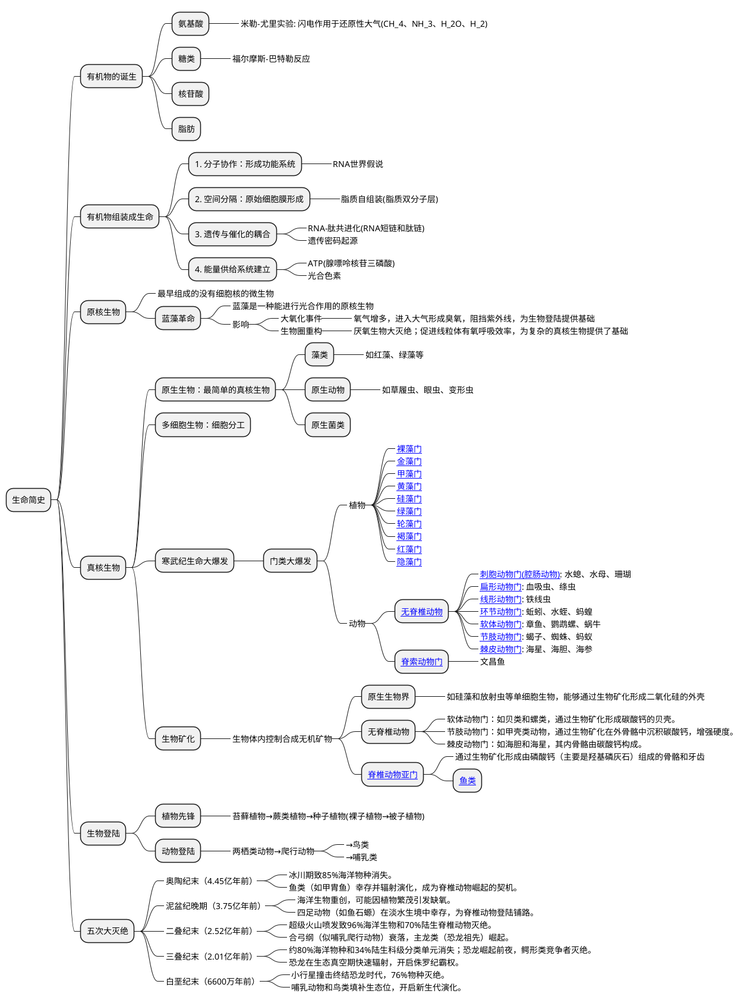

之前有一篇文章《[唯物主义历史观](/2023/08/economic/economic_and_history/)》从经济学、社会学等角度简单说了一下我对人类历史的一些思考。这段时间DeepSeek特别火，问了它非常多的问题。所以基于deepseek的回答再续写一篇文章拓宽一下视野，整理一下地球生命的历史。

首先需要明确，由于远古证据的稀缺性和研究方法的局限性,目前生命演化史上的很多问题都是以假说形式存在。比如说化石，它的形成条件苛刻，远古时期的单细胞生物不可能有化石留下来,而且板块运动火山喷发等地质活动也会破坏原始地层。所以目前科学家们提出来的各种假说都只是生命演化历程中可能的路径，真实的历史比假说可能更复杂。

