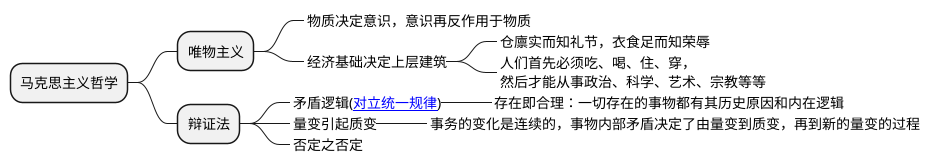

辩证逻辑(Dialectical Logic)是与形式逻辑不同的逻辑系统，其核心在于通过矛盾、运动与整体性来理解事物的本质与发展规律。辩证逻辑的历史与哲学中的辩证法思想紧密交织，尤其在中西方哲学传统中呈现出多样化的形态。

如老子的《道德经》是中国古代辩证逻辑学最有名的著作，里面有一句非常经典的话“反者道之动，弱者道之用”阐释了事物的矛盾和对立转化，近现代毛泽东总结了中西方的辩证思想写出了《矛盾论》；而西方古希腊，无矛盾的亚里士多德逻辑学取得了一边倒的巨大优势。直到黑格尔逻辑学基于对康德的批判与超越发展出了[辩证法](https://baike.baidu.com/item/黑格尔辩证法)，马克思继承了黑格尔的辩证法，并结合[唯物主义](https://baike.baidu.com/item/唯物主义/270875)发展出马克思主义哲学。

### 辩证逻辑的核心特征

辩证逻辑一般研究的是变化中的复杂系统，比如“先有鸡还是先有蛋”。辩证逻辑认为事物的发展是动态的，量变引起质变。

1. **矛盾驱动**：事物因内在矛盾而发展（如资本与劳动的对立）。  
2. **动态过程**：真理是历史性、过程性的（如阶级斗争与社会形态更替）。  
3. **整体关联**：部分需置于整体中理解（如生态系统的相互作用）。  
4. **否定性思维**：通过批判与超越旧形式实现进步（如科技革命对传统的颠覆）。

**辩证逻辑 vs. 形式逻辑**

| **维度**       | **形式逻辑**                     | **辩证逻辑**                     |
|----------------|----------------------------------|-----------------------------------|
| **核心关注**   | 静态结构、无矛盾性               | 动态过程、矛盾运动                |
| **真理观**     | 非时间性、形式有效性             | 历史性、实践中的具体真理          |
| **方法论**     | 演绎推理、符号化                 | 矛盾分析、综合与批判              |
| **应用领域**   | 数学、计算机科学、语言学         | 哲学、历史、社会科学、复杂系统研究 |

