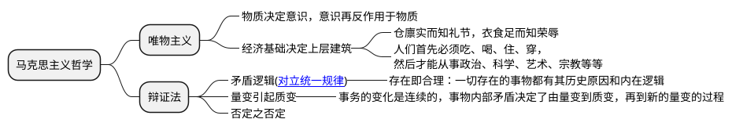

辩证逻辑(Dialectical Logic)是与形式逻辑不同的逻辑系统，其核心在于通过矛盾、运动与整体性来理解事物的本质与发展规律。辩证逻辑的历史与哲学中的辩证法思想紧密交织，尤其在中西方哲学传统中呈现出多样化的形态。

如老子的《道德经》是中国古代辩证逻辑学最有名的著作，里面有一句非常经典的话“反者道之动，弱者道之用”阐释了事物的矛盾和对立转化，近现代毛泽东总结了中西方的辩证思想写出了《矛盾论》；而西方古希腊，无矛盾的亚里士多德逻辑学取得了一边倒的巨大优势。直到黑格尔逻辑学基于对康德的批判与超越发展出了[辩证法](https://baike.baidu.com/item/黑格尔辩证法)，马克思继承了黑格尔的辩证法，并结合[唯物主义](https://baike.baidu.com/item/唯物主义/270875)发展出马克思主义哲学。

## 辩证逻辑的核心特征

**辩证逻辑一般研究的是变化中的复杂系统**，比如“先有鸡还是先有蛋”。辩证逻辑认为事物的发展是动态的，量变引起质变。

1. **矛盾驱动**：事物因内在矛盾而发展（如资本与劳动的对立）。  
2. **动态过程**：真理是历史性、过程性的（如阶级斗争与社会形态更替）。  
3. **整体关联**：部分需置于整体中理解（如生态系统的相互作用）。  
4. **否定性思维**：通过批判与超越旧形式实现进步（如科技革命对传统的颠覆）。

**辩证逻辑 vs. 形式逻辑**

| **维度**       | **形式逻辑**                     | **辩证逻辑**                     |
|----------------|----------------------------------|-----------------------------------|
| **核心关注**   | 静态结构、无矛盾性               | 动态过程、矛盾运动                |
| **真理观**     | 非时间性、形式有效性             | 历史性、实践中的具体真理          |
| **方法论**     | 演绎推理、符号化                 | 矛盾分析、综合与批判              |
| **应用领域**   | 数学、计算机科学、语言学         | 哲学、历史、社会科学、复杂系统研究 |

## “历史”与“变化”

1. **历史**：不是简单的年表或过去事件的堆砌，而是人类社会在生产力与生产关系、经济基础与上层建筑相互作用中开展的、具有方向性和规律性的过程。
2. **变化**：历史的本质特征。社会形态、思想观念、文化艺术等都在不断运动、发展与演变。任何事物都是在“变化”中才具有“历史性”。
3. **联系**：历史正是这些变化在时间维度上的积累与展开。没有变化就没有历史；历史则是变化的总体呈现和规律总结。

## 辩证逻辑

1. **是什么**：区别于形式逻辑的“同一性思维”（A ＝ A），辩证逻辑强调“事物都是相互联系并在一定条件下相互转化的整体”。
2. **三大规律**

   * **质量互变规律**：量变积累到一定程度必然引起质变，质变又成为新一轮量变的起点。
   * **对立统一规律**：矛盾双方既对立又统一，推动事物发展。
   * **否定之否定规律**：事物发展呈螺旋上升、波浪式前进，旧事物被新事物否定，新事物又在更高阶段被更新。
3. **作用**：帮助我们在分析问题时，既看到各要素的差异与对立，也看到它们在一定条件下的相互依存与转化，从而把握事物发展趋势。

## “矛盾转化”

1. **含义**：矛盾的主要方面和次要方面能够互为转化；矛盾各方在一定条件下地位发生变化，从而引发事物性质或发展方向的根本改变。
2. **机制**

   * **主要矛盾与次要矛盾的相互作用**：当次要矛盾发展到一定程度，就可能演变成主要矛盾。
   * **条件的变化**：外部环境或内部结构一旦变化，会使矛盾各方力量对比逆转。
3. **示例**：一个国家的经济矛盾（如需求不足）长期得不到解决，可能转化为政治矛盾（社会动荡）；企业内部，技术瓶颈（次要矛盾）若持续得不到突破，可能上升为生存危机（主要矛盾）。

## 整体把握与实践意义

* **从历史看变化**：认识到一切社会现象都不是孤立的静态画面，而是在不断变化中。
* **用辩证逻辑分析矛盾**：强调既要看到对立面，又要看到它们的统一与转化，避免机械形而上学地割裂问题。
* **关注矛盾转化**：抓住主要矛盾，防止次要矛盾演变成新的主要矛盾，从而在社会治理、企业管理、个人成长等方面做出正确决策。

**只有把握了“历史的变化”这一对象，用“辩证逻辑”这一方法，洞察“矛盾转化”这一动力，才能真正理解事物发展的规律，并在实践中有效引导和推动变化**。
