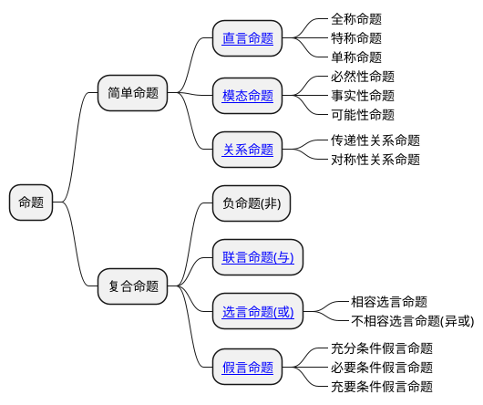
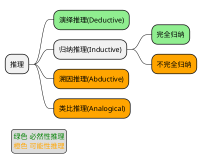
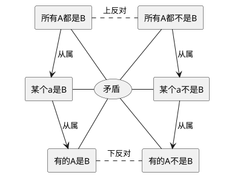
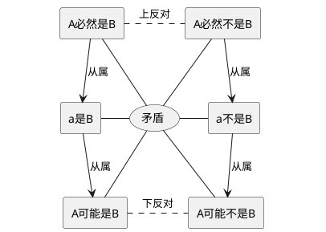
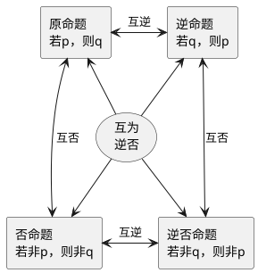

## 命题的种类

```plantuml
@startmindmap
* 命题
** 简单命题
*** [[#categorical-proposition 直言命题]]
****_ 全称命题
****_ 特称命题
****_ 单称命题
*** [[#modal-proposition 模态命题]]
****_ 必然性命题
****_ 事实性命题
****_ 可能性命题
*** [[#relational-proposition 关系命题]]
****_ 传递性关系命题
****_ 对称性关系命题
** 复合命题
*** 负命题(非)
*** [[#and-or 联言命题(与)]]
*** [[#and-or 选言命题(或)]]
****_ 相容选言命题
****_ 不相容选言命题(异或)
*** [[#if-then 假言命题]]
****_ 充分条件假言命题
****_ 必要条件假言命题
****_ 充要条件假言命题
@endmindmap
```

## 推理的分类

```plantuml
@startmindmap
* 推理
**[#LightGreen] 演绎推理(Deductive)
** 归纳推理(Inductive)
***[#LightGreen] 完全归纳
***[#Orange] 不完全归纳
**[#Orange] 溯因推理(Abductive)
**[#Orange] 类比推理(Analogical)
legend left
  <font color="green">绿色 必然性推理</font>
  <font color="orange">橙色 可能性推理</font>
endlegend
@endmindmap
```

## 对当关系

**直言命题的对当方阵**

```plantuml
@startuml
skinparam componentStyle rectangle

[所有A都是B] . [所有A都不是B]:上反对
[所有A都是B] -- (矛盾)
(矛盾) -- [有的A不是B]
[所有A都不是B] -- (矛盾)
(矛盾) -- [有的A是B]
[有的A是B] . [有的A不是B]:下反对
[所有A都是B] --> [某个a是B]:从属
[某个a是B] --> [有的A是B]:从属
[所有A都不是B] --> [某个a不是B]:从属
[某个a不是B] --> [有的A不是B]:从属
[某个a是B] --right-- (矛盾)
(矛盾) --right-- [某个a不是B]

[某个a是B]-[hidden]-(a)
[某个a不是B]-[hidden]-(b)
hide a
hide b
@enduml
```

**模态命题的对当方阵**

```plantuml
@startuml
skinparam componentStyle rectangle

[A必然是B] . [A必然不是B]:上反对
[A必然是B] -- (矛盾)
(矛盾) -- [A可能不是B]
[A必然不是B] -- (矛盾)
(矛盾) -- [A可能是B]
[A可能是B] . [A可能不是B]:下反对
[A必然是B] --> [a是B]:从属
[a是B] --> [A可能是B]:从属
[A必然不是B] --> [a不是B]:从属
[a不是B] --> [A可能不是B]:从属
[a是B] --right-- (矛盾)
(矛盾) --right-- [a不是B]

[a是B]-[hidden]-(a)
[a不是B]-[hidden]-(b)
hide a
hide b
@enduml
```

## 逆命题与否命题

```plantuml
@startuml
skinparam componentStyle rectangle

[原命题\n若p，则q] <-right-> [逆命题\n若q，则p]:互逆
[原命题\n若p，则q] <-- (互为\n逆否)
(互为\n逆否) --> [逆否命题\n若非q，则非p]
[逆命题\n若q，则p] <-- (互为\n逆否)
(互为\n逆否) --> [否命题\n若非p，则非q]
[否命题\n若非p，则非q] <-right-> [逆否命题\n若非q，则非p]:互逆
[原命题\n若p，则q] <-down-> [否命题\n若非p，则非q]:互否
[逆命题\n若q，则p] <-down-> [逆否命题\n若非q，则非p]:互否
@enduml
```

## 三段论的格式

