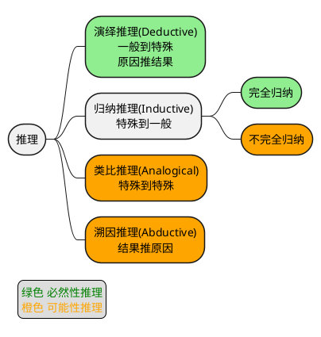
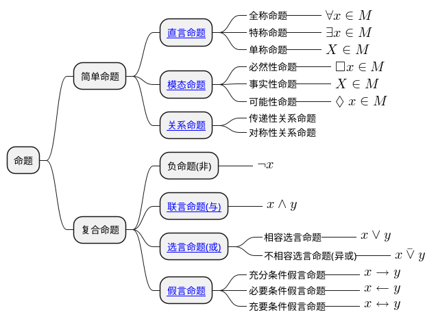
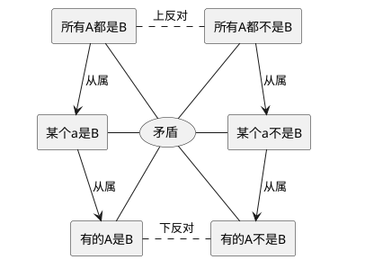
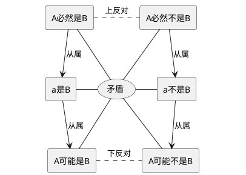
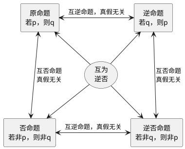

形式逻辑可以追溯到古希腊的亚里士多德时期，他在《工具论》中系统阐述三段论，因此被称为“形式逻辑之父”。后来的斯多葛学派又提出逻辑连接词（如“且”“或”“非”）的形式分析，充实了形式逻辑。

在中国则主要是名家与墨家（战国时期），墨家提出“辩”的概念，在《[墨辩](https://baike.baidu.com/item/墨辩)》中探讨“名实关系”与逻辑悖论（如“白马非马”）；名家惠施、公孙龙关注概念分析与语言逻辑。

近代文艺复兴后，莱布尼茨首次用代数符号表达逻辑关系，因此他也被视为“数理逻辑”先驱。19世纪布尔创立“布尔代数”为计算机逻辑电路奠定数学基础。二战时期，图灵提出“图灵机”模型，将逻辑与计算理论结合，直接影响计算机科学。

## 推理的分类

## 命题的种类

## 对当关系

**直言命题的对当方阵**

**模态命题的对当方阵**

## 逆命题与否命题

## 三段论的格式

