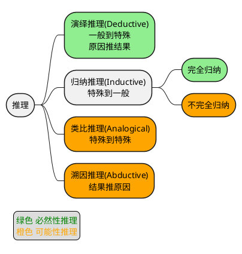
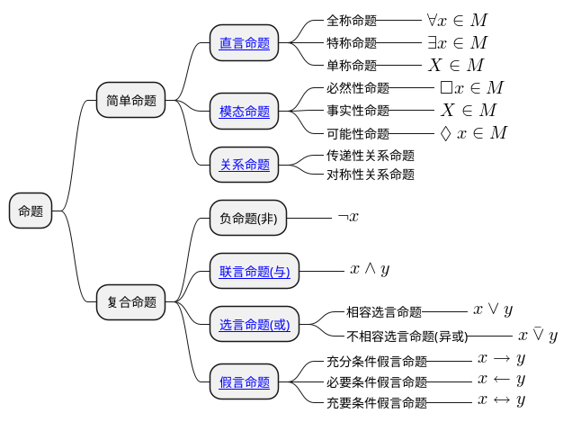
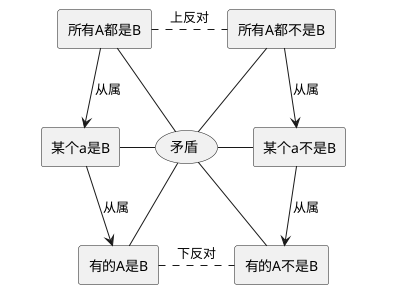
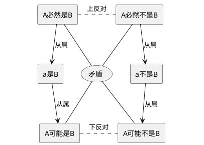
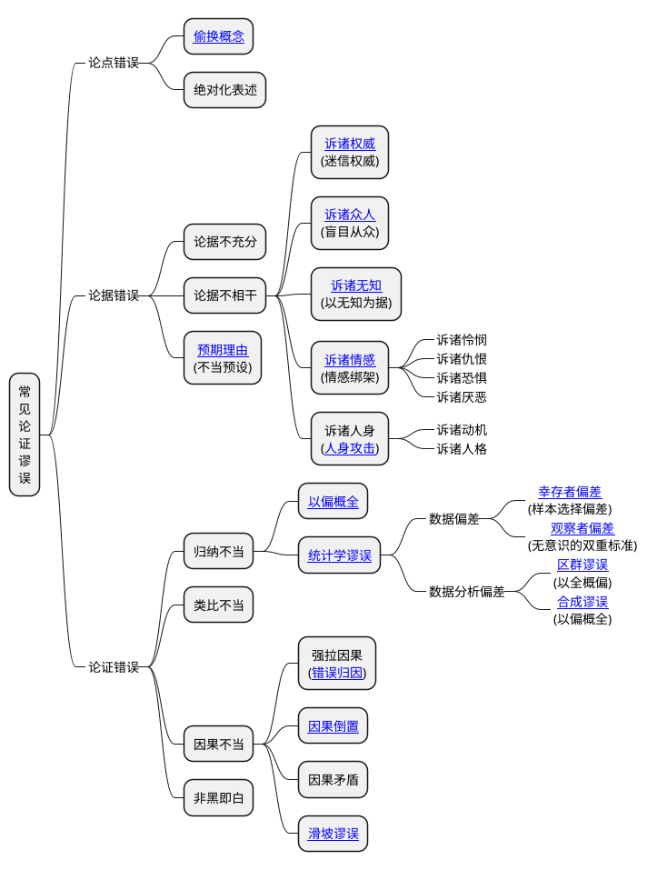

形式逻辑可以追溯到古希腊的亚里士多德时期，他在《工具论》中系统阐述三段论，因此被称为“形式逻辑之父”。后来的斯多葛学派又提出逻辑连接词（如“且”“或”“非”）的形式分析，充实了形式逻辑。

在中国则主要是名家与墨家（战国时期），墨家提出“辩”的概念，在《[墨辩](https://baike.baidu.com/item/墨辩)》中探讨“名实关系”与逻辑悖论（如“白马非马”）；名家惠施、公孙龙关注概念分析与语言逻辑。

近代文艺复兴后，莱布尼茨首次用代数符号表达逻辑关系，因此他也被视为“数理逻辑”先驱。19世纪布尔创立“布尔代数”为计算机逻辑电路奠定数学基础。二战时期，图灵提出“图灵机”模型，将逻辑与计算理论结合，直接影响计算机科学。

## 推理的分类

这里面只有演绎推理和完全归纳是必然的严密的推理。

演绎推理需要我们严格遵循演绎逻辑，比如三段论中必须遵循主体内涵和外延一致，否则极容易出现“偷换概念”、“红鲱鱼”等谬误。

归纳推理中完全归纳是严密的推理形式，但是真实世界有太多的东西是我们没法通过枚举的形式进行完全归纳的，所以必然要用到不完全归纳。想要保证不完全归纳的结论可靠，就需要用科学归纳法，否则容易产生“以偏概全”谬误。如“我遇到的三个东北人都豪爽→东北人豪爽”，“我发现三个江西人都喜欢吃辣→江西人都喜欢吃辣”。这是人类“经验主义”惯性思维方式，更节省精力，符合进化形成的生存策略。传统文化中有许多这样的“经验主义”的“智慧”，这种思维惯性需要警惕。

类比推理从它的英文“Analogical”词根“ana”可以看出它是不符合逻辑的，表示“按比例对应”。类比只适用于让人快速理解某个概念，类比推理方式本身不是严密的逻辑推理。中国论证中频繁使用类比的现象，背后有着深刻的文化、思维和社会根源，中国有隐喻文化，社会语境中一直倡导委婉表达的智慧。比如《孟子》的“鱼，我所欲也；熊掌，亦我所欲也。二者不可得兼，舍鱼而取熊掌者也。生，亦我所欲也；义，亦我所欲也。二者不可得兼，舍生而取义者也。”用鱼和熊掌来类比“舍生取义”；《荀子·劝学》中大量的类比论证，“蚓无爪牙之利，筋骨之强，上食埃土，下饮黄泉，用心一也。蟹六跪而二螯，非蛇鳝之穴无可寄托者，用心躁也”。中国的类比传统，既是文化基因的延续，也是适应社会需求的沟通策略。它并非替代逻辑论证，而是作为补充手段，在降低认知门槛、增强说服感染力方面发挥着独特作用。

## 命题的种类

## 对当关系

**直言命题的对当方阵**

**模态命题的对当方阵**

## 逆命题与否命题

## 三段论的格式

## 论证错误

> [謬誤列表](https://zh.wikipedia.org/wiki/謬誤列表)
