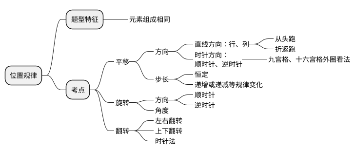
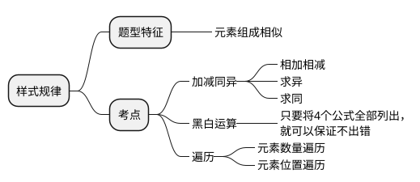
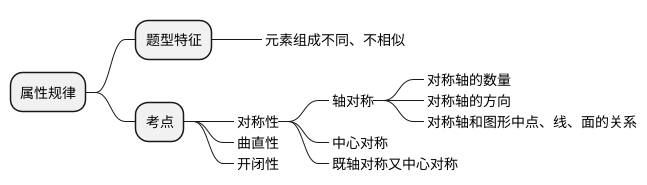
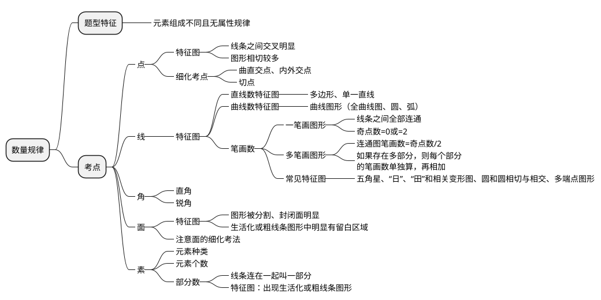
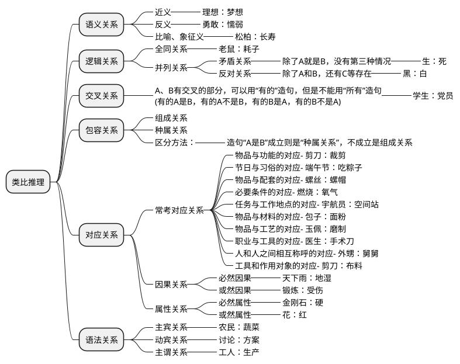
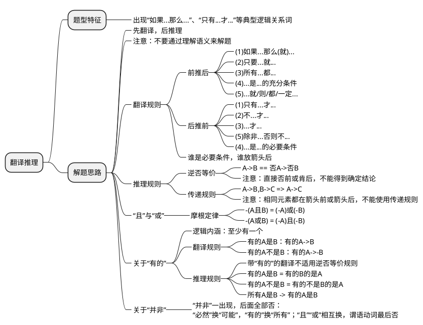
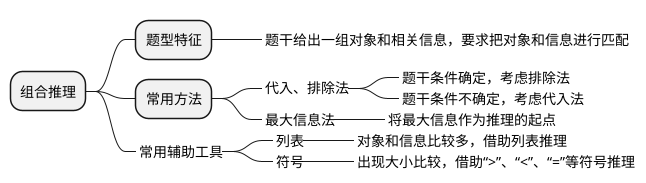

## 图形推理

元素相同看位置，平移旋转和翻转

元素相似看样式，加减运算和遍历

元素不同看属性，对称开闭和曲直

属性不同看数量，点线笔画面素形

特殊情况看关系，相交相切和相离

### 位置规律

### 样式规律

### 属性规律

### 数量规律

### 特殊规律

### 空间重构

## 定义判断

## 类比推理

## 逻辑判断

### 翻译推理

### 组合推理

### 加强题型

### 削弱题型

