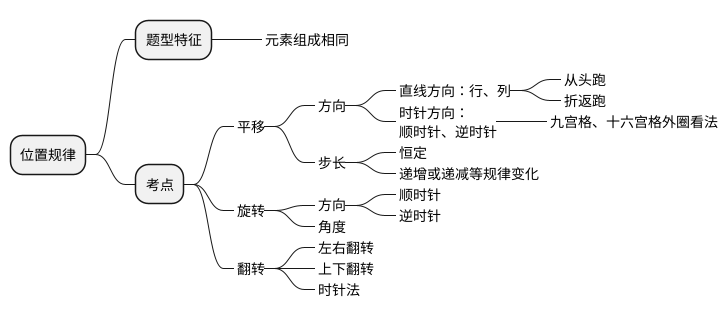
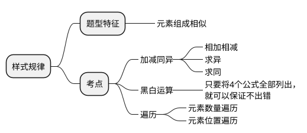
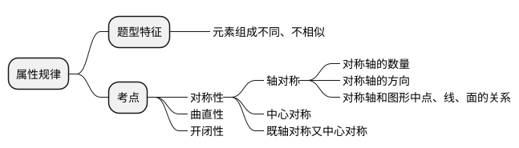
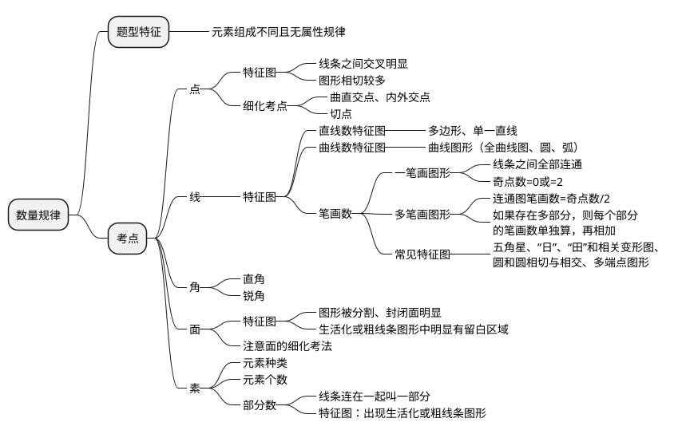
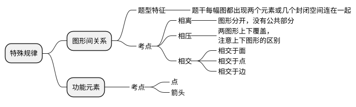
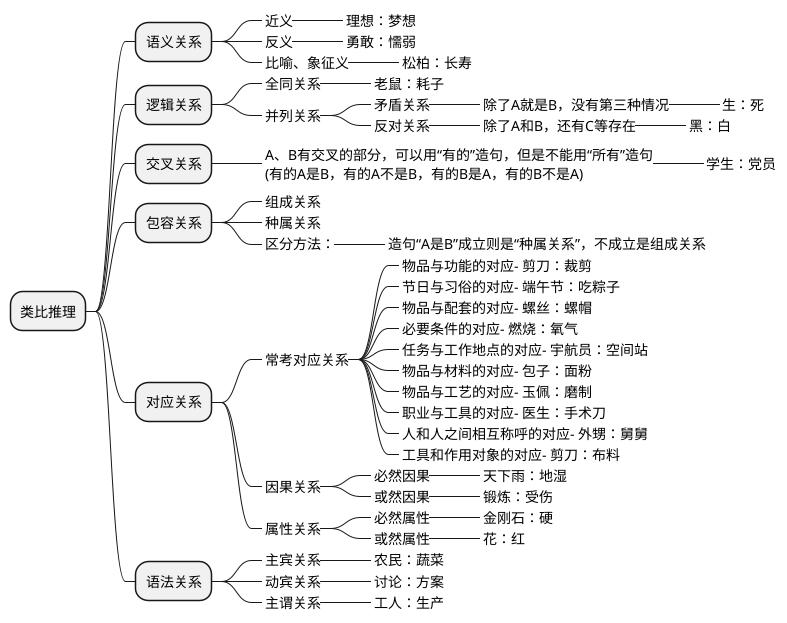

## 图形推理

<header>做题思路</header>

元素相同看位置，平移旋转和翻转

元素相似看样式，加减运算和遍历

元素不同看属性，对称开闭和曲直

属性不同看数量，面线笔画点素形

数量不同看关系，交切相离面线点

日田变形圆交切，二除奇点笔画数

<!-- more -->

### 位置规律

### 样式规律

### 属性规律

### 数量规律

### 特殊规律

### 空间重构

## 定义判断

> 定义判断题怎么做？？？ https://www.zhihu.com/question/271885649
> 定义判断 有什么学习技巧吗？ https://www.zhihu.com/question/273682592

## 类比推理

> 行测类比推理怎么做？ https://www.zhihu.com/question/373977860

<header>做题思路</header>

类比推理找关系，逻辑语法和语义。

全同关系找一样，必须一点不能差。

并列关系看范畴，矛盾反对分清晰。

交叉关系很隐蔽，包含范围有重叠。

属性关系看词性，名词形容相对应。

因果关系看逻辑，必然或然分仔细。

包容关系分两种，种属组成各不同。

对应关系大杂烩，常识知识要具备。

选项逻辑都一致，二级辨析帮助你。

古今中外别忘记，自他雅俗也可以。

语义关系很重要，言语基础要打牢。

语法关系造句子，主动被动看清楚。

