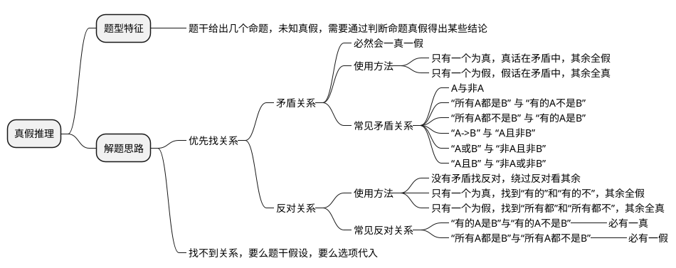

## 图形推理

<header>做题思路</header>

元素相同看位置，平移旋转和翻转

元素相似看样式，加减运算和遍历

元素不同看属性，对称开闭和曲直

属性不同看数量，点线笔画面素形

数量不同看关系，交切相离面线点

<!-- more -->

### 位置规律

### 样式规律

### 属性规律

### 数量规律

### 特殊规律

### 空间重构

## 定义判断

> 定义判断题怎么做？？？ https://www.zhihu.com/question/271885649
> 定义判断 有什么学习技巧吗？ https://www.zhihu.com/question/273682592

## 类比推理

> 行测类比推理怎么做？ https://www.zhihu.com/question/373977860

<header>做题思路</header>

类比推理找关系，逻辑语法和语义。

全同关系找一样，必须一点不能差。

并列关系看范畴，矛盾反对分清晰。

交叉关系很隐蔽，包含范围有重叠。

属性关系看词性，名词形容相对应。

因果关系看逻辑，必然或然分仔细。

包容关系分两种，种属组成各不同。

对应关系大杂烩，常识知识要具备。

选项逻辑都一致，二级辨析帮助你。

古今中外别忘记，自他雅俗也可以。

语义关系很重要，言语基础要打牢。

语法关系造句子，主动被动看清楚。

## 逻辑判断

### 翻译推理

#### 充分条件，必要条件

$$
A\rightarrow B
$$

$$
如果A,就B \Leftrightarrow A是B的充分条件 \Leftrightarrow A\rightarrow B
$$

$$
只有A,才B \Leftrightarrow A是B的必要条件 \Leftrightarrow B\rightarrow A \newline
$$

<header>充分条件真值表</header>

|p|q|p→q|
|-|-|-|
|真|真|真|
|真|假|假|
|假|真|真|
|假|假|真|

##### 例题

> （2018年江西）某学校有五位学生会留任委员会候选成员，分别是小张、小王、小李、小刘、小陈，其中小张、小王、小李对此次竞选的结果预测如下：
> 小张：“如果小陈没有当选，则我也不当选。”
> 小王：“我和小刘、小陈三人要么都当选，要么都不当选。”
> 小李：“如果我当选，则小王也当选。”
> 评定结果出来后，发现三人的预测都是错误的，则最终有多少人当选？
> A. 1    B. 2    C. 3    D. 4

1. 翻译成逻辑数学
   $$
   \begin{align}
   \neg陈 &\rightarrow \neg张 \newline
   王\land刘\land陈 &\lor \neg王\land\neg刘\land\neg陈 \newline
   李&\rightarrow王
   \end{align}
   $$
2. 三个预测都是错误的，三个命题都为假
   $$
   \begin{align}
   \neg(\neg陈 \rightarrow \neg张) &\Rightarrow \neg陈 \land 张 \newline
   \neg(李\rightarrow王) &\Rightarrow 李\land\neg王 \newline
   \neg(王\land刘\land陈 \lor \neg王\land\neg刘\land\neg陈) &\Rightarrow 刘
   \end{align}
   $$

小张、小李、小刘当选，小陈、小王未当选，故选C

#### 摩根定律

$$
\begin{align}
\neg(A\land B)&\Leftrightarrow\neg A \lor \neg B \newline
\neg(A\lor B)&\Leftrightarrow\neg A \land \neg B
\end{align}
$$

#### 量词推理

$$
\begin{align}
\exists A \rightarrow B \newline
(存在)有的A是B\newline
\newline
否定：\forall A \nrightarrow B \newline
所有A不是B
\end{align}
$$

$$
\begin{align}
\forall A \rightarrow B \newline
所有A是B \newline
\newline
否定：\exists A \nrightarrow B \newline
存在A不是B
\end{align}
$$

#### 例题

> （2020年山东）某城市选拔志愿者，已知情况如下：
> 1) 只有小红报名，小白、小黑和小花才会都跟着报名；
> 2) 如果小白不报名，则小黑也不报名；
> 3) 如果小黑不报名，则小灰也不报名；
> 4) 小红没报名；
> 5) 小灰报名了。
> 
> 由此可推出：
> - A. 小白、小黑和小花都报名了
> - B. 小白和小黑都报名了
> - C. 小黑和小白都报名了
> - D. 小白和小花都报名了

翻译成逻辑数学：
1) $白\land 黑\land 花 \rightarrow 红$
   等价于逆否命题：
   $\neg红\rightarrow\neg白\lor\neg黑\lor\neg花$
2) $\neg白\rightarrow\neg黑$ 
   等价于逆否命题：
   $黑\rightarrow白$
3) $\neg黑\rightarrow\neg灰$
   等价于逆否命题：
   $灰\rightarrow黑$
4) $\neg红$
5) $灰$

$$
\begin{align}
3\land5&\rightarrow 黑 \newline
黑\land2&\rightarrow 白 \newline
4\land1\land黑\land白&\rightarrow \neg花 \newline
\end{align}
$$

小白和小黑报名了，小花没有报名

### 组合推理

#### 例题

> （2019年山东）有教师、公务员、银行职员三人，其中甲不是银行职员，乙不是教师，丙不是公务员。教师比乙年龄大，丙在三人中年龄最小。
> 根据上述条件，下列说法错误的是：
> * A. 甲是教师
> * B. 乙是公务员
> * C. 甲不是公务员
> * D. 丙不是银行职员

先根据题干条件绘制一个表格

|/|甲|乙|丙|
|-|-|-|-|
|教| |X| |
|公| | |X|
|银|X| | |

教师比乙年龄大，丙在三人中年龄最小。可得到：

$$
年龄上：教师>乙>丙
$$

所以甲是教师，乙是公务员，丙是银行职员，答案选D。

---

> （2021年四川）档案室有五个柜子，分别放着教育学院、体育学院、人文学院、管理学院喝信息学院五个学院的资料，现在由甲、乙、丙、丁、戊五位同学来猜这五个柜子与五个学院的对应关系：
> 甲：第二个柜子是教育学院的，第三个柜子是体育学院的。
> 乙：第二个柜子是人文学院的，第四个柜子是管理学院的。
> 丙：第一个柜子是管理学院的，第五个柜子是信息学院的。
> 丁：第三个柜子是人文学院的，第四个柜子是信息学院的。
> 戊：第二个柜子是体育学院的，第五个柜子是教育学院的。
> 打开柜子后发现，每个人都只猜对了一半，而且每个柜子都有一个人猜对。由此可以推出：
> * A. 第一个柜子里放着人文学院的资料
> * B. 第二个柜子里放着教育学院的资料
> * C. 第三个柜子里放着管理学院的资料
> * D. 第四个柜子里放着信息学院的资料

这种题目有两种思路：最大信息法或最小信息法

这题更适合用**最小信息法**。因为每个柜子都有人猜对，而题干信息里第一个柜子只有一个人猜，所以这个最小的信息一定的正确的，对应的另一半是错的。

* 丙：第一个柜子是管理学院的，~第五个柜子是信息学院的~；排除A、C选项
* 乙：第二个柜子是人文学院的，~第四个柜子是管理学院的~；排除A、B选项

所以答案是D选项。

---

> （2021年江苏）甲、乙、丙、丁4位中学同学毕业30年后相聚。现在，他们已成为企业家、大学教师、歌手和会计师，且每个人只有一中身份，并不重复。他们在中学时代就各人的未来职业有过如下预言：
> 甲：乙不会成为歌手
> 乙：丙会成为会计师
> 丙：丁不会成为企业家
> 丁：乙不会成为大学教师
> 现在看来，他们当中只有会计师的预言是正确的。
> 根据上述信息可以推断，甲、乙、丙、丁的职业分别为：
> * A. 企业家、大学教师、歌手、会计师
> * B. 大学教师、歌手、企业家、会计师
> * C. 企业家、歌手、会计师、大学教师
> * D. 会计师、大学教师、歌手、企业家

这种题目用**最大信息法**。题干说只有会计师的预言是正确的，找到包含会计师预言的：
* 乙：丙会成为会计师；乙说丙是会计师，说明乙自己不是会计师，如果这条为真，与只有会计师的预言正确相悖。所以丙不会成为会计师，排除C选项；
* 丙：丁不会成为企业家；因为丙不是会计师，所以丁会成为企业家；答案选D

---

> （2020年四川）张先生拟购买几种鲜花，购买意向如下：
> 1) 玫瑰、郁金香至多买一种
> 2) 牡丹、玫瑰和雏菊至少买一种；
> 3) 郁金香、雏菊、百合至少买两种；
> 4) 如果买郁金香，则不购买牡丹。
> 根据上述一项，可以得出张先生：
> * A. 必须买百合
> * B. 郁金香、牡丹至少买了一种
> * C. 雏菊、玫瑰至少买了一种
> * D. 至少买了3种鲜花

信息不明确，仍然用**最大信息法**。题干中郁金香出现次数最多，根据郁金香进行讨论：
* 购买郁金香，根据信息1则不买玫瑰，根据信息4不买牡丹；
  不买玫瑰不买牡丹，根据信息2购买雏菊；
  购买郁金香，购买雏菊，根据信息3，百合是否购买未知；排除A、D
* 不买郁金香，根据信息3，购买雏菊，购买百合；
  其他条件无法推出玫瑰、牡丹是否购买

结合两种情况，雏菊一定会购买，答案选C

---

> （2018年江西）老大、老二、老三三兄弟分别在上海、浙江和江西工作，他们的职业分别是律师、医生和公务员。已知：老大不在上海工作，老二不在浙江工作；在上海工作的不是公务员；在浙江工作的是律师；老二不是医生。
> 那么老大、老二、老三分别在哪儿工作？
> * A. 浙江、上海和江西
> * B. 浙江、江西和上海
> * C. 江西、上海和浙江
> * D. 江西、浙江和上海

### 真假推理

#### 例题

> （2018年山东）甲、乙、丙、丁四人讨论本班同学完成作业的情况。
> 甲说：班里所有同学都写完作业了。
> 乙说：如果小李写完作业了，那么小赵就没写完作业。
> 丙说：小李写完作业了。
> 丁说：班里有人没写完作业。
> 已知四人中只有一人说的不对，那么可推出下列哪项？
> A. 甲说的不对，小赵没有写完作业；
> B. 乙说的不对，小李写完了作业
> C. 丙说的不对，小赵没有写完作业；
> D. 丁说的不对，小赵写完了作业；

1. 找矛盾。甲和丁的言论矛盾了，必有一真一假，四人只有一人说的不对，所以其余的人说的都是对的。

2. 看其余。小李写完了->小赵没写完 所以甲说的不对；选A

---

> （2020年山东）某慈善组织号召企业向受暴雨袭击的某地区捐赠帐篷。某地区为表谢意向该组织询问是哪些企业进行了捐赠。经调查，了解到以下情况：
> 1) 四家企业都没有捐赠；
> 2) 丁企业没有捐赠；
> 3) 乙企业和丁企业至少有一家企业没有捐赠；
> 4) 四家企业中确有企业捐赠。
> 后来得知上述四种情况两种为真，两种为假。
> 由此可以推出：
> A. 甲企业没有捐赠
> B. 乙企业进行了捐赠
> C. 丙企业没有进行捐赠
> D. 丁企业进行了捐赠

1. 找矛盾。1和4有矛盾，一真一假。因为四种情况两种为真，两种为假。所以2和3也是一真一假。
2. 看其余。2和3一真一假，当2为真时，3也为真，矛盾。所以2为假，3为真；

丁企业进行了捐赠，选D

---

> （2018广西）课间休息时，一位同学帮老师擦了黑板，老师回到教室后询问是谁擦的黑板。
> 他问了四位同学，得到以下回答：
> 1) 或者班长擦了，或者学习委员擦了；
> 2) 如果纪律委员没擦，那班长也没擦；
> 3) 如果卫生委员没擦，那班长擦了；
> 4) 班长和学习委员都没擦。
> 实际上，四位同学的回答中只有一句是假的。具体可以推出擦黑板的是：
> A. 纪律委员    B. 学习委员    C. 卫生委员    D. 班长

1. 找矛盾。看出1和4矛盾，一真一假，只有一句假的，其余为真。
2. 看其余。2逆否得到，班长擦了，纪律委员也擦了，与只有以为同学擦了黑板矛盾了，所以班长没擦。对3逆否得到，班长没擦，卫生委员擦了。所以卫生委员擦了黑板。选C。

---

> （2018年安徽）四位球迷在某球赛的晋级赛开始之前对几个队伍的赛况进行预测，他们比较关注其中的两支球队，分别做了如下预测：
> 方某说：如果甲队不能晋级，那么乙队也不能晋级；
> 白某说：不管甲队能不能晋级，乙队都不能晋级；
> 夏某说：乙队能晋级，但甲队不能晋级；
> 邓某说：我看这几支球队都不能晋级。
> 比赛结果证明，四位球迷中只有一位的预测是正确的。
> 根据上述情况，以下哪项一定为真？
> A. 白某预测是正确的
> B. 邓某预测是正确的
> C. 如果甲队能够晋级，那么方某的预测是正确的
> D. 如果甲队不能晋级，那么方某的预测是正确的

1. 找矛盾。方某和夏某的言论矛盾了，一真一假，只有一真，其余为假。
2. 看其余。
   白某和邓某都是错的，排除A、B选项。
   白某所说为假，乙队晋级
   此时得不出结论，需要代入C、D选项排除。选C

### 加强/削弱题型

<header>做题思路</header>

“看清”提问

找准“靶子”

预设“方法”

“对比”选项

<header>做题思路</header>

|加强方式|削弱方式|
|-------|--------|
|补充论据|否定论点/论据|
|搭桥|拆桥|

#### 例题

> （2019年山东）研究证明，用传统方法熬制的骨头汤中，游离钙含量很低，每100毫升骨头汤中钙含量只有2毫克左右，因此传统的“喝骨头汤补钙”的观念是错误的。
> 以下哪项如果为真，最能支持上述结论
> * A. 只有游离的钙离子才能被人体消化吸收
> * B. 骨头汤中含有较多脂肪，常喝骨头汤可能引发高血脂症
> * C. 骨头汤中含有胶原蛋白，能增强人体造血机能
> * D. 中国居民的钙摄入量普遍不足，而食补最为方便

1. 看清提问：**最能支持上述结论**，为加强题型
2. 找准靶子：
   * 论据：用传统方法熬制的骨头汤中，游离钙含量很低，每100毫升骨头汤中钙含量只有2毫克左右
   * 论点：传统的“喝骨头汤补钙”的观念是错误的
3. 预设方法：论点说喝骨头汤不补钙，论据说骨头汤游离钙含量低，论据论点话题不一致，优先考虑**搭桥**方法
4. 对比选项：
   * A项，只有游离的钙离子才能被人体吸收，在游离钙和补钙之间建立联系，为搭桥项，可选
   * B项，与论点话题不一致，无法加强，排除
   * C项，与论点话题不一致，无法加强，排除
   * D项，食补与喝骨头汤不补钙相反，无法加强，排除

---

> （2020年浙江）一般消毒用的酒精浓度为70\%\~75\%，此浓度的酒精渗透性最好，杀毒效果也最好，浓度更高的话，反而达不到消毒作用。因此，酒精浓度越高，消毒效果不一定越好。
> 以下哪个选项为真，最能支持上述结论？
> * A. 即使浓度低于60\%，酒精也可以杀灭一部分病毒和细菌
> * B. 酒精通过渗透进病原体并不破坏其完整性，以达到杀毒效果
> * C. 高浓度的酒精会刺激皮肤，吸收表皮大量水分，造成皮肤脱水
> * D. 浓度为95\%的酒精可以在病原表面形成一层防止酒精渗透的保护壳

1. 看清提问：**最能支持上述结论**，为加强题型
2. 找准靶子：
   * 论据：一般消毒用的酒精浓度为70\%\~75\%，此浓度的酒精渗透性最好，杀毒效果也最好，浓度更高的话，反而达不到消毒作用
   * 论点：酒精浓度越高，消毒效果不一定越好
3. 预设方法：论据论点话题都涉及酒精浓度的消毒效果，话题一致，优先考虑补充论据；
4. 对比选项：
   * A项，浓度低于60\%也能消毒，与题干论点酒精浓度越高不一定越好，话题不一致，无法加强，排除；
   * B项，杀毒效果的原理，与论点话题不一致，无法加强，排除；
   * C项，高浓度的酒精缺点，会刺激皮肤，吸收表皮水分造成脱水，与论点消毒效果话题不一致，无法加强，排除；
   * D项，浓度为95\%的酒精可以在病原表面形成一层防止酒精渗透的保护壳，高浓度酒精对病原体有保护作用，可以证明酒精浓度越高，消毒效果不一定越好，补充论据，可以加强，可选。

---

> （2019年广东）在发达国家的产业结构中，服务业占了很高的比重。根据他们的经验，提高服务业占比就可以促进就业。但是，服务业具有较高的进入壁垒，这也是我国服务业发展相对滞后的一个重要原因。因此，我国可以通过打破服务业的行业壁垒进一步促进就业。
> 以下最可能是上述论证潜在假设的是：
> A. 服务业促进就业的规律适合用于我国
> B. 我国创造就业的能力弱于发达国家
> C. 发达国家的服务业也存在行业壁垒
> D. 其他行业对促进就业没有显著作用

1. 看清提问：**可能是上述论证潜在假设的是**，为加强题型
2. 找准靶子：
   * 论据：
      1. 在发达国家的产业结构中，服务业占了很高的比重。根据他们的经验，提高服务业占比就可以促进就业
      2. 服务业具有较高的进入壁垒，这也是我国服务业发展相对滞后的一个重要原因
   * 论点：我国可以通过打破服务业的行业壁垒进一步促进就业
3. 预设方法：论据论点说的都是服务业与就业的关系，话题一致，优先考虑补充论据；
4. 对比选项：
   * A项，服务业促进就业的规律适合用于我国，是论点的必要条件，当选；
   * B项，我国创造就业的能力弱于发达国家，与论点服务业促进就业话题不一致，无法加强，排除；
   * C项，发达国家的服务业也存在行业壁垒，与论点话题不一致，无法加强，排除；
   * D项，其他行业对促进就业没有显著作用，论点说的是服务业促进就业，主体不一致，排除。

