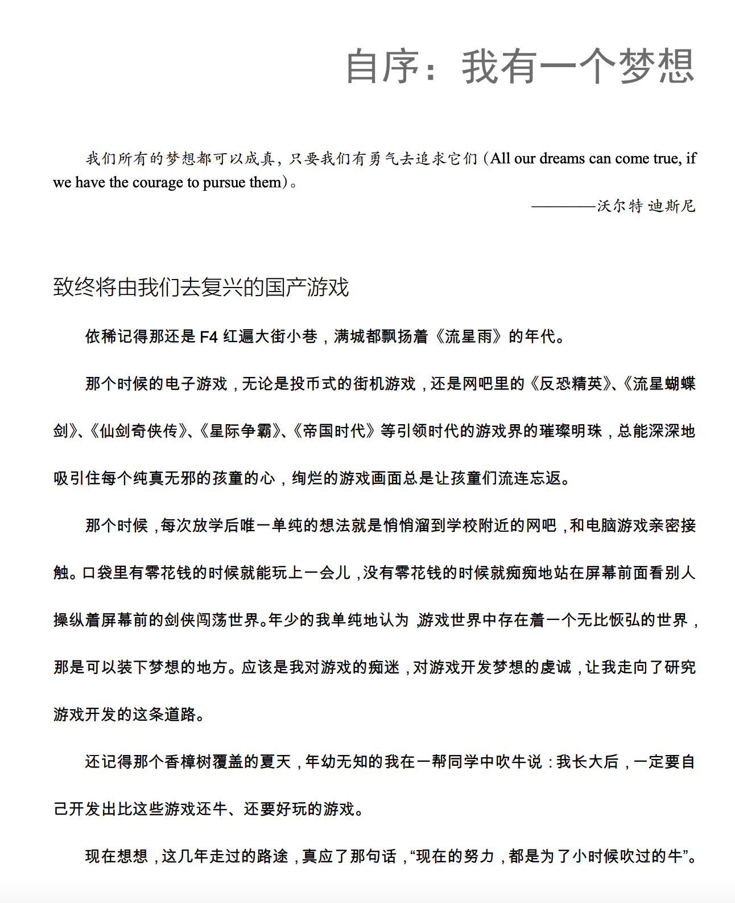
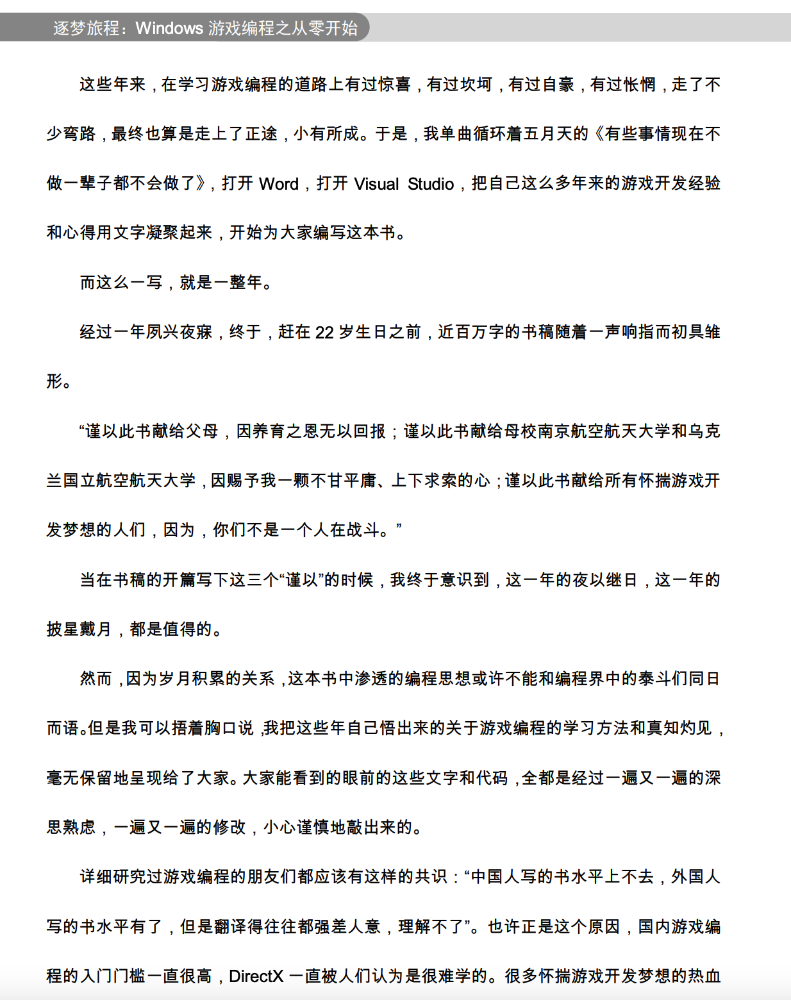
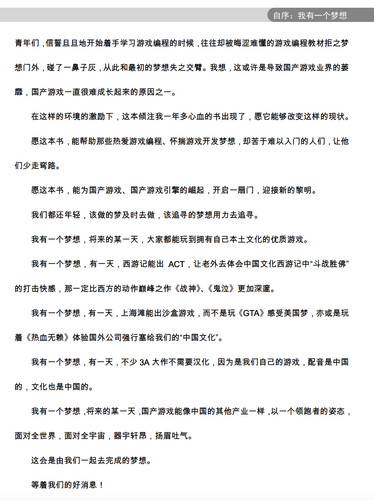
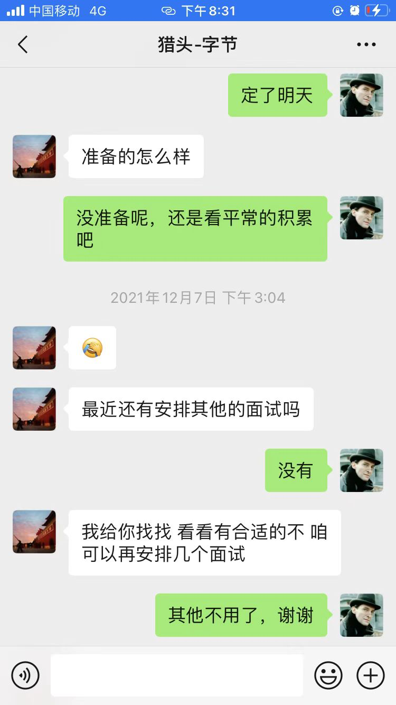

> 他曾是引领着无数人前行的灯塔，却无法照亮自己前行的路。

今天一则新闻让我震惊了，毛星云，一个偶像般的大神人物，因为抑郁症跳楼自杀了。

很多人可能没听说过“毛星云”这个人，他是《筑梦之旅：Windows游戏编程》的作者——南京航空航天大学毕业的一位90后，微软最有价值专家，中国2013年度十大杰出IT博客作者，出版了《逐梦旅程：Windows游戏编程之从零开始》《OpenCV3编程入门》两本书，腾讯游戏首席引擎工程师。

## 致敬这位理想主义者

他在乌克兰留学的时候写下的这本《逐梦旅程：Windows游戏编程之从零开始》是我在大学图书馆看到的第一本游戏开发的书籍——这本激发了我对计算机程序无限兴趣的书也曾是我心中的灯塔。

他在书中的自序写过这样一段话，多少满怀梦想的少年曾被这段话点燃了心中的那团火：

> 愿这本书，能帮助那些热爱游戏编程、怀揣游戏开发梦想，却苦于难以入门的人们，让他 们少走弯路。 
>
> 愿这本书，能为国产游戏、国产游戏引擎的崛起，开启一扇门，迎接新的黎明。 
>
> 我们都还年轻，该做的梦及时去做，该追寻的梦想用力去追寻。
>
> 我有一个梦想，将来的某一天，大家都能玩到拥有自己本土文化的优质游戏。 
>
> 我有一个梦想，有一天，西游记能出 ACT，让老外去体会中国文化西游记中“斗战胜佛” 的打击快感，那一定比西方的动作巅峰之作《战神》、《鬼泣》更加深邃。 
>
> 我有一个梦想，有一天，上海滩能出沙盒游戏，而不是玩《GTA》感受美国梦，亦或是玩 着《热血无赖》体验国外公司强行塞给我们的“中国文化”。 
>
> 我有一个梦想，有一天，不少 3A 大作不需要汉化，因为是我们自己的游戏，配音是中国 的，文化也是中国的。 我有一个梦想，将来的某一天，国产游戏能像中国的其他产业一样，以一个领跑者的姿态， 面对全世界，面对全宇宙，器宇轩昂，扬眉吐气。 
>
> 这会是由我们一起去完成的梦想。

他最后一次的知乎动态是2021年11月4号，看上去如此开朗的一个人，竟然在12月11号跳楼自杀了。

昔人已乘黄鹤去，此地空余黄鹤楼。 黄鹤一去不复返，白云千载空悠悠。

## 北上广有理想吗？

这几天刚好猎头找我面试字节，我对“字节一年，人间三年”的黑话也早有耳闻，我这段时间一直在思考人生的意义是什么，人这一辈子应该追求什么。是大城市的所谓的“奋斗”，还是小城市的一本书、一杯茶、一抹冬日的暖阳......

大城市里生活的二、三十岁的年轻人，经历了千禧年的更替，在新世纪里接受了二十年经济、科技、文化飞速发展的洗礼。他们从乡土中走来，在大城市里漂泊着、不安着、迷茫着。

为了追求所谓的“梦想”，在北上广的繁华里，我看见过女生三十不敢恋爱不敢结婚，男人三十五为了家庭熬秃了头熬坏了身体，甚至有些人找一个可以安身的地方都变得奢侈。这里的生活成本太高，这样的生存条件容不下他们的肉体。于是有了这样一句话：**北上广容不下肉体，十八线搁不下灵魂**。

事实真的是这样吗，老家的生活就是没有梦想的安于现状，北上广的疲于奔命就是追求梦想？

为什么那么多人不断努力着，在那拥挤的地铁里，在那汹涌的人潮里，是时代惯性还是人性的贪恋？

每天疲惫的身体，透支的睡眠，当完成并非自己想做的工作后，得到的一丝丝心理安慰式的成就感，此时还记得你来时的梦想吗？

既是生存，既是赚钱，北上广和老家有什么本质的区别，生活不会因为你在北上广没赚到钱而退后三分，也不会因为你在老家赚到了钱而故意刁难。

电影《中国合伙人》成冬青的一句话，"梦想是什么?梦想就是一种让你感到坚持就是幸福的东西"。

是否应该重新审视一下自己。在大城市的霓虹里，在生活快节奏的时刻中，在觥筹交错的时间夹缝中，在面对未来的迷茫未知中，抽出一点时间，我想好好思考一下：**是生活了一万天，还是仅仅生活了一天，却重复了一万次！我们为什么来到这里！**

当我看到这则新闻，我想我已经有答案了。