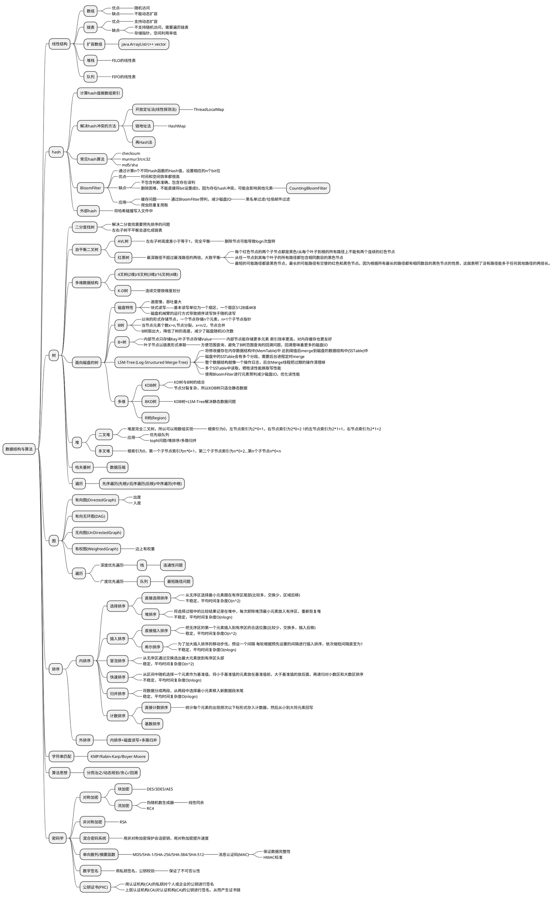
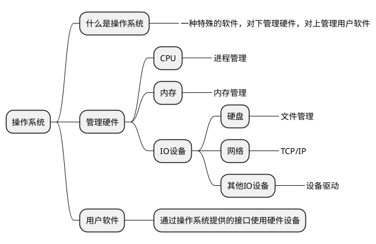
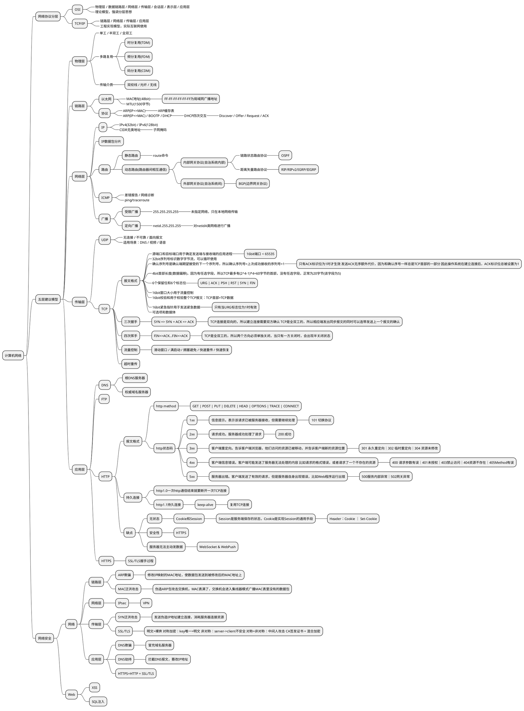
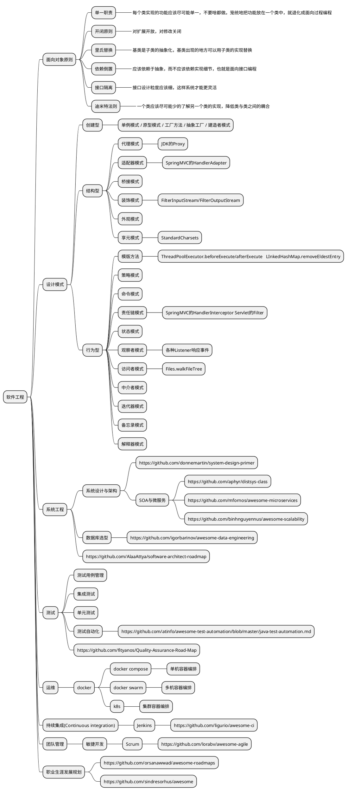
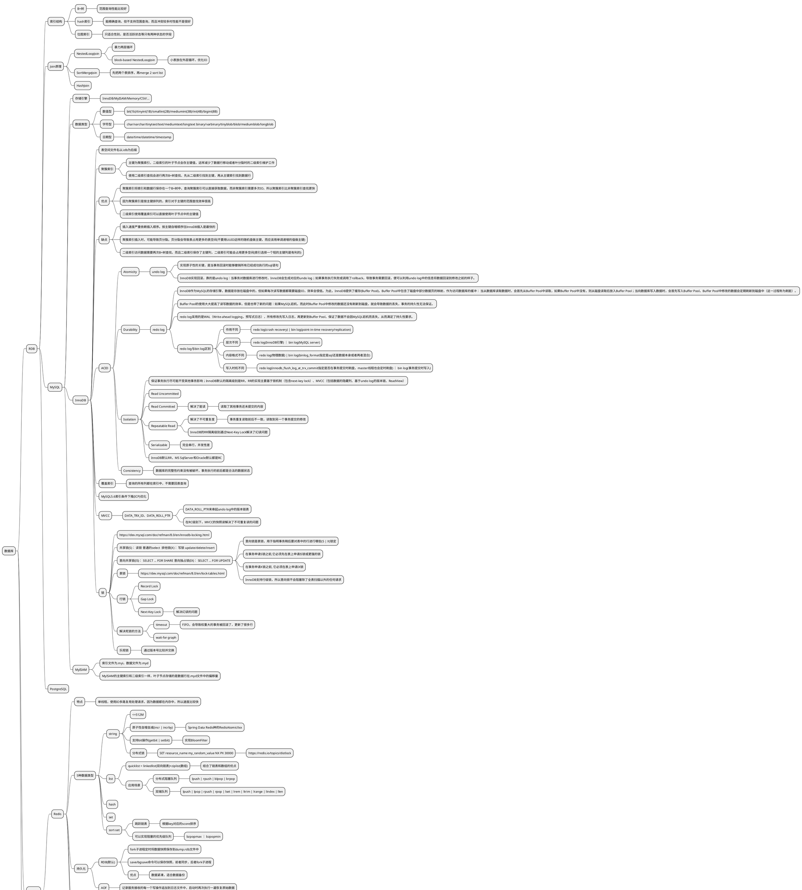

```plantuml
@startmindmap
* Java
** 基础
*** 集合
**** List
***** ArrayList
****** 1.5倍扩容，初始容量为10(Java7有延迟初始化)
***** Vector
****** 默认两倍扩容，初始容量为10
******* 可用Collections.synchronizedList(new ArrayList())替代
***** LinkedList
****** 双向链表
***** CopyOnWriteArrayList
****** 写时拷贝，保证并发时读写分离，不适合写频繁的场景
**** Map
***** HashMap
****** 容量为2的幂，初始容量为16 负载因子(元素数量与容量比)大于0.75时扩容
******* 用位运算代替取余：index=hash&(length-1)
******* rehash时元素计算的newIndex=hash&(length*2-1)                                             =hash&(length-1)+hash&length                                             =oldIndex+hash&length 也就是看元素hash值高一位是0还是1，决定是否移动到新桶
****** 拉链法解决hash冲突
******* java8进行了优化，当元素数量超过64个会有红黑树优化：当拉链增长到8会进化成红黑树，当链表缩短到6退化成链表
***** LinkedHashMap
****** 在HashMap的基础上加了一条链表存储元素的插入顺序
****** 可以通过重载removeEldestEntry方法实现LRU缓存
***** WeakHashMap
****** Entry持有key的弱引用，当外部的key被回收时，Entry会加入到回收队列，下次读写会把这个Entry从表中移除
***** IdentityHashMap
****** 语义上相等(equals)的不同对象被认为是不同的key
******* 不看对象重载的hashCode()和equals()方法
***** Hashtable
****** 可用Collections.synchronizedMap(new HashMap())替代
***** TreeMap
****** 基于红黑树实现的有序Map，红黑树查找类似于二分查找，所以红黑树的增删改查时间复杂度是O(logn)
***** ConcurrentHashMap
****** 解决HashMap并发问题，比如多个线程同时resize会导致环路
****** 并发版本的HashMap，Java7用分段锁减小锁的粒度提高并发度，Java8通过CAS+synchronized控制并发
***** ConcurrentSkipListMap
****** 使用跳跃链表实现，跳跃链表是与二叉搜索树相当的数据结构，基于多级并联的链表实现 相较二叉查找树消耗更多的内存资源，但是实现比二叉查找树简单，而且支持并发
**** Set
***** HashSet/LinkedHashSet/TreeSet/CopyOnWriteArraySet/ConcurrentSkipListSet
**** Queue
***** PriorityQueue
****** 基于二叉堆实现
***** ConcurrentLinkedQueue
****** 使用CAS实现并发操作
**** BlockingQueue
***** ArrayBlockingQueue/LinkedBlockingQueue/SynchronousQueue/DelayQueue/PriorityBlockingQueue
**** Deque
***** ArrayDeque/LinkedList/ConcurrentLinkedDeque
**** BlockingDeque
***** LinkedBlockingDeque
**** TransferQueue
***** LinkedTransferQueue
**** Collections
***** unmodifiable/synchronized/checked
***** fill/reverse/frequency/disjoint/max/min/sort/binarySearch/shuffle/rotate
***** newSetFromMap/asLifoQueue
****** Collections.newSetFromMap(new ConcurrentHashMap())  => ConcurrentHashSet
*** 并发
**** Java内存模型
***** 对称多处理机(SMP)的内存可见性
****** volatile与synchronized
**** CAS
***** 底层调用CPU同步元语实现
****** Intel的cmpxchg指令
**** 进程
***** Runtime.exec()/ProcessBuilder
**** 线程
***** 线程中段机制
****** interrupted()与isInterrupted()的区别
***** 线程局部变量
****** ThreadLocal
******* ThreadLocalMap开放地址法解决hash冲突
**** 线程池
***** ThreadPoolExecutor
****** 1、当有任务提交时，会创建核心线程去执行任务(即使有核心线程空闲也会创建)； 2、当核心线程数达到corePoolSize时，后续提交的任务都会进入BlockingQueue中排队； 3、当BlockingQueue满了(offer()失败)，就会创建临时线程处理任务(临时线程空闲一定时间后，会被销毁)； 4、当线程总数达到maximumPoolSize时，后续提交的任务会被RejectedExecutionHandler拒绝。
****** allowsCoreThreadTimeOut()可以让核心线程空闲后销毁 prestartAllCoreThreads()可以预先创建所有的核心线程
****** 如何选择线程数
******* FixedThreadPool和CacheThreadPool的区别
******** 计算密集型还是IO密集型任务
****** 如何选择队列
******* ArrayBlockingQueue、LinkedBlockingQueue、SynchronousQueue的区别
***** ScheduledThreadPoolExecutor
****** 内部是一个基于时间排序的优先级队列
****** fixRate和fixDelay区别
******* fixRate是以任务开始时刻计算间隔，fixDelay是以任务结束时刻计算间隔
***** ForkJoinPool
****** 适合比较大的可拆分的计算型任务
******* java8 Stream api
******** Spliterator
******** CountedCompleter extends ForkJoinTask
**** 并发工具
***** 锁
****** ReentrantLock
******* 重入锁
******** 公平锁
********* 线程需要排队，先来先服务
********** 排队意味着大概率会挂起线程
******** 非公平锁
********* 新来的线程可以抢占已经排队的锁
********** 性能更好，避免无谓的线程挂起
****** ReentrantReadWriteLock
******* 读写锁
******** 读共享，写互斥
****** StampedLock
******* 读取支持乐观锁
******* 不支持重入
***** 同步工具
****** CyclicBarrier
******* 多个线程await()等待，达到一定数量后一起执行
******** 赛马
****** CountDownLatch
******* 若干线程countDown()直到latch为0后await线程启动
******** 点火箭
********* countDown()
********* await()
****** Exchanger
******* 可理解为双向的SynchronousQueue
******** 一手交钱一手交货
****** Phaser
**** synchronized实现
***** JVM规范
****** monitorenter ｜ monitorexit
***** Hotspot实现
****** 重量级锁
******* 会放弃CPU，会导致线程切换，比较耗时
****** 轻量级锁
******* 使用CAS操作尝试将头字段存入栈中的lock_record （可以用洗手间等待大小便形象比喻）
****** 偏向锁
******* 优化同一个线程多次申请同一个锁的竞争 一旦出现其他线程竞争资源，偏向锁就会被撤销
******** -XX:-UseBiasedLocking 禁用偏向锁
*** IO
**** 传统IO
***** InputStream&OutputStream(字节流) ｜ Reader&Writer(字符流)
**** NIO
***** 文件读写
****** Files&Paths
***** Buffer
****** 0<=mark<=position<=limit<=capacity
****** flip() / rewind()
****** heap(Java堆内存) / direct(操作系统内存映射)
***** Selector
****** I/O多路复用
******* select()/pool() [POSIX]
******** 基于轮询实现，复杂度O(n)
******* epoll(Linux) | kqueue(BSD)
******** 类似于阻塞队列，复杂度O(1)
***** AIO
****** AsynchronousChannel
******* aio_read() / aio_write() [POSIX]
******* IOCP [Windows]
**** 序列化
***** 二进制
****** Java序列化
******* ObjectInputStream/ObjectOutputStream
***** 字符
****** xml
******* SAX
******** push
********* SAXParser
******** pull
********* XMLEventFactory | XMLInputFactory | XMLOutputFactory
******* DOM
******** DocumentBuilder
******* Bind
******** JAXB
****** json
******* Jackson | Gson | FastJson
**** 网络
***** 链路层
****** NetworkInterface ｜ InterfaceAddress
***** 传输层
****** InetAddress
******* Inet4Address(IPv4) | Inet6Address(IPv6)
***** 传输层
****** 套接字
******* SocketAddress
******** InetSocketAddress
****** UDP
******* DatagramSocket ｜ DatagramPacket DatagramChannel(nio)
****** TCP
******* ServerSocket | Socket SSLServerSocket | SSLSocket ServerSocketChannel | SocketChannel
***** 应用层
****** 万维网三要素
******* URL ｜ HTML ｜ HTTP
****** HTTP
******* HttpURLConnection
**** RPC
***** RMI ｜ JWS
*** 安全
**** 加密(Cipher)
***** 对称加密
****** KeyGenerator ｜ SecretKey
****** SecretKeyFactory
***** 非对称加密
****** KeyFactory ｜ KeyPairGenerator ｜ KeyPair ｜ PublicKey ｜ PrivateKey
**** 单向散列
***** MessageDigest(消息摘要)
***** Mac(消息认证码)
**** 伪随机数
***** Random ｜ SecureRandom ｜ ThreadLocalRandom
**** 签名与证书
***** Signature ｜ Certificate ｜ CertificateFactory
*** 反射
**** 动态代理
***** Proxy ｜ InvocationHandler
**** 内省机制
***** Introspector ｜ PropertyDescriptor ｜ PropertyEditor
**** 字节码操作
***** Cglib
****** Enhancer
***** Javasist ｜ ByteBuddy ｜ ASM
** JVM
*** 工作原理
**** 解释执行
***** 由javac编译器翻译成与平台无关的字节码，执行时再由java解释器将字节码翻译成对应平台的机器码
**** 编译执行
***** Hotspot的JIT即时编译器支持三种模式
****** interpreted-only
******* 完全解释执行
****** compilation
******* 每次调用方法都会强制编译成机器码，并将机器码缓存起来，但代码缓存大小有限
****** mixed(默认)
******* 热点方法编译成机器码，其他方法有解释器临时解释执行
**** 逃逸分析
***** 将函数范围内的小对象分配在栈上，减少GC运行频率
*** JVM规范定义的内存结构
**** pc寄存器
***** 当前线程执行JVM指令的位置
**** 虚拟机堆栈
***** 当前线程的函数执行栈
****** -Xss=-XX:ThreadStackSize
**** Java堆
***** Java对象存放地
**** 方法区
***** 类结构和代码块的字节码存放地
**** 运行时常量池
***** 编译时已知的字面量，运行时解析的方法引用和字段引用
**** 本地方法栈
***** C/C++语言实现的native代码的执行堆栈
*** GC
**** 如何判断垃圾对象
***** 引用计数
****** 循环引用问题
***** 可达性分析
****** 引用树遍历
******* GC Root
******** 栈里的参数和局部变量 类的静态字段
**** 如何回收对象
***** 基础GC算法
****** 标记清除算法(Mark-Sweep)
******* 缺点
******** 大量内存碎片，导致后面创建的大对象无法申请连续内存
****** 拷贝算法(Copying)
******* 缺点
******** 移动对象后需要更新对象引用
******** 1、内存使用率高的对象 2、内存使用率不高，会有一半的内存空闲 3、对于存活率高的对象，会产生大量的拷贝操作
****** 标记整理(Mark-Compact)
******* 缺点
******** 前面有一块内存是垃圾对象，后面的对象都需要往前移动 存活对象较多时，移动耗时基本与内存大小成正比。
***** 分代GC
****** 新生代(Minor GC)
******* Eden
******** 新建对象的地方，经过一轮新生代GC后会被拷贝到幸存者区
******* Survivor
******** 两个幸存者区来回拷贝，若干次GC后被移入老年代
****** 老年代(Major GC)
****** 永久代
*** Hotspot GC
**** 串行收集器
***** Serial ｜ Serial Old(Mark-Compact)
****** Stop The World
**** 并行收集器
***** ParNew | Parallel Scavenge | ParOld(Mark-Compact)
****** Stop The World
**** 并发收集器
***** CMS
****** 阶段
******* 初始标记
******** 标记GC Roots能直接关联到的对象，速度很快
******* 并发标记
******** 和用户线程并发进行标记，时间长
******* 重新标记
******** 修正并发标记过程中变动的对象
******* 并发清理
******** 和用户线程并发进行清理，可能会产生浮动垃圾
****** 优点
******* 只有初始标记和重新标记阶段会StopTheWorld， 停顿时间比较短，适合响应速度有要求的应用
****** 缺点
******* 使用标记清除算法，会产生大量内存碎片， 当无法找到连续的内存时会提前出发一次FullGC
******* 无法处理浮动垃圾，可能出现浮动垃圾在未清除前又把老年代塞满了， 导致“Concurrent Mode Failure”从而触发另一次FullGC
***** G1
****** 分区
******* 
*** 分析工具
**** jdk自带
***** CLI
****** jps
******* 查看Java进程
****** jstack
******* 线程栈
****** jmap
******* 内存使用情况，内存dump信息
****** jstat
******* JVM的统计信息，内存使用情况
****** jhat
******* 内存分析工具，分析dump文件
***** GUI
****** jconsole
****** visualVM
**** 第三方
***** Alibaba arthas
***** Eclipse memory analyzer
*** 常见参数
**** -XX:+HeapDumpOnOutOfMemory
***** 内存溢出时导出堆内存信息
**** -XX:HeapDumpPath=path
***** 堆dump文件路径
**** -XX:ParallelGCThreads=threads
***** 年轻代和老年代并行GC线程数
**** -XX:ConcGCThreads=threads
***** 并发GC线程数
**** -XX:+DisableExplicitGC
***** 禁止显示调用System.gc()
**** -Xmn == -XX:NewSize
***** 年轻代堆区初始容量
**** -XX:MaxNewSize=size
***** 年轻代堆区最大容量
**** -Xms == -XX:InitialHeapSize
***** 堆区初始容量
**** -Xmx == -XX:MaxHeapSize
***** 堆区最大容量
**** -XX:MaxTenuringThreshold=threshold
***** 最大老化年龄
**** -XX:SurvivorRatio=ratio
***** eden/survivor区的比例
** 社区框架
*** Spring
**** ioc
***** 容器
****** BeanFactory
******* XmlBeanFactory / DefaultListableBeanFactory
****** ApplicationContext
******* GenericApplicationContext
***** 扩展接口
****** BeanPostProcessor (Bean创建后，对Bean进行额外处理)
******* AsyncAnnocationBeanPostProcessor
******* CommonAnnotationBeanPostProcessor
****** BeanFactoryPostProcessor (BeanFactory创建后，此时Bean还未创建)
******* ConfigurationClassPostProcessor
***** Bean生命周期
****** 实例化
******* IABPP.beforeInstantiation() -> 实例化 -> IABPP.afterInstantiation()
****** 属性注入
******* IABPP.properties() -> 注入
****** 初始化
******* Invoke XxxAware(BeanFactoryAware...)  -> BPP.beforeInitialization() -> 初始化 -> InitializingBean.afterPropertiesSet() -> init-method -> BPP.afterInitialization()
****** running
****** 销毁
******* DABPP.beforeDestruction() -> DisposiableBean.destroy() -> destroy-method
**** aop
***** 动态代理
****** JDK基于接口的动态代理
******* Proxy | InvokeHandler
****** Cglib基于类的动态代理
******* Enhancer ｜ MethodInterceptor
**** mvc
**** tx
***** 传递性
**** SpringBoot
***** Spring4.0中的@Conditional(ConditionEvaluator)
***** SpringBoot中的@EnableAutoConfiguration会从所有类路径下的jar包里的 META-INF/spring.factories中读取所有的EnableAutoConfiuration
*** data access
**** Hibernate ORM
***** 懒加载问题
****** N+1问题
******* for循环里懒加载关联对象
**** MyBatis
**** Spring Data
@endmindmap
```

| 特性         | G1 GC                            | ZGC                         | Shenandoah GC                 |
| ---------- | -------------------------------- | --------------------------- | ----------------------------- |
| **引入版本**   | JDK 7（实验），JDK 9+ 默认              | JDK 11（实验），JDK 17+ 稳定       | JDK 12+                       |
| **目标**     | 平衡吞吐与延迟                          | 极低停顿，几乎不随堆增大                | 极低停顿，减少压缩停顿                   |
| **暂停时间**   | 10ms~200ms（取决于堆和负载）              | <10ms（通常）                   | 10ms~50ms（取决于堆大小）             |
| **堆大小支持**  | 中大型（几十 GB）                       | 多 TB                        | 中大型（几十 GB）                    |
| **内存回收策略** | 分代 + 区域划分（Region）                | 并发 + 分段压缩（Colored Pointers） | 并发标记压缩（Concurrent Relocation） |
| **停顿控制**   | 可设目标停顿时间（Pause Time Goal）        | 自动控制，几乎不受堆大小影响              | 可配置停顿时间，实时压缩                  |
| **并发特性**   | 并发标记阶段                           | 大部分并发，标记/重定位几乎无停顿           | 大部分并发，压缩并发执行                  |
| **调优难度**   | 中等，常用调优参数：`-XX:MaxGCPauseMillis` | 低，需要的调优参数少                  | 中等，需要关注压缩策略                   |
| **吞吐影响**   | 中等，适合大多数应用                       | 极小，低延迟优先                    | 中等，稍微影响吞吐                     |
| **适用场景**   | 延迟敏感不极端，大多数企业应用                  | 高并发、低延迟、超大堆（TB级）            | 延迟敏感、堆大、企业服务或中大型 JVM 服务       |
| **默认启用**   | JDK 9+ 默认                        | 不默认，需要 `-XX:+UseZGC`        | 不默认，需要 `-XX:+UseShenandoahGC` |

JDK 9 起：官方标记 CMS 已废弃（deprecated） JDK 14+：正式移除 CMS

官方推荐：对大多数场景 → G1 GC； 对低延迟 / 大堆 → ZGC 或 Shenandoah
