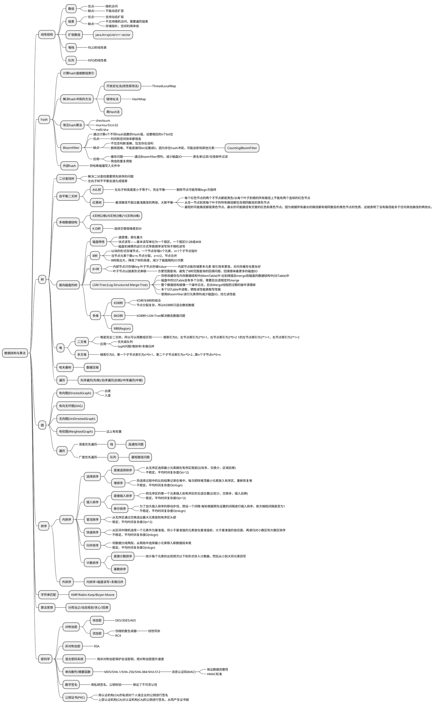
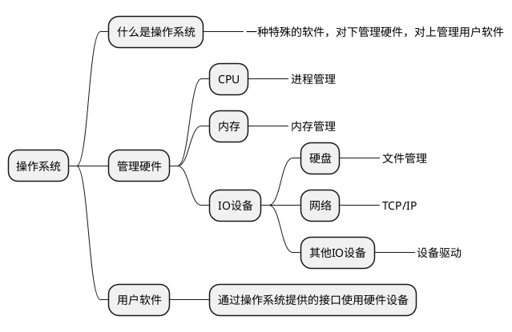
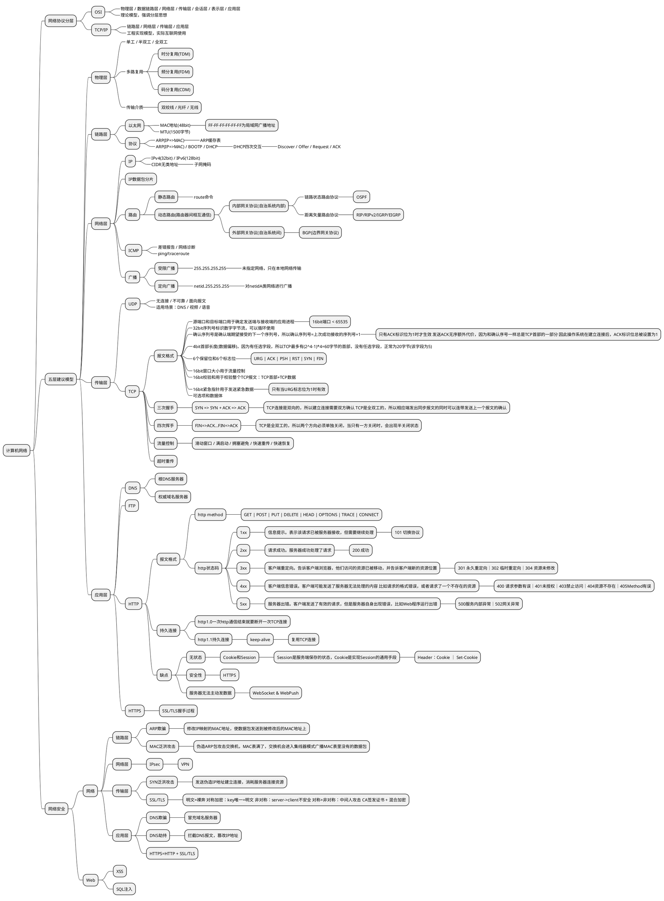
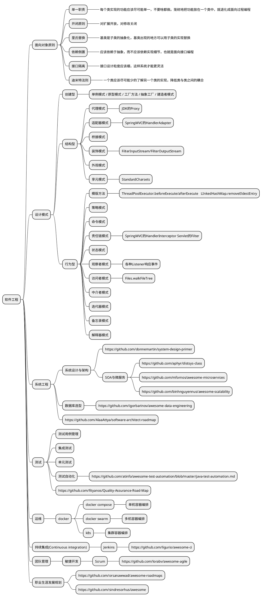

```plantuml
@startmindmap
* 数据结构与算法
** 线性结构
*** 数组
****_ 优点
*****_ 随机访问
****_ 缺点
*****_ 不能动态扩容
*** 链表
****_ 优点
*****_ 支持动态扩容
****_ 缺点
*****_ 不支持随机访问，需要遍历链表
*****_ 存储指针，空间利用率低
*** 扩容数组
**** java.ArrayList/c++ vector
*** 堆栈
****_ FILO的线性表
*** 队列
****_ FIFO的线性表
** hash
*** 计算hash值做数组索引
*** 解决hash冲突的方法
**** 开放定址法(线性探测法)
*****_ ThreadLocalMap
**** 链地址法
*****_ HashMap
**** 再Hash法
*** 常见hash算法
****_ checksum
****_ murmur3/crc32
****_ md5/sha
*** BloomFilter
****_ 通过计算n个不同Hash函数的Hash值，设置相应的n个bit位
****_ 优点
*****_ 时间和空间效率都很高
****_ 缺点
*****_ 不包含判断准确，包含存在误判
*****_ 删除困难，不能直接将bit设置成0，因为存在hash冲突，可能会影响其他元素
****** CountingBloomFilter
****_ 应用
*****_ 缓存问题
******_ 通过BloomFilter预判，减少磁盘IO
*******_ 黑名单过滤/垃圾邮件过滤
*****_ 爬虫防重复爬取
*** 外部hash
****_ 将哈希碰撞写入文件中
** 树
*** 二分查找树
****_ 解决二分查找需要预先排序的问题
****_ 左右子树不平衡会退化成链表
*** 自平衡二叉树
**** AVL树
*****_ 左右子树高度差小于等于1，完全平衡
******_ 删除节点可能导致logn次旋转
**** 红黑树
*****_ 最深路径不超过最浅路径的两倍，大致平衡
******_ 每个红色节点的两个子节点都是黑色/从每个叶子到根的所有路径上不能有两个连续的红色节点
******_ 从任一节点到其每个叶子的所有路径都包含相同数目的黑色节点
******_ 最短的可能路径都是黑色节点，最长的可能路径有交替的红色和黑色节点。因为根据所有最长的路径都有相同数目的黑色节点的性质，这就表明了没有路径能多于任何其他路径的两倍长。
*** 多维数据结构
**** 4叉树(2维)/8叉树(3维)/16叉树(4维)
**** K-D树
*****_ 连续交替按维度划分
*** 面向磁盘的树
**** 磁盘特性
*****_ 速度慢，吞吐量大
*****_ 块式读写——基本读写单位为一个扇区，一个扇区512B或4KB
*****_ 磁盘机械臂的运行方式导致顺序读写快于随机读写
**** B树
*****_ 以块的形式存储节点，一个节点存储n个元素，n+1个子节点指针
*****_ 当节点元素个数x>n,节点分裂，x<n/2，节点合并
*****_ B树扇出大，降低了树的高度，减少了磁盘随机IO次数
**** B+树
*****_ 内部节点只存储Key 叶子节点存储Value
******_ 内部节点能存储更多元素 索引效率更高，对内存缓存也更友好
*****_ 叶子节点以链表形式串联
******_ 方便范围查询，避免了B树范围查询的回溯问题，回溯意味着更多的磁盘IO
**** LSM-Tree (Log-Structured Merge-Tree)
*****_ 将修改缓存在内存数据结构中(MemTable)中 达到阈值后merge到磁盘的数据结构中(SSTable)中
*****_ 磁盘中的SSTable会有多个分段，需要后台进程定时merge
*****_ 整个数据结构就像一个操作日志，后台Merge线程把过期的操作清理掉
*****_ 多个SSTable中读取，牺牲读性能换取写性能
*****_ 使用BloomFilter进行元素预判减少磁盘IO，优化读性能
**** 多维
***** KDB树
******_ KD树与B树的结合
******_ 节点分裂复杂，所以KDB树只适合静态数据
***** BKD树
******_ KDB树+LSM-Tree解决静态数据问题
***** R树(Region)
*** 堆
**** 二叉堆
*****_ 堆是完全二叉树，所以可以用数组实现
******_ 根索引为0，左节点索引为2*0+1，右节点索引为2*0+2 1的左节点索引为2*1+1，右节点索引为2*1+2
*****_ 应用
******_ 优先级队列
******_ topN问题/堆排序/多路归并
**** 多叉堆
*****_ 根索引为0，第一个子节点索引为n*0+1，第二个子节点索引为n*0+2...第n个子节点n*0+n
*** 哈夫曼树
**** 数据压缩
*** 遍历
**** 先序遍历(先根)/后序遍历(后根)/中序遍历(中根)
** 图
*** 有向图(DirectedGraph)
****_ 出度
****_ 入度
*** 有向无环图(DAG)
*** 无向图(UnDirectedGraph)
*** 有权图(WeightedGraph)
****_ 边上有权重
*** 遍历
****_ 深度优先遍历
***** 栈
****** 连通性问题
****_ 广度优先遍历
***** 队列
****** 最短路径问题
** 排序
*** 内排序
**** 选择排序
***** 直接选择排序
******_ 从无序区选择最小元素跟在有序区尾部(比较多，交换少，区域后移)
******_ 不稳定，平均时间复杂度O(n^2)
***** 堆排序
******_ 将选择过程中的比较结果记录在堆中，每次卸除堆顶最小元素放入有序区，重新恢复堆
******_ 不稳定，平均时间复杂度O(nlogn)
**** 插入排序
***** 直接插入排序
******_ 把无序区的第一个元素插入到有序区的合适位置(比较少，交换多，插入后移)
******_ 稳定，平均时间复杂度O(n^2)
***** 希尔排序
******_ 为了加大插入排序的移动步伐，预设一个间隔 每轮根据预先设置的间隔进行插入排序，依次缩短间隔直至为1
******_ 不稳定，平均时间复杂度O(nlogn)
**** 冒泡排序
*****_ 从无序区通过交换选出最大元素放到有序区头部
*****_ 稳定，平均时间复杂度O(n^2)
**** 快速排序
*****_ 从区间中随机选择一个元素作为基准值，将小于基准值的元素放在基准值前，大于基准值的放后面，再递归对小数区和大数区排序
*****_ 不稳定，平均时间复杂度O(nlogn)
**** 归并排序
*****_ 将数据分成两段，从两段中选择最小元素移入新数据段末尾
*****_ 稳定，平均时间复杂度O(nlogn)
**** 计数排序
***** 直接计数排序
******_ 统计每个元素的出现频次以下标形式存入计数器，然后从小到大将元素回写
***** 基数排序
*** 外排序
**** 内排序+磁盘读写+多路归并
** 字符串匹配
*** KMP/Rabin-Karp/Boyer-Moore
** 算法思想
*** 分而治之/动态规划/贪心/回溯
** 密码学
*** 对称加密
**** 块加密
*****_ DES/3DES/AES
**** 流加密
*****_ 伪随机数生成器
******_ 线性同余
*****_ RC4
*** 非对称加密
****_ RSA
*** 混合密码系统
****_ 用非对称加密保护会话密钥，用对称加密提升速度
*** 单向散列/摘要函数
****_ MD5/SHA-1/SHA-256/SHA-384/SHA-512
*****_ 消息认证码(MAC)
******_ 保证数据完整性
******_ HMAC标准
*** 数字签名
****_ 用私钥签名，公钥校验
*****_ 保证了不可否认性
*** 公钥证书(PKC)
****_ 用认证机构(CA)的私钥对个人或企业的公钥进行签名
****_ 上层认证机构(CA)对认证机构(CA)的公钥进行签名，从而产生证书链
@endmindmap
```

```plantuml
@startmindmap
* 操作系统
** 什么是操作系统
***_ 一种特殊的软件，对下管理硬件，对上管理用户软件
** 管理硬件
*** CPU
****_ 进程管理
*** 内存
****_ 内存管理
*** IO设备
**** 硬盘
*****_ 文件管理
**** 网络
*****_ TCP/IP
**** 其他IO设备
*****_ 设备驱动
** 用户软件
*** 通过操作系统提供的接口使用硬件设备
@endmindmap
```

```plantuml
@startmindmap
* 计算机网络
** 网络协议分层
*** OSI
****_ 物理层 / 数据链路层 / 网络层 / 传输层 / 会话层 / 表示层 / 应用层
****_ 理论模型，强调分层思想
*** TCP/IP
****_ 链路层 / 网络层 / 传输层 / 应用层
****_ 工程实现模型，实际互联网使用
** 五层建议模型
*** 物理层
****_ 单工 / 半双工 / 全双工
****_ 多路复用
***** 时分复用(TDM)
***** 频分复用(FDM)
***** 码分复用(CDM)
****_ 传输介质
***** 双绞线 / 光纤 / 无线
*** 链路层
**** 以太网
*****_ MAC地址(48bit)
****** FF-FF-FF-FF-FF-FF为局域网广播地址
*****_ MTU(1500字节)
**** 协议
*****_ ARP(IP=>MAC)
******_ ARP缓存表
*****_ ARP(IP=>MAC) / BOOTP / DHCP
******_ DHCP四次交互
*******_ Discover / Offer / Request / ACK
*** 网络层
**** IP
*****_ IPv4(32bit) / IPv6(128bit)
*****_ CIDR无类地址
******_ 子网掩码
**** IP数据包分片
**** 路由
***** 静态路由
******_ route命令
***** 动态路由(路由器间相互通信)
****** 内部网关协议(自治系统内部)
*******_ 链路状态路由协议
******** OSPF
*******_ 距离矢量路由协议
******** RIP/RIPv2/IGRP/EIGRP
****** 外部网关协议(自治系统间)
******* BGP(边界网关协议)
**** ICMP
*****_ 差错报告 / 网络诊断
*****_ ping/traceroute
**** 广播
***** 受限广播
******_ 255.255.255.255
*******_ 未指定网络，只在本地网络传输
***** 定向广播
******_ netid.255.255.255
*******_ 对netidA类网络进行广播
*** 传输层
**** UDP
*****_ 无连接 / 不可靠 / 面向报文
*****_ 适用场景：DNS / 视频 / 语音
**** TCP
***** 报文格式
******_ 源端口和目标端口用于确定发送端与接收端的应用进程
******* 16bit端口 < 65535
******_ 32bit序列号标识数字字节流，可以循环使用
******_ 确认序列号是确认端期望接受的下一个序列号，所以确认序列号=上次成功接收的序列号+1
******* 只有ACK标识位为1时才生效 发送ACK无序额外代价，因为和确认序号一样总是TCP首部的一部分 因此操作系统在建立连接后，ACK标识位总被设置为1
******_ 4bit首部长度(数据偏移)，因为有任选字段，所以TCP最多有(2^4-1)*4=60字节的首部，没有任选字段，正常为20字节(该字段为5)
******_ 6个保留位和6个标志位
******* URG | ACK | PSH | RST | SYN | FIN
******_ 16bit窗口大小用于流量控制
******_ 16bit校验和用于校验整个TCP报文：TCP首部+TCP数据
******_ 16bit紧急指针用于发送紧急数据
******* 只有当URG标志位为1时有效
******_ 可选项和数据体
***** 三次握手
****** SYN => SYN + ACK => ACK
******* TCP连接是双向的，所以建立连接需要双方确认 TCP是全双工的，所以相应端发出同步报文的同时可以连带发送上一个报文的确认
***** 四次挥手
****** FIN=>ACK...FIN=>ACK
******* TCP是全双工的，所以两个方向必须单独关闭，当只有一方关闭时，会出现半关闭状态
***** 流量控制
****** 滑动窗口 / 满启动 / 拥塞避免 / 快速重传 / 快速恢复
***** 超时重传
*** 应用层
**** DNS
***** 根DNS服务器
***** 权威域名服务器
**** FTP
**** HTTP
***** 报文格式
****** http method
******* GET | POST | PUT | DELETE | HEAD | OPTIONS | TRACE | CONNECT
****** http状态码
******* 1xx
******** 信息提示。表示该请求已被服务器接收，但需要继续处理
********* 101 切换协议
******* 2xx
******** 请求成功。服务器成功处理了请求
********* 200 成功
******* 3xx
******** 客户端重定向。告诉客户端浏览器，他们访问的资源已被移动，并告诉客户端新的资源位置
********* 301 永久重定向｜302 临时重定向｜304 资源未修改
******* 4xx
******** 客户端信息错误。客户端可能发送了服务器无法处理的内容 比如请求的格式错误，或者请求了一个不存在的资源
********* 400 请求参数有误｜401未授权｜403禁止访问｜404资源不存在｜405Method有误
******* 5xx
******** 服务器出错。客户端发送了有效的请求，但是服务器自身出现错误，比如Web程序运行出错
********* 500服务内部异常｜502网关异常
***** 持久连接
****** http1.0一次http通信结束就要断开一次TCP连接
****** http1.1持久连接
******* keep-alive
******** 复用TCP连接
***** 缺点
****** 无状态
******* Cookie和Session
******** Session是服务端保存的状态，Cookie是实现Session的通用手段
********* Header：Cookie ｜ Set-Cookie
****** 安全性
******* HTTPS
****** 服务器无法主动发数据
******* WebSocket & WebPush
**** HTTPS
***** SSL/TLS握手过程
** 网络安全
*** 网络
**** 链路层
***** ARP欺骗
****** 修改IP映射的MAC地址，使数据包发送到被修改后的MAC地址上
***** MAC泛洪攻击
****** 伪造ARP包攻击交换机，MAC表满了，交换机会进入集线器模式广播MAC表里没有的数据包
**** 网络层
***** IPsec
****** VPN
**** 传输层
***** SYN泛洪攻击
****** 发送伪造IP地址建立连接，消耗服务器连接资源
***** SSL/TLS
****** 明文=裸奔 对称加密：key唯一=明文 非对称：server->client不安全 对称+非对称：中间人攻击 CA签发证书 + 混合加密
**** 应用层
***** DNS欺骗
****** 冒充域名服务器
***** DNS劫持
****** 拦截DNS报文，篡改IP地址
***** HTTPS=HTTP + SSL/TLS
*** Web
**** XSS
**** SQL注入
@endmindmap
```

```plantuml
@startmindmap
* 软件工程
** 面向对象原则
*** 单一职责
****_ 每个类实现的功能应该尽可能单一，不要啥都做。笼统地把功能放在一个类中，就退化成面向过程编程
*** 开闭原则
****_ 对扩展开放，对修改关闭
*** 里氏替换
****_ 基类是子类的抽象化，基类出现的地方可以用子类的实现替换
*** 依赖倒置
****_ 应该依赖于抽象，而不应该依赖实现细节，也就是面向接口编程
*** 接口隔离
****_ 接口设计粒度应该细，这样系统才能更灵活
*** 迪米特法则
****_ 一个类应该尽可能少的了解另一个类的实现，降低类与类之间的耦合
** 设计模式
*** 创建型
**** 单例模式 / 原型模式 / 工厂方法 / 抽象工厂 / 建造者模式
*** 结构型
**** 代理模式
***** JDK的Proxy
**** 适配器模式
***** SpringMVC的HandlerAdapter
**** 桥接模式
**** 装饰模式
***** FilterInputStream/FilterOutputStream
**** 外观模式
**** 享元模式
***** StandardCharsets
*** 行为型
**** 模版方法
***** ThreadPoolExecutor.beforeExecute/afterExecute   LInkedHashMap.removeEldestEntry
**** 策略模式
**** 命令模式
**** 责任链模式
***** SpringMVC的HandlerInterceptor Servlet的Filter
**** 状态模式
**** 观察者模式
***** 各种Listener响应事件
**** 访问者模式
***** Files.walkFileTree
**** 中介者模式
**** 迭代器模式
**** 备忘录模式
**** 解释器模式
** 系统工程
*** 系统设计与架构
**** https://github.com/donnemartin/system-design-primer
**** SOA与微服务
***** https://github.com/aphyr/distsys-class
***** https://github.com/mfornos/awesome-microservices
***** https://github.com/binhnguyennus/awesome-scalability
*** 数据库选型
**** https://github.com/igorbarinov/awesome-data-engineering
*** https://github.com/AlaaAttya/software-architect-roadmap
** 测试
*** 测试用例管理
*** 集成测试
*** 单元测试
*** 测试自动化
**** https://github.com/atinfo/awesome-test-automation/blob/master/java-test-automation.md
*** https://github.com/fityanos/Quality-Assurance-Road-Map
** 运维
*** docker
**** docker compose
***** 单机容器编排
**** docker swarm
***** 多机容器编排
**** k8s
***** 集群容器编排
** 持续集成(Continuous integration)
*** Jenkins
**** https://github.com/ligurio/awesome-ci
** 团队管理
*** 敏捷开发
**** Scrum
***** https://github.com/lorabv/awesome-agile
** 职业生涯发展规划
*** https://github.com/orsanawwad/awesome-roadmaps
*** https://github.com/sindresorhus/awesome
@endmindmap
```
